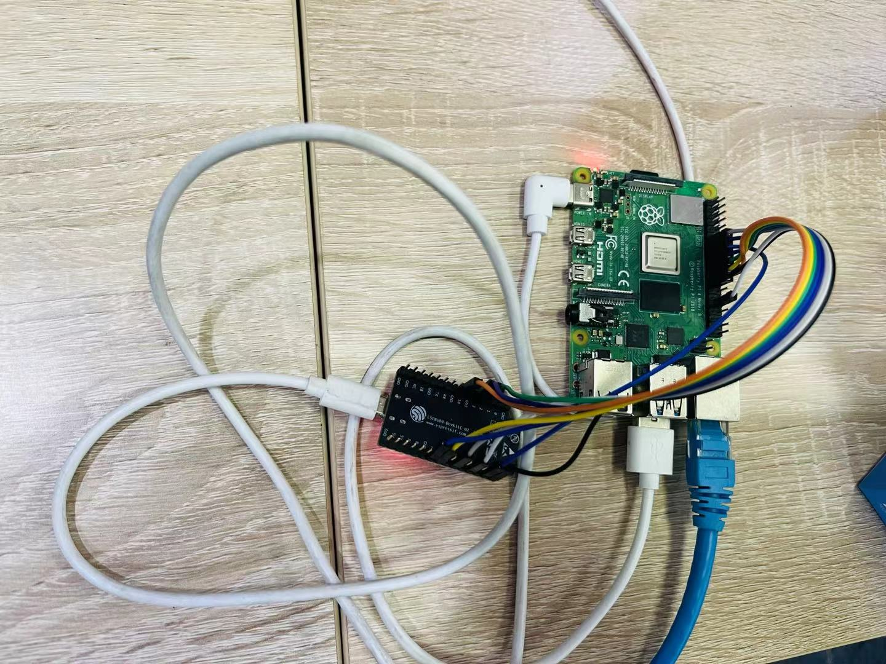

# ESP32-C2 Debug Log

## 1. esp32

Model: ESP8684-DevKitC-02 V1.0

## 2. host

Model: Raspberry Pi 4B (with 8GB DRAM)

OS Version: Raspbian GNU/Linux 12 (bookworm)

Linux Kernel Verion: 6.1.0-rpi7-rpi-v7l (armv7l)

cmdline.txt

```
console=serial0,115200 console=tty1 root=PARTUUID=3ddb125a-02 rootfstype=ext4 fsck.repair=yes rootwait quiet splash plymouth.ignore-serial-consoles cfg80211.ieee80211_regdom=CN
```

config.txt

```
# For more options and information see
# http://rptl.io/configtxt
# Some settings may impact device functionality. See link above for details

# Uncomment some or all of these to enable the optional hardware interfaces
#dtparam=i2c_arm=on
#dtparam=i2s=on
#dtparam=spi=on

# Enable audio (loads snd_bcm2835)
dtparam=audio=on

# Additional overlays and parameters are documented
# /boot/firmware/overlays/README

# Automatically load overlays for detected cameras
camera_auto_detect=1

# Automatically load overlays for detected DSI displays
display_auto_detect=1

# Automatically load initramfs files, if found
auto_initramfs=1

# Enable DRM VC4 V3D driver
dtoverlay=vc4-kms-v3d
max_framebuffers=2

# Don't have the firmware create an initial video= setting in cmdline.txt.
# Use the kernel's default instead.
disable_fw_kms_setup=1

# Disable compensation for displays with overscan
disable_overscan=1

# Run as fast as firmware / board allows
arm_boost=1
arm_64bit=0
enable_uart=1
dtparam=spi=on
dtoverlay=disable-bt
dtoverlay=disable-wifi
core_freq=250
core_freq_min=250

[cm4]
# Enable host mode on the 2711 built-in XHCI USB controller.
# This line should be removed if the legacy DWC2 controller is required
# (e.g. for USB device mode) or if USB support is not required.
otg_mode=1

[all]

```

## 3. setup picture

Wiring fully referenced to [SPI configuration](https://github.com/espressif/esp-hosted/blob/master/esp_hosted_ng/docs/setup.md#21-spi-configuration).



## 4. esp-hosted

Note: setup on the Raspberry Pi, using the `root` user.

Open a new shell 1:

### 1) setup esp-hosted

```shell
root@rpi-4b:~# cd /opt/
root@rpi-4b:/opt# git clone https://github.com/espressif/esp-hosted.git
Cloning into 'esp-hosted'...
remote: Enumerating objects: 9741, done.
remote: Counting objects: 100% (9722/9722), done.
remote: Compressing objects: 100% (3673/3673), done.
remote: Total 9741 (delta 5636), reused 9112 (delta 5362), pack-reused 19
Receiving objects: 100% (9741/9741), 32.41 MiB | 14.08 MiB/s, done.
Resolving deltas: 100% (5636/5636), done.
root@rpi-4b:/opt# cd esp-hosted/esp_hosted_ng/esp/esp_driver/
root@rpi-4b:/opt/esp-hosted/esp_hosted_ng/esp/esp_driver# chmod +x ./setup.sh
root@rpi-4b:/opt/esp-hosted/esp_hosted_ng/esp/esp_driver# ./setup.sh
HEAD is now at 573600b Merge branch 'fix/error_messages' into 'master'
ESP hosted: initialize submodule esp-idf
Submodule 'esp_hosted_fg/common/protobuf-c' (https://github.com/protobuf-c/protobuf-c.git) registered for path '../../../esp_hosted_fg/common/protobuf-c'
Submodule 'esp_hosted_fg/esp/esp_driver/esp-idf' (https://github.com/espressif/esp-idf.git) registered for path '../../../esp_hosted_fg/esp/esp_driver/esp-idf'
Submodule 'esp_hosted_ng/esp/esp_driver/esp-idf' (https://github.com/espressif/esp-idf.git) registered for path 'esp-idf'
Cloning into '/opt/esp-hosted/esp_hosted_fg/common/protobuf-c'...
Cloning into '/opt/esp-hosted/esp_hosted_fg/esp/esp_driver/esp-idf'...
Cloning into '/opt/esp-hosted/esp_hosted_ng/esp/esp_driver/esp-idf'...
remote: Total 0 (delta 0), reused 0 (delta 0), pack-reused 0
remote: Enumerating objects: 95, done.
remote: Counting objects: 100% (95/95), done.
remote: Compressing objects: 100% (37/37), done.
remote: Total 48 (delta 41), reused 12 (delta 7), pack-reused 0
Unpacking objects: 100% (48/48), 5.91 KiB | 59.00 KiB/s, done.
From https://github.com/protobuf-c/protobuf-c
 * branch            abc67a11c6db271bedbb9f58be85d6f4e2ea8389 -> FETCH_HEAD
Submodule path '../../../esp_hosted_fg/common/protobuf-c': checked out 'abc67a11c6db271bedbb9f58be85d6f4e2ea8389'
remote: Total 0 (delta 0), reused 0 (delta 0), pack-reused 0
remote: Enumerating objects: 11923, done.
remote: Counting objects: 100% (11922/11922), done.
remote: Compressing objects: 100% (6204/6204), done.
remote: Total 7627 (delta 4374), reused 2494 (delta 1069), pack-reused 0
Receiving objects: 100% (7627/7627), 5.25 MiB | 10.79 MiB/s, done.
Resolving deltas: 100% (4374/4374), completed with 2957 local objects.
From https://github.com/espressif/esp-idf
 * branch              cbce221e88d52665523093b2b6dd0ebe3f1243f1 -> FETCH_HEAD
Submodule path '../../../esp_hosted_fg/esp/esp_driver/esp-idf': checked out 'cbce221e88d52665523093b2b6dd0ebe3f1243f1'
remote: Total 0 (delta 0), reused 0 (delta 0), pack-reused 0
remote: Enumerating objects: 11786, done.
remote: Counting objects: 100% (11786/11786), done.
remote: Compressing objects: 100% (6109/6109), done.
remote: Total 7519 (delta 4354), reused 2431 (delta 1064), pack-reused 0
Receiving objects: 100% (7519/7519), 4.67 MiB | 9.30 MiB/s, done.
Resolving deltas: 100% (4354/4354), completed with 2957 local objects.
From https://github.com/espressif/esp-idf
 * branch              d3c99ed3b88eb4c7fb5cf29d6cca1f390ff107e1 -> FETCH_HEAD
Submodule path 'esp-idf': checked out 'd3c99ed3b88eb4c7fb5cf29d6cca1f390ff107e1'
ESP hosted: initialize submodule for esp-idf
Submodule 'components/bootloader/subproject/components/micro-ecc/micro-ecc' (https://github.com/kmackay/micro-ecc.git) registered for path 'components/bootloader/subproject/components/micro-ecc/micro-ecc'
Submodule 'components/bt/controller/lib_esp32' (https://github.com/espressif/esp32-bt-lib.git) registered for path 'components/bt/controller/lib_esp32'
Submodule 'components/bt/controller/lib_esp32c2/esp32c2-bt-lib' (https://github.com/espressif/esp32c2-bt-lib.git) registered for path 'components/bt/controller/lib_esp32c2/esp32c2-bt-lib'
Submodule 'components/bt/controller/lib_esp32c3_family' (https://github.com/espressif/esp32c3-bt-lib.git) registered for path 'components/bt/controller/lib_esp32c3_family'
Submodule 'components/bt/controller/lib_esp32c6/esp32c6-bt-lib' (https://github.com/espressif/esp32c6-bt-lib.git) registered for path 'components/bt/controller/lib_esp32c6/esp32c6-bt-lib'
Submodule 'components/bt/controller/lib_esp32h2/esp32h2-bt-lib' (https://github.com/espressif/esp32h2-bt-lib.git) registered for path 'components/bt/controller/lib_esp32h2/esp32h2-bt-lib'
Submodule 'components/bt/host/nimble/nimble' (https://github.com/espressif/esp-nimble.git) registered for path 'components/bt/host/nimble/nimble'
Submodule 'components/cmock/CMock' (https://github.com/ThrowTheSwitch/CMock.git) registered for path 'components/cmock/CMock'
Submodule 'components/esp_coex/lib' (https://github.com/espressif/esp-coex-lib.git) registered for path 'components/esp_coex/lib'
Submodule 'components/esp_phy/lib' (https://github.com/espressif/esp-phy-lib.git) registered for path 'components/esp_phy/lib'
Submodule 'components/esp_wifi/lib' (https://github.com/espressif/esp32-wifi-lib.git) registered for path 'components/esp_wifi/lib'
Submodule 'components/heap/tlsf' (https://github.com/espressif/tlsf.git) registered for path 'components/heap/tlsf'
Submodule 'components/ieee802154/lib' (https://github.com/espressif/esp-ieee802154-lib.git) registered for path 'components/ieee802154/lib'
Submodule 'components/json/cJSON' (https://github.com/DaveGamble/cJSON.git) registered for path 'components/json/cJSON'
Submodule 'components/lwip/lwip' (https://github.com/espressif/esp-lwip.git) registered for path 'components/lwip/lwip'
Submodule 'components/mbedtls/mbedtls' (https://github.com/espressif/mbedtls.git) registered for path 'components/mbedtls/mbedtls'
Submodule 'components/mqtt/esp-mqtt' (https://github.com/espressif/esp-mqtt.git) registered for path 'components/mqtt/esp-mqtt'
Submodule 'components/openthread/lib' (https://github.com/espressif/esp-thread-lib.git) registered for path 'components/openthread/lib'
Submodule 'components/openthread/openthread' (https://github.com/espressif/openthread.git) registered for path 'components/openthread/openthread'
Submodule 'components/protobuf-c/protobuf-c' (https://github.com/protobuf-c/protobuf-c.git) registered for path 'components/protobuf-c/protobuf-c'
Submodule 'components/spiffs/spiffs' (https://github.com/pellepl/spiffs.git) registered for path 'components/spiffs/spiffs'
Submodule 'components/unity/unity' (https://github.com/ThrowTheSwitch/Unity.git) registered for path 'components/unity/unity'
Cloning into '/opt/esp-hosted/esp_hosted_ng/esp/esp_driver/esp-idf/components/bootloader/subproject/components/micro-ecc/micro-ecc'...
Cloning into '/opt/esp-hosted/esp_hosted_ng/esp/esp_driver/esp-idf/components/bt/controller/lib_esp32'...
Cloning into '/opt/esp-hosted/esp_hosted_ng/esp/esp_driver/esp-idf/components/bt/controller/lib_esp32c2/esp32c2-bt-lib'...
Cloning into '/opt/esp-hosted/esp_hosted_ng/esp/esp_driver/esp-idf/components/bt/controller/lib_esp32c3_family'...
Cloning into '/opt/esp-hosted/esp_hosted_ng/esp/esp_driver/esp-idf/components/bt/controller/lib_esp32c6/esp32c6-bt-lib'...
Cloning into '/opt/esp-hosted/esp_hosted_ng/esp/esp_driver/esp-idf/components/bt/controller/lib_esp32h2/esp32h2-bt-lib'...
Cloning into '/opt/esp-hosted/esp_hosted_ng/esp/esp_driver/esp-idf/components/bt/host/nimble/nimble'...
Cloning into '/opt/esp-hosted/esp_hosted_ng/esp/esp_driver/esp-idf/components/cmock/CMock'...
Cloning into '/opt/esp-hosted/esp_hosted_ng/esp/esp_driver/esp-idf/components/esp_coex/lib'...
Cloning into '/opt/esp-hosted/esp_hosted_ng/esp/esp_driver/esp-idf/components/esp_phy/lib'...
Cloning into '/opt/esp-hosted/esp_hosted_ng/esp/esp_driver/esp-idf/components/esp_wifi/lib'...
Cloning into '/opt/esp-hosted/esp_hosted_ng/esp/esp_driver/esp-idf/components/heap/tlsf'...
Cloning into '/opt/esp-hosted/esp_hosted_ng/esp/esp_driver/esp-idf/components/ieee802154/lib'...
Cloning into '/opt/esp-hosted/esp_hosted_ng/esp/esp_driver/esp-idf/components/json/cJSON'...
Cloning into '/opt/esp-hosted/esp_hosted_ng/esp/esp_driver/esp-idf/components/lwip/lwip'...
Cloning into '/opt/esp-hosted/esp_hosted_ng/esp/esp_driver/esp-idf/components/mbedtls/mbedtls'...
Cloning into '/opt/esp-hosted/esp_hosted_ng/esp/esp_driver/esp-idf/components/mqtt/esp-mqtt'...
Cloning into '/opt/esp-hosted/esp_hosted_ng/esp/esp_driver/esp-idf/components/openthread/lib'...
Cloning into '/opt/esp-hosted/esp_hosted_ng/esp/esp_driver/esp-idf/components/openthread/openthread'...
Cloning into '/opt/esp-hosted/esp_hosted_ng/esp/esp_driver/esp-idf/components/protobuf-c/protobuf-c'...
Cloning into '/opt/esp-hosted/esp_hosted_ng/esp/esp_driver/esp-idf/components/spiffs/spiffs'...
Cloning into '/opt/esp-hosted/esp_hosted_ng/esp/esp_driver/esp-idf/components/unity/unity'...
remote: Total 0 (delta 0), reused 0 (delta 0), pack-reused 0
remote: Enumerating objects: 27, done.
remote: Counting objects: 100% (27/27), done.
remote: Compressing objects: 100% (12/12), done.
remote: Total 14 (delta 11), reused 3 (delta 0), pack-reused 0
Unpacking objects: 100% (14/14), 2.57 KiB | 58.00 KiB/s, done.
From https://github.com/kmackay/micro-ecc
 * branch            d037ec89546fad14b5c4d5456c2e23a71e554966 -> FETCH_HEAD
Submodule path 'components/bootloader/subproject/components/micro-ecc/micro-ecc': checked out 'd037ec89546fad14b5c4d5456c2e23a71e554966'
remote: Total 0 (delta 0), reused 0 (delta 0), pack-reused 0
remote: Enumerating objects: 9, done.
remote: Counting objects: 100% (9/9), done.
remote: Compressing objects: 100% (4/4), done.
remote: Total 5 (delta 1), reused 2 (delta 0), pack-reused 0
Unpacking objects: 100% (5/5), 195.14 KiB | 904.00 KiB/s, done.
From https://github.com/espressif/esp32-bt-lib
 * branch            e1b3a29c58a452a6c017113686262094afd87042 -> FETCH_HEAD
Submodule path 'components/bt/controller/lib_esp32': checked out 'e1b3a29c58a452a6c017113686262094afd87042'
remote: Total 0 (delta 0), reused 0 (delta 0), pack-reused 0
remote: Enumerating objects: 5, done.
remote: Counting objects: 100% (5/5), done.
remote: Compressing objects: 100% (3/3), done.
remote: Total 3 (delta 1), reused 1 (delta 0), pack-reused 0
Unpacking objects: 100% (3/3), 316.86 KiB | 1.12 MiB/s, done.
From https://github.com/espressif/esp32c2-bt-lib
 * branch            5fcfd0e457a76ebb234086ccd6dc391690d69e90 -> FETCH_HEAD
Submodule path 'components/bt/controller/lib_esp32c2/esp32c2-bt-lib': checked out '5fcfd0e457a76ebb234086ccd6dc391690d69e90'
remote: Total 0 (delta 0), reused 0 (delta 0), pack-reused 0
remote: Enumerating objects: 11, done.
remote: Counting objects: 100% (11/11), done.
remote: Compressing objects: 100% (4/4), done.
remote: Total 6 (delta 3), reused 3 (delta 0), pack-reused 0
Unpacking objects: 100% (6/6), 94.94 KiB | 619.00 KiB/s, done.
From https://github.com/espressif/esp32c3-bt-lib
 * branch            b438f60a295183e7c67eb42ae05f4580f4b1ced0 -> FETCH_HEAD
Submodule path 'components/bt/controller/lib_esp32c3_family': checked out 'b438f60a295183e7c67eb42ae05f4580f4b1ced0'
remote: Total 0 (delta 0), reused 0 (delta 0), pack-reused 0
remote: Enumerating objects: 5, done.
remote: Counting objects: 100% (5/5), done.
remote: Compressing objects: 100% (3/3), done.
remote: Total 3 (delta 1), reused 1 (delta 0), pack-reused 0
Unpacking objects: 100% (3/3), 635.50 KiB | 1.85 MiB/s, done.
From https://github.com/espressif/esp32c6-bt-lib
 * branch            d785de0a7c46d9badcd73bc83c2e5cb78f7054b2 -> FETCH_HEAD
Submodule path 'components/bt/controller/lib_esp32c6/esp32c6-bt-lib': checked out 'd785de0a7c46d9badcd73bc83c2e5cb78f7054b2'
remote: Total 0 (delta 0), reused 0 (delta 0), pack-reused 0
remote: Enumerating objects: 5, done.
remote: Counting objects: 100% (5/5), done.
remote: Compressing objects: 100% (3/3), done.
remote: Total 3 (delta 1), reused 1 (delta 0), pack-reused 0
Unpacking objects: 100% (3/3), 630.56 KiB | 1.87 MiB/s, done.
From https://github.com/espressif/esp32h2-bt-lib
 * branch            35bd3cd7352014d303a96c46d8ea8446ea0a9a54 -> FETCH_HEAD
Submodule path 'components/bt/controller/lib_esp32h2/esp32h2-bt-lib': checked out '35bd3cd7352014d303a96c46d8ea8446ea0a9a54'
remote: Total 0 (delta 0), reused 0 (delta 0), pack-reused 0
remote: Enumerating objects: 1215, done.
remote: Counting objects: 100% (1215/1215), done.
remote: Compressing objects: 100% (591/591), done.
remote: Total 803 (delta 418), reused 388 (delta 123), pack-reused 0
Receiving objects: 100% (803/803), 557.75 KiB | 3.08 MiB/s, done.
Resolving deltas: 100% (418/418), completed with 269 local objects.
From https://github.com/espressif/esp-nimble
 * branch            9478bc510fa9fc792d98efbc80dc547b97a13b99 -> FETCH_HEAD
Submodule path 'components/bt/host/nimble/nimble': checked out '9478bc510fa9fc792d98efbc80dc547b97a13b99'
remote: Total 0 (delta 0), reused 0 (delta 0), pack-reused 0
remote: Enumerating objects: 72, done.
remote: Counting objects: 100% (72/72), done.
remote: Compressing objects: 100% (37/37), done.
remote: Total 37 (delta 30), reused 2 (delta 0), pack-reused 0
Unpacking objects: 100% (37/37), 7.28 KiB | 109.00 KiB/s, done.
From https://github.com/ThrowTheSwitch/CMock
 * branch            eeecc49ce8af123cf8ad40efdb9673e37b56230f -> FETCH_HEAD
Submodule path 'components/cmock/CMock': checked out 'eeecc49ce8af123cf8ad40efdb9673e37b56230f'
remote: Total 0 (delta 0), reused 0 (delta 0), pack-reused 0
remote: Enumerating objects: 27, done.
remote: Counting objects: 100% (27/27), done.
remote: Compressing objects: 100% (6/6), done.
remote: Total 16 (delta 7), reused 12 (delta 3), pack-reused 0
Unpacking objects: 100% (16/16), 40.50 KiB | 552.00 KiB/s, done.
From https://github.com/espressif/esp-coex-lib
 * branch            37698e17a4c7fd2e0872317fc8befaac3bb10cb4 -> FETCH_HEAD
Submodule path 'components/esp_coex/lib': checked out '37698e17a4c7fd2e0872317fc8befaac3bb10cb4'
remote: Total 0 (delta 0), reused 0 (delta 0), pack-reused 0
remote: Enumerating objects: 50, done.
remote: Counting objects: 100% (50/50), done.
remote: Compressing objects: 100% (26/26), done.
remote: Total 27 (delta 14), reused 8 (delta 0), pack-reused 0
Unpacking objects: 100% (27/27), 558.20 KiB | 1.48 MiB/s, done.
From https://github.com/espressif/esp-phy-lib
 * branch            998e05636344949ba219e8ac56feb733e27bf5d2 -> FETCH_HEAD
Submodule path 'components/esp_phy/lib': checked out '998e05636344949ba219e8ac56feb733e27bf5d2'
remote: Total 0 (delta 0), reused 0 (delta 0), pack-reused 0
remote: Enumerating objects: 81, done.
remote: Counting objects: 100% (81/81), done.
remote: Compressing objects: 100% (41/41), done.
remote: Total 48 (delta 37), reused 15 (delta 7), pack-reused 0
Unpacking objects: 100% (48/48), 2.18 MiB | 1.51 MiB/s, done.
From https://github.com/espressif/esp32-wifi-lib
 * branch            0a89d5ffd2c452407940c2e617434e54f3c34576 -> FETCH_HEAD
Submodule path 'components/esp_wifi/lib': checked out '0a89d5ffd2c452407940c2e617434e54f3c34576'
remote: Total 0 (delta 0), reused 0 (delta 0), pack-reused 0
remote: Enumerating objects: 7, done.
remote: Counting objects: 100% (7/7), done.
remote: Compressing objects: 100% (4/4), done.
remote: Total 4 (delta 2), reused 2 (delta 0), pack-reused 0
Unpacking objects: 100% (4/4), 853 bytes | 56.00 KiB/s, done.
From https://github.com/espressif/tlsf
 * branch            8c9cd0517adf99e363812e9a295dfe3898fdd345 -> FETCH_HEAD
Submodule path 'components/heap/tlsf': checked out '8c9cd0517adf99e363812e9a295dfe3898fdd345'
Submodule path 'components/ieee802154/lib': checked out '102b03c8095de8a337c293f79dce189be63186f3'
remote: Total 0 (delta 0), reused 0 (delta 0), pack-reused 0
remote: Enumerating objects: 31, done.
remote: Counting objects: 100% (31/31), done.
remote: Compressing objects: 100% (15/15), done.
remote: Total 16 (delta 12), reused 3 (delta 0), pack-reused 0
Unpacking objects: 100% (16/16), 2.54 KiB | 53.00 KiB/s, done.
From https://github.com/DaveGamble/cJSON
 * branch            d348621ca93571343a56862df7de4ff3bc9b5667 -> FETCH_HEAD
Submodule path 'components/json/cJSON': checked out 'd348621ca93571343a56862df7de4ff3bc9b5667'
remote: Total 0 (delta 0), reused 0 (delta 0), pack-reused 0
remote: Enumerating objects: 248, done.
remote: Counting objects: 100% (248/248), done.
remote: Compressing objects: 100% (124/124), done.
remote: Total 139 (delta 96), reused 32 (delta 6), pack-reused 0
Receiving objects: 100% (139/139), 50.25 KiB | 1.44 MiB/s, done.
Resolving deltas: 100% (96/96), completed with 92 local objects.
From https://github.com/espressif/esp-lwip
 * branch            269a58f18597aedec31c439e34cdaea47229dda3 -> FETCH_HEAD
Submodule path 'components/lwip/lwip': checked out '269a58f18597aedec31c439e34cdaea47229dda3'
remote: Total 0 (delta 0), reused 0 (delta 0), pack-reused 0
remote: Enumerating objects: 1844, done.
remote: Counting objects: 100% (1844/1844), done.
remote: Compressing objects: 100% (775/775), done.
remote: Total 948 (delta 802), reused 238 (delta 164), pack-reused 0
Receiving objects: 100% (948/948), 846.16 KiB | 4.19 MiB/s, done.
Resolving deltas: 100% (802/802), completed with 615 local objects.
From https://github.com/espressif/mbedtls
 * branch            65b3c0857c9f207dcb0b646f2b4ebd8e5edf83c1 -> FETCH_HEAD
Submodule path 'components/mbedtls/mbedtls': checked out '65b3c0857c9f207dcb0b646f2b4ebd8e5edf83c1'
remote: Total 0 (delta 0), reused 0 (delta 0), pack-reused 0
remote: Enumerating objects: 71, done.
remote: Counting objects: 100% (71/71), done.
remote: Compressing objects: 100% (33/33), done.
remote: Total 36 (delta 25), reused 7 (delta 0), pack-reused 0
Unpacking objects: 100% (36/36), 10.54 KiB | 119.00 KiB/s, done.
From https://github.com/espressif/esp-mqtt
 * branch            dffabb067fb3c39f486033d2e47eb4b1416f0c82 -> FETCH_HEAD
Submodule path 'components/mqtt/esp-mqtt': checked out 'dffabb067fb3c39f486033d2e47eb4b1416f0c82'
remote: Total 0 (delta 0), reused 0 (delta 0), pack-reused 0
remote: Enumerating objects: 17, done.
remote: Counting objects: 100% (17/17), done.
remote: Compressing objects: 100% (5/5), done.
remote: Total 11 (delta 3), reused 10 (delta 2), pack-reused 0
Unpacking objects: 100% (11/11), 105.08 KiB | 853.00 KiB/s, done.
From https://github.com/espressif/esp-thread-lib
 * branch            c9c17a0b6634af016111c9817f0be1fe0e7112f6 -> FETCH_HEAD
Submodule path 'components/openthread/lib': checked out 'c9c17a0b6634af016111c9817f0be1fe0e7112f6'
remote: Total 0 (delta 0), reused 0 (delta 0), pack-reused 0
remote: Enumerating objects: 2790, done.
remote: Counting objects: 100% (2790/2790), done.
remote: Compressing objects: 100% (1253/1253), done.
remote: Total 1439 (delta 1243), reused 294 (delta 173), pack-reused 0
Receiving objects: 100% (1439/1439), 1.35 MiB | 5.08 MiB/s, done.
Resolving deltas: 100% (1243/1243), completed with 1047 local objects.
From https://github.com/espressif/openthread
 * branch            5beae143700db54c6e9bd4b15a568abe2f305723 -> FETCH_HEAD
Submodule path 'components/openthread/openthread': checked out '5beae143700db54c6e9bd4b15a568abe2f305723'
remote: Total 0 (delta 0), reused 0 (delta 0), pack-reused 0
remote: Enumerating objects: 95, done.
remote: Counting objects: 100% (95/95), done.
remote: Compressing objects: 100% (37/37), done.
remote: Total 48 (delta 41), reused 12 (delta 7), pack-reused 0
Unpacking objects: 100% (48/48), 5.91 KiB | 58.00 KiB/s, done.
From https://github.com/protobuf-c/protobuf-c
 * branch            abc67a11c6db271bedbb9f58be85d6f4e2ea8389 -> FETCH_HEAD
Submodule path 'components/protobuf-c/protobuf-c': checked out 'abc67a11c6db271bedbb9f58be85d6f4e2ea8389'
remote: Total 0 (delta 0), reused 0 (delta 0), pack-reused 0
remote: Enumerating objects: 13, done.
remote: Counting objects: 100% (13/13), done.
remote: Compressing objects: 100% (5/5), done.
remote: Total 7 (delta 6), reused 3 (delta 2), pack-reused 0
Unpacking objects: 100% (7/7), 1.06 KiB | 49.00 KiB/s, done.
From https://github.com/pellepl/spiffs
 * branch            0dbb3f71c5f6fae3747a9d935372773762baf852 -> FETCH_HEAD
Submodule path 'components/spiffs/spiffs': checked out '0dbb3f71c5f6fae3747a9d935372773762baf852'
remote: Total 0 (delta 0), reused 0 (delta 0), pack-reused 0
remote: Enumerating objects: 217, done.
remote: Counting objects: 100% (217/217), done.
remote: Compressing objects: 100% (109/109), done.
remote: Total 121 (delta 70), reused 29 (delta 9), pack-reused 0
Receiving objects: 100% (121/121), 70.61 KiB | 1.26 MiB/s, done.
Resolving deltas: 100% (70/70), completed with 53 local objects.
From https://github.com/ThrowTheSwitch/Unity
 * branch            7d2bf62b7e6afaf38153041a9d53c21aeeca9a25 -> FETCH_HEAD
Submodule path 'components/unity/unity': checked out '7d2bf62b7e6afaf38153041a9d53c21aeeca9a25'
ESP hosted: installing prerequisites for esp-idf
Detecting the Python interpreter
Checking "python3" ...
Python 3.11.2
"python3" has been detected
Checking Python compatibility
Installing ESP-IDF tools
Current system platform: linux-armhf
Selected targets are: esp32c6, esp32c2, esp32c3, esp32, esp32s3, esp32s2, esp32h2
Installing tools: xtensa-esp-elf-gdb, riscv32-esp-elf-gdb, xtensa-esp32-elf, xtensa-esp32s2-elf, xtensa-esp32s3-elf, riscv32-esp-elf, esp32ulp-elf, openocd-esp32, esp-rom-elfs
Skipping xtensa-esp-elf-gdb@12.1_20221002 (already installed)
Skipping riscv32-esp-elf-gdb@12.1_20221002 (already installed)
Skipping xtensa-esp32-elf@esp-12.2.0_20230208 (already installed)
Skipping xtensa-esp32s2-elf@esp-12.2.0_20230208 (already installed)
Skipping xtensa-esp32s3-elf@esp-12.2.0_20230208 (already installed)
Skipping riscv32-esp-elf@esp-12.2.0_20230208 (already installed)
Skipping esp32ulp-elf@2.35_20220830 (already installed)
Skipping openocd-esp32@v0.12.0-esp32-20230419 (already installed)
Skipping esp-rom-elfs@20230320 (already installed)
Installing Python environment and packages
Python 3.11.2
pip 24.0 from /root/.espressif/python_env/idf5.1_py3.11_env/lib/python3.11/site-packages/pip (python 3.11)
Upgrading pip and setuptools...
Looking in indexes: https://pypi.org/simple, https://www.piwheels.org/simple
Requirement already satisfied: pip in /root/.espressif/python_env/idf5.1_py3.11_env/lib/python3.11/site-packages (24.0)
Requirement already satisfied: setuptools in /root/.espressif/python_env/idf5.1_py3.11_env/lib/python3.11/site-packages (69.2.0)
Skipping the download of /root/.espressif/espidf.constraints.v5.1.txt because it was downloaded recently.
Installing Python packages
 Constraint file: /root/.espressif/espidf.constraints.v5.1.txt
 Requirement files:
  - /opt/esp-hosted/esp_hosted_ng/esp/esp_driver/esp-idf/tools/requirements/requirements.core.txt
Looking in indexes: https://pypi.org/simple, https://www.piwheels.org/simple, https://dl.espressif.com/pypi
Ignoring importlib_metadata: markers 'python_version < "3.8"' don't match your environment
Requirement already satisfied: setuptools in /root/.espressif/python_env/idf5.1_py3.11_env/lib/python3.11/site-packages (from -r /opt/esp-hosted/esp_hosted_ng/esp/esp_driver/esp-idf/tools/requirements/requirements.core.txt (line 3)) (69.2.0)
Requirement already satisfied: packaging in /root/.espressif/python_env/idf5.1_py3.11_env/lib/python3.11/site-packages (from -r /opt/esp-hosted/esp_hosted_ng/esp/esp_driver/esp-idf/tools/requirements/requirements.core.txt (line 4)) (24.0)
Requirement already satisfied: click in /root/.espressif/python_env/idf5.1_py3.11_env/lib/python3.11/site-packages (from -r /opt/esp-hosted/esp_hosted_ng/esp/esp_driver/esp-idf/tools/requirements/requirements.core.txt (line 7)) (8.1.7)
Requirement already satisfied: pyserial in /root/.espressif/python_env/idf5.1_py3.11_env/lib/python3.11/site-packages (from -r /opt/esp-hosted/esp_hosted_ng/esp/esp_driver/esp-idf/tools/requirements/requirements.core.txt (line 8)) (3.5)
Requirement already satisfied: cryptography in /root/.espressif/python_env/idf5.1_py3.11_env/lib/python3.11/site-packages (from -r /opt/esp-hosted/esp_hosted_ng/esp/esp_driver/esp-idf/tools/requirements/requirements.core.txt (line 9)) (39.0.2)
Requirement already satisfied: pyparsing in /root/.espressif/python_env/idf5.1_py3.11_env/lib/python3.11/site-packages (from -r /opt/esp-hosted/esp_hosted_ng/esp/esp_driver/esp-idf/tools/requirements/requirements.core.txt (line 10)) (3.0.9)
Requirement already satisfied: pyelftools in /root/.espressif/python_env/idf5.1_py3.11_env/lib/python3.11/site-packages (from -r /opt/esp-hosted/esp_hosted_ng/esp/esp_driver/esp-idf/tools/requirements/requirements.core.txt (line 11)) (0.29)
Requirement already satisfied: idf-component-manager in /root/.espressif/python_env/idf5.1_py3.11_env/lib/python3.11/site-packages (from -r /opt/esp-hosted/esp_hosted_ng/esp/esp_driver/esp-idf/tools/requirements/requirements.core.txt (line 12)) (1.5.2)
Requirement already satisfied: esp-coredump in /root/.espressif/python_env/idf5.1_py3.11_env/lib/python3.11/site-packages (from -r /opt/esp-hosted/esp_hosted_ng/esp/esp_driver/esp-idf/tools/requirements/requirements.core.txt (line 13)) (1.10.0)
Requirement already satisfied: esptool in /root/.espressif/python_env/idf5.1_py3.11_env/lib/python3.11/site-packages (from -r /opt/esp-hosted/esp_hosted_ng/esp/esp_driver/esp-idf/tools/requirements/requirements.core.txt (line 14)) (4.7.0)
Requirement already satisfied: esp-idf-kconfig in /root/.espressif/python_env/idf5.1_py3.11_env/lib/python3.11/site-packages (from -r /opt/esp-hosted/esp_hosted_ng/esp/esp_driver/esp-idf/tools/requirements/requirements.core.txt (line 15)) (1.4.2)
Requirement already satisfied: esp-idf-monitor in /root/.espressif/python_env/idf5.1_py3.11_env/lib/python3.11/site-packages (from -r /opt/esp-hosted/esp_hosted_ng/esp/esp_driver/esp-idf/tools/requirements/requirements.core.txt (line 16)) (1.4.0)
Requirement already satisfied: esp-idf-size in /root/.espressif/python_env/idf5.1_py3.11_env/lib/python3.11/site-packages (from -r /opt/esp-hosted/esp_hosted_ng/esp/esp_driver/esp-idf/tools/requirements/requirements.core.txt (line 17)) (1.2.0)
Requirement already satisfied: freertos_gdb in /root/.espressif/python_env/idf5.1_py3.11_env/lib/python3.11/site-packages (from -r /opt/esp-hosted/esp_hosted_ng/esp/esp_driver/esp-idf/tools/requirements/requirements.core.txt (line 20)) (1.0.3)
Requirement already satisfied: cffi>=1.12 in /root/.espressif/python_env/idf5.1_py3.11_env/lib/python3.11/site-packages (from cryptography->-r /opt/esp-hosted/esp_hosted_ng/esp/esp_driver/esp-idf/tools/requirements/requirements.core.txt (line 9)) (1.16.0)
Requirement already satisfied: requests<3 in /root/.espressif/python_env/idf5.1_py3.11_env/lib/python3.11/site-packages (from idf-component-manager->-r /opt/esp-hosted/esp_hosted_ng/esp/esp_driver/esp-idf/tools/requirements/requirements.core.txt (line 12)) (2.31.0)
Requirement already satisfied: urllib3<2 in /root/.espressif/python_env/idf5.1_py3.11_env/lib/python3.11/site-packages (from idf-component-manager->-r /opt/esp-hosted/esp_hosted_ng/esp/esp_driver/esp-idf/tools/requirements/requirements.core.txt (line 12)) (1.26.18)
Requirement already satisfied: requests-file<2 in /root/.espressif/python_env/idf5.1_py3.11_env/lib/python3.11/site-packages (from idf-component-manager->-r /opt/esp-hosted/esp_hosted_ng/esp/esp_driver/esp-idf/tools/requirements/requirements.core.txt (line 12)) (1.5.1)
Requirement already satisfied: requests-toolbelt in /root/.espressif/python_env/idf5.1_py3.11_env/lib/python3.11/site-packages (from idf-component-manager->-r /opt/esp-hosted/esp_hosted_ng/esp/esp_driver/esp-idf/tools/requirements/requirements.core.txt (line 12)) (1.0.0)
Requirement already satisfied: schema in /root/.espressif/python_env/idf5.1_py3.11_env/lib/python3.11/site-packages (from idf-component-manager->-r /opt/esp-hosted/esp_hosted_ng/esp/esp_driver/esp-idf/tools/requirements/requirements.core.txt (line 12)) (0.7.5)
Requirement already satisfied: six in /root/.espressif/python_env/idf5.1_py3.11_env/lib/python3.11/site-packages (from idf-component-manager->-r /opt/esp-hosted/esp_hosted_ng/esp/esp_driver/esp-idf/tools/requirements/requirements.core.txt (line 12)) (1.16.0)
Requirement already satisfied: tqdm<5 in /root/.espressif/python_env/idf5.1_py3.11_env/lib/python3.11/site-packages (from idf-component-manager->-r /opt/esp-hosted/esp_hosted_ng/esp/esp_driver/esp-idf/tools/requirements/requirements.core.txt (line 12)) (4.66.2)
Requirement already satisfied: colorama in /root/.espressif/python_env/idf5.1_py3.11_env/lib/python3.11/site-packages (from idf-component-manager->-r /opt/esp-hosted/esp_hosted_ng/esp/esp_driver/esp-idf/tools/requirements/requirements.core.txt (line 12)) (0.4.6)
Requirement already satisfied: pyyaml>5.2 in /root/.espressif/python_env/idf5.1_py3.11_env/lib/python3.11/site-packages (from idf-component-manager->-r /opt/esp-hosted/esp_hosted_ng/esp/esp_driver/esp-idf/tools/requirements/requirements.core.txt (line 12)) (6.0.1)
Requirement already satisfied: cachecontrol>0.12.6 in /root/.espressif/python_env/idf5.1_py3.11_env/lib/python3.11/site-packages (from cachecontrol[filecache]>0.12.6; python_version >= "3.6"->idf-component-manager->-r /opt/esp-hosted/esp_hosted_ng/esp/esp_driver/esp-idf/tools/requirements/requirements.core.txt (line 12)) (0.14.0)
Requirement already satisfied: contextlib2>0.6.0 in /root/.espressif/python_env/idf5.1_py3.11_env/lib/python3.11/site-packages (from idf-component-manager->-r /opt/esp-hosted/esp_hosted_ng/esp/esp_driver/esp-idf/tools/requirements/requirements.core.txt (line 12)) (21.6.0)
Requirement already satisfied: construct~=2.10 in /root/.espressif/python_env/idf5.1_py3.11_env/lib/python3.11/site-packages (from esp-coredump->-r /opt/esp-hosted/esp_hosted_ng/esp/esp_driver/esp-idf/tools/requirements/requirements.core.txt (line 13)) (2.10.70)
Requirement already satisfied: pygdbmi>=0.9.0.2 in /root/.espressif/python_env/idf5.1_py3.11_env/lib/python3.11/site-packages (from esp-coredump->-r /opt/esp-hosted/esp_hosted_ng/esp/esp_driver/esp-idf/tools/requirements/requirements.core.txt (line 13)) (0.11.0.0)
Requirement already satisfied: bitstring>=3.1.6 in /root/.espressif/python_env/idf5.1_py3.11_env/lib/python3.11/site-packages (from esptool->-r /opt/esp-hosted/esp_hosted_ng/esp/esp_driver/esp-idf/tools/requirements/requirements.core.txt (line 14)) (4.1.4)
Requirement already satisfied: ecdsa>=0.16.0 in /root/.espressif/python_env/idf5.1_py3.11_env/lib/python3.11/site-packages (from esptool->-r /opt/esp-hosted/esp_hosted_ng/esp/esp_driver/esp-idf/tools/requirements/requirements.core.txt (line 14)) (0.18.0)
Requirement already satisfied: reedsolo<1.8,>=1.5.3 in /root/.espressif/python_env/idf5.1_py3.11_env/lib/python3.11/site-packages (from esptool->-r /opt/esp-hosted/esp_hosted_ng/esp/esp_driver/esp-idf/tools/requirements/requirements.core.txt (line 14)) (1.7.0)
Requirement already satisfied: intelhex in /root/.espressif/python_env/idf5.1_py3.11_env/lib/python3.11/site-packages (from esptool->-r /opt/esp-hosted/esp_hosted_ng/esp/esp_driver/esp-idf/tools/requirements/requirements.core.txt (line 14)) (2.3.0)
Requirement already satisfied: kconfiglib>=13.7.1 in /root/.espressif/python_env/idf5.1_py3.11_env/lib/python3.11/site-packages (from esp-idf-kconfig->-r /opt/esp-hosted/esp_hosted_ng/esp/esp_driver/esp-idf/tools/requirements/requirements.core.txt (line 15)) (14.1.0)
Requirement already satisfied: esp-idf-panic-decoder~=1.0 in /root/.espressif/python_env/idf5.1_py3.11_env/lib/python3.11/site-packages (from esp-idf-monitor->-r /opt/esp-hosted/esp_hosted_ng/esp/esp_driver/esp-idf/tools/requirements/requirements.core.txt (line 16)) (1.0.1)
Requirement already satisfied: rich in /root/.espressif/python_env/idf5.1_py3.11_env/lib/python3.11/site-packages (from esp-idf-size->-r /opt/esp-hosted/esp_hosted_ng/esp/esp_driver/esp-idf/tools/requirements/requirements.core.txt (line 17)) (13.7.1)
Requirement already satisfied: bitarray<3.0.0,>=2.8.0 in /root/.espressif/python_env/idf5.1_py3.11_env/lib/python3.11/site-packages (from bitstring>=3.1.6->esptool->-r /opt/esp-hosted/esp_hosted_ng/esp/esp_driver/esp-idf/tools/requirements/requirements.core.txt (line 14)) (2.9.2)
Requirement already satisfied: msgpack<2.0.0,>=0.5.2 in /root/.espressif/python_env/idf5.1_py3.11_env/lib/python3.11/site-packages (from cachecontrol>0.12.6->cachecontrol[filecache]>0.12.6; python_version >= "3.6"->idf-component-manager->-r /opt/esp-hosted/esp_hosted_ng/esp/esp_driver/esp-idf/tools/requirements/requirements.core.txt (line 12)) (1.0.8)
Requirement already satisfied: filelock>=3.8.0 in /root/.espressif/python_env/idf5.1_py3.11_env/lib/python3.11/site-packages (from cachecontrol[filecache]>0.12.6; python_version >= "3.6"->idf-component-manager->-r /opt/esp-hosted/esp_hosted_ng/esp/esp_driver/esp-idf/tools/requirements/requirements.core.txt (line 12)) (3.13.1)
Requirement already satisfied: pycparser in /root/.espressif/python_env/idf5.1_py3.11_env/lib/python3.11/site-packages (from cffi>=1.12->cryptography->-r /opt/esp-hosted/esp_hosted_ng/esp/esp_driver/esp-idf/tools/requirements/requirements.core.txt (line 9)) (2.21)
Requirement already satisfied: charset-normalizer<4,>=2 in /root/.espressif/python_env/idf5.1_py3.11_env/lib/python3.11/site-packages (from requests<3->idf-component-manager->-r /opt/esp-hosted/esp_hosted_ng/esp/esp_driver/esp-idf/tools/requirements/requirements.core.txt (line 12)) (3.3.2)
Requirement already satisfied: idna<4,>=2.5 in /root/.espressif/python_env/idf5.1_py3.11_env/lib/python3.11/site-packages (from requests<3->idf-component-manager->-r /opt/esp-hosted/esp_hosted_ng/esp/esp_driver/esp-idf/tools/requirements/requirements.core.txt (line 12)) (3.6)
Requirement already satisfied: certifi>=2017.4.17 in /root/.espressif/python_env/idf5.1_py3.11_env/lib/python3.11/site-packages (from requests<3->idf-component-manager->-r /opt/esp-hosted/esp_hosted_ng/esp/esp_driver/esp-idf/tools/requirements/requirements.core.txt (line 12)) (2024.2.2)
Requirement already satisfied: markdown-it-py>=2.2.0 in /root/.espressif/python_env/idf5.1_py3.11_env/lib/python3.11/site-packages (from rich->esp-idf-size->-r /opt/esp-hosted/esp_hosted_ng/esp/esp_driver/esp-idf/tools/requirements/requirements.core.txt (line 17)) (3.0.0)
Requirement already satisfied: pygments<3.0.0,>=2.13.0 in /root/.espressif/python_env/idf5.1_py3.11_env/lib/python3.11/site-packages (from rich->esp-idf-size->-r /opt/esp-hosted/esp_hosted_ng/esp/esp_driver/esp-idf/tools/requirements/requirements.core.txt (line 17)) (2.17.2)
Requirement already satisfied: mdurl~=0.1 in /root/.espressif/python_env/idf5.1_py3.11_env/lib/python3.11/site-packages (from markdown-it-py>=2.2.0->rich->esp-idf-size->-r /opt/esp-hosted/esp_hosted_ng/esp/esp_driver/esp-idf/tools/requirements/requirements.core.txt (line 17)) (0.1.2)
All done! You can now run:

  . ./export.sh

ESP hosted: replacing wireless libraries
###### Setup Done ######
root@rpi-4b:/opt/esp-hosted/esp_hosted_ng/esp/esp_driver# cmake .
-- The C compiler identification is GNU 12.2.0
-- The CXX compiler identification is GNU 12.2.0
-- Detecting C compiler ABI info
-- Detecting C compiler ABI info - done
-- Check for working C compiler: /usr/bin/cc - skipped
-- Detecting C compile features
-- Detecting C compile features - done
-- Detecting CXX compiler ABI info
-- Detecting CXX compiler ABI info - done
-- Check for working CXX compiler: /usr/bin/c++ - skipped
-- Detecting CXX compile features
-- Detecting CXX compile features - done
HEAD is now at 573600b Merge branch 'fix/error_messages' into 'master'
Detecting the Python interpreter
Checking "python3" ...
Python 3.11.2
"python3" has been detected
Checking Python compatibility
Installing ESP-IDF tools
Current system platform: linux-armhf
Selected targets are: esp32, esp32c6, esp32s2, esp32h2, esp32c3, esp32c2, esp32s3
Installing tools: xtensa-esp-elf-gdb, riscv32-esp-elf-gdb, xtensa-esp32-elf, xtensa-esp32s2-elf, xtensa-esp32s3-elf, riscv32-esp-elf, esp32ulp-elf, openocd-esp32, esp-rom-elfs
Skipping xtensa-esp-elf-gdb@12.1_20221002 (already installed)
Skipping riscv32-esp-elf-gdb@12.1_20221002 (already installed)
Skipping xtensa-esp32-elf@esp-12.2.0_20230208 (already installed)
Skipping xtensa-esp32s2-elf@esp-12.2.0_20230208 (already installed)
Skipping xtensa-esp32s3-elf@esp-12.2.0_20230208 (already installed)
Skipping riscv32-esp-elf@esp-12.2.0_20230208 (already installed)
Skipping esp32ulp-elf@2.35_20220830 (already installed)
Skipping openocd-esp32@v0.12.0-esp32-20230419 (already installed)
Skipping esp-rom-elfs@20230320 (already installed)
Installing Python environment and packages
Python 3.11.2
pip 24.0 from /root/.espressif/python_env/idf5.1_py3.11_env/lib/python3.11/site-packages/pip (python 3.11)
Looking in indexes: https://pypi.org/simple, https://www.piwheels.org/simple
Requirement already satisfied: pip in /root/.espressif/python_env/idf5.1_py3.11_env/lib/python3.11/site-packages (24.0)
Requirement already satisfied: setuptools in /root/.espressif/python_env/idf5.1_py3.11_env/lib/python3.11/site-packages (69.2.0)
Looking in indexes: https://pypi.org/simple, https://www.piwheels.org/simple, https://dl.espressif.com/pypi
Ignoring importlib_metadata: markers 'python_version < "3.8"' don't match your environment
Requirement already satisfied: setuptools in /root/.espressif/python_env/idf5.1_py3.11_env/lib/python3.11/site-packages (from -r /opt/esp-hosted/esp_hosted_ng/esp/esp_driver/esp-idf/tools/requirements/requirements.core.txt (line 3)) (69.2.0)
Requirement already satisfied: packaging in /root/.espressif/python_env/idf5.1_py3.11_env/lib/python3.11/site-packages (from -r /opt/esp-hosted/esp_hosted_ng/esp/esp_driver/esp-idf/tools/requirements/requirements.core.txt (line 4)) (24.0)
Requirement already satisfied: click in /root/.espressif/python_env/idf5.1_py3.11_env/lib/python3.11/site-packages (from -r /opt/esp-hosted/esp_hosted_ng/esp/esp_driver/esp-idf/tools/requirements/requirements.core.txt (line 7)) (8.1.7)
Requirement already satisfied: pyserial in /root/.espressif/python_env/idf5.1_py3.11_env/lib/python3.11/site-packages (from -r /opt/esp-hosted/esp_hosted_ng/esp/esp_driver/esp-idf/tools/requirements/requirements.core.txt (line 8)) (3.5)
Requirement already satisfied: cryptography in /root/.espressif/python_env/idf5.1_py3.11_env/lib/python3.11/site-packages (from -r /opt/esp-hosted/esp_hosted_ng/esp/esp_driver/esp-idf/tools/requirements/requirements.core.txt (line 9)) (39.0.2)
Requirement already satisfied: pyparsing in /root/.espressif/python_env/idf5.1_py3.11_env/lib/python3.11/site-packages (from -r /opt/esp-hosted/esp_hosted_ng/esp/esp_driver/esp-idf/tools/requirements/requirements.core.txt (line 10)) (3.0.9)
Requirement already satisfied: pyelftools in /root/.espressif/python_env/idf5.1_py3.11_env/lib/python3.11/site-packages (from -r /opt/esp-hosted/esp_hosted_ng/esp/esp_driver/esp-idf/tools/requirements/requirements.core.txt (line 11)) (0.29)
Requirement already satisfied: idf-component-manager in /root/.espressif/python_env/idf5.1_py3.11_env/lib/python3.11/site-packages (from -r /opt/esp-hosted/esp_hosted_ng/esp/esp_driver/esp-idf/tools/requirements/requirements.core.txt (line 12)) (1.5.2)
Requirement already satisfied: esp-coredump in /root/.espressif/python_env/idf5.1_py3.11_env/lib/python3.11/site-packages (from -r /opt/esp-hosted/esp_hosted_ng/esp/esp_driver/esp-idf/tools/requirements/requirements.core.txt (line 13)) (1.10.0)
Requirement already satisfied: esptool in /root/.espressif/python_env/idf5.1_py3.11_env/lib/python3.11/site-packages (from -r /opt/esp-hosted/esp_hosted_ng/esp/esp_driver/esp-idf/tools/requirements/requirements.core.txt (line 14)) (4.7.0)
Requirement already satisfied: esp-idf-kconfig in /root/.espressif/python_env/idf5.1_py3.11_env/lib/python3.11/site-packages (from -r /opt/esp-hosted/esp_hosted_ng/esp/esp_driver/esp-idf/tools/requirements/requirements.core.txt (line 15)) (1.4.2)
Requirement already satisfied: esp-idf-monitor in /root/.espressif/python_env/idf5.1_py3.11_env/lib/python3.11/site-packages (from -r /opt/esp-hosted/esp_hosted_ng/esp/esp_driver/esp-idf/tools/requirements/requirements.core.txt (line 16)) (1.4.0)
Requirement already satisfied: esp-idf-size in /root/.espressif/python_env/idf5.1_py3.11_env/lib/python3.11/site-packages (from -r /opt/esp-hosted/esp_hosted_ng/esp/esp_driver/esp-idf/tools/requirements/requirements.core.txt (line 17)) (1.2.0)
Requirement already satisfied: freertos_gdb in /root/.espressif/python_env/idf5.1_py3.11_env/lib/python3.11/site-packages (from -r /opt/esp-hosted/esp_hosted_ng/esp/esp_driver/esp-idf/tools/requirements/requirements.core.txt (line 20)) (1.0.3)
Requirement already satisfied: cffi>=1.12 in /root/.espressif/python_env/idf5.1_py3.11_env/lib/python3.11/site-packages (from cryptography->-r /opt/esp-hosted/esp_hosted_ng/esp/esp_driver/esp-idf/tools/requirements/requirements.core.txt (line 9)) (1.16.0)
Requirement already satisfied: requests<3 in /root/.espressif/python_env/idf5.1_py3.11_env/lib/python3.11/site-packages (from idf-component-manager->-r /opt/esp-hosted/esp_hosted_ng/esp/esp_driver/esp-idf/tools/requirements/requirements.core.txt (line 12)) (2.31.0)
Requirement already satisfied: urllib3<2 in /root/.espressif/python_env/idf5.1_py3.11_env/lib/python3.11/site-packages (from idf-component-manager->-r /opt/esp-hosted/esp_hosted_ng/esp/esp_driver/esp-idf/tools/requirements/requirements.core.txt (line 12)) (1.26.18)
Requirement already satisfied: requests-file<2 in /root/.espressif/python_env/idf5.1_py3.11_env/lib/python3.11/site-packages (from idf-component-manager->-r /opt/esp-hosted/esp_hosted_ng/esp/esp_driver/esp-idf/tools/requirements/requirements.core.txt (line 12)) (1.5.1)
Requirement already satisfied: requests-toolbelt in /root/.espressif/python_env/idf5.1_py3.11_env/lib/python3.11/site-packages (from idf-component-manager->-r /opt/esp-hosted/esp_hosted_ng/esp/esp_driver/esp-idf/tools/requirements/requirements.core.txt (line 12)) (1.0.0)
Requirement already satisfied: schema in /root/.espressif/python_env/idf5.1_py3.11_env/lib/python3.11/site-packages (from idf-component-manager->-r /opt/esp-hosted/esp_hosted_ng/esp/esp_driver/esp-idf/tools/requirements/requirements.core.txt (line 12)) (0.7.5)
Requirement already satisfied: six in /root/.espressif/python_env/idf5.1_py3.11_env/lib/python3.11/site-packages (from idf-component-manager->-r /opt/esp-hosted/esp_hosted_ng/esp/esp_driver/esp-idf/tools/requirements/requirements.core.txt (line 12)) (1.16.0)
Requirement already satisfied: tqdm<5 in /root/.espressif/python_env/idf5.1_py3.11_env/lib/python3.11/site-packages (from idf-component-manager->-r /opt/esp-hosted/esp_hosted_ng/esp/esp_driver/esp-idf/tools/requirements/requirements.core.txt (line 12)) (4.66.2)
Requirement already satisfied: colorama in /root/.espressif/python_env/idf5.1_py3.11_env/lib/python3.11/site-packages (from idf-component-manager->-r /opt/esp-hosted/esp_hosted_ng/esp/esp_driver/esp-idf/tools/requirements/requirements.core.txt (line 12)) (0.4.6)
Requirement already satisfied: pyyaml>5.2 in /root/.espressif/python_env/idf5.1_py3.11_env/lib/python3.11/site-packages (from idf-component-manager->-r /opt/esp-hosted/esp_hosted_ng/esp/esp_driver/esp-idf/tools/requirements/requirements.core.txt (line 12)) (6.0.1)
Requirement already satisfied: cachecontrol>0.12.6 in /root/.espressif/python_env/idf5.1_py3.11_env/lib/python3.11/site-packages (from cachecontrol[filecache]>0.12.6; python_version >= "3.6"->idf-component-manager->-r /opt/esp-hosted/esp_hosted_ng/esp/esp_driver/esp-idf/tools/requirements/requirements.core.txt (line 12)) (0.14.0)
Requirement already satisfied: contextlib2>0.6.0 in /root/.espressif/python_env/idf5.1_py3.11_env/lib/python3.11/site-packages (from idf-component-manager->-r /opt/esp-hosted/esp_hosted_ng/esp/esp_driver/esp-idf/tools/requirements/requirements.core.txt (line 12)) (21.6.0)
Requirement already satisfied: construct~=2.10 in /root/.espressif/python_env/idf5.1_py3.11_env/lib/python3.11/site-packages (from esp-coredump->-r /opt/esp-hosted/esp_hosted_ng/esp/esp_driver/esp-idf/tools/requirements/requirements.core.txt (line 13)) (2.10.70)
Requirement already satisfied: pygdbmi>=0.9.0.2 in /root/.espressif/python_env/idf5.1_py3.11_env/lib/python3.11/site-packages (from esp-coredump->-r /opt/esp-hosted/esp_hosted_ng/esp/esp_driver/esp-idf/tools/requirements/requirements.core.txt (line 13)) (0.11.0.0)
Requirement already satisfied: bitstring>=3.1.6 in /root/.espressif/python_env/idf5.1_py3.11_env/lib/python3.11/site-packages (from esptool->-r /opt/esp-hosted/esp_hosted_ng/esp/esp_driver/esp-idf/tools/requirements/requirements.core.txt (line 14)) (4.1.4)
Requirement already satisfied: ecdsa>=0.16.0 in /root/.espressif/python_env/idf5.1_py3.11_env/lib/python3.11/site-packages (from esptool->-r /opt/esp-hosted/esp_hosted_ng/esp/esp_driver/esp-idf/tools/requirements/requirements.core.txt (line 14)) (0.18.0)
Requirement already satisfied: reedsolo<1.8,>=1.5.3 in /root/.espressif/python_env/idf5.1_py3.11_env/lib/python3.11/site-packages (from esptool->-r /opt/esp-hosted/esp_hosted_ng/esp/esp_driver/esp-idf/tools/requirements/requirements.core.txt (line 14)) (1.7.0)
Requirement already satisfied: intelhex in /root/.espressif/python_env/idf5.1_py3.11_env/lib/python3.11/site-packages (from esptool->-r /opt/esp-hosted/esp_hosted_ng/esp/esp_driver/esp-idf/tools/requirements/requirements.core.txt (line 14)) (2.3.0)
Requirement already satisfied: kconfiglib>=13.7.1 in /root/.espressif/python_env/idf5.1_py3.11_env/lib/python3.11/site-packages (from esp-idf-kconfig->-r /opt/esp-hosted/esp_hosted_ng/esp/esp_driver/esp-idf/tools/requirements/requirements.core.txt (line 15)) (14.1.0)
Requirement already satisfied: esp-idf-panic-decoder~=1.0 in /root/.espressif/python_env/idf5.1_py3.11_env/lib/python3.11/site-packages (from esp-idf-monitor->-r /opt/esp-hosted/esp_hosted_ng/esp/esp_driver/esp-idf/tools/requirements/requirements.core.txt (line 16)) (1.0.1)
Requirement already satisfied: rich in /root/.espressif/python_env/idf5.1_py3.11_env/lib/python3.11/site-packages (from esp-idf-size->-r /opt/esp-hosted/esp_hosted_ng/esp/esp_driver/esp-idf/tools/requirements/requirements.core.txt (line 17)) (13.7.1)
Requirement already satisfied: bitarray<3.0.0,>=2.8.0 in /root/.espressif/python_env/idf5.1_py3.11_env/lib/python3.11/site-packages (from bitstring>=3.1.6->esptool->-r /opt/esp-hosted/esp_hosted_ng/esp/esp_driver/esp-idf/tools/requirements/requirements.core.txt (line 14)) (2.9.2)
Requirement already satisfied: msgpack<2.0.0,>=0.5.2 in /root/.espressif/python_env/idf5.1_py3.11_env/lib/python3.11/site-packages (from cachecontrol>0.12.6->cachecontrol[filecache]>0.12.6; python_version >= "3.6"->idf-component-manager->-r /opt/esp-hosted/esp_hosted_ng/esp/esp_driver/esp-idf/tools/requirements/requirements.core.txt (line 12)) (1.0.8)
Requirement already satisfied: filelock>=3.8.0 in /root/.espressif/python_env/idf5.1_py3.11_env/lib/python3.11/site-packages (from cachecontrol[filecache]>0.12.6; python_version >= "3.6"->idf-component-manager->-r /opt/esp-hosted/esp_hosted_ng/esp/esp_driver/esp-idf/tools/requirements/requirements.core.txt (line 12)) (3.13.1)
Requirement already satisfied: pycparser in /root/.espressif/python_env/idf5.1_py3.11_env/lib/python3.11/site-packages (from cffi>=1.12->cryptography->-r /opt/esp-hosted/esp_hosted_ng/esp/esp_driver/esp-idf/tools/requirements/requirements.core.txt (line 9)) (2.21)
Requirement already satisfied: charset-normalizer<4,>=2 in /root/.espressif/python_env/idf5.1_py3.11_env/lib/python3.11/site-packages (from requests<3->idf-component-manager->-r /opt/esp-hosted/esp_hosted_ng/esp/esp_driver/esp-idf/tools/requirements/requirements.core.txt (line 12)) (3.3.2)
Requirement already satisfied: idna<4,>=2.5 in /root/.espressif/python_env/idf5.1_py3.11_env/lib/python3.11/site-packages (from requests<3->idf-component-manager->-r /opt/esp-hosted/esp_hosted_ng/esp/esp_driver/esp-idf/tools/requirements/requirements.core.txt (line 12)) (3.6)
Requirement already satisfied: certifi>=2017.4.17 in /root/.espressif/python_env/idf5.1_py3.11_env/lib/python3.11/site-packages (from requests<3->idf-component-manager->-r /opt/esp-hosted/esp_hosted_ng/esp/esp_driver/esp-idf/tools/requirements/requirements.core.txt (line 12)) (2024.2.2)
Requirement already satisfied: markdown-it-py>=2.2.0 in /root/.espressif/python_env/idf5.1_py3.11_env/lib/python3.11/site-packages (from rich->esp-idf-size->-r /opt/esp-hosted/esp_hosted_ng/esp/esp_driver/esp-idf/tools/requirements/requirements.core.txt (line 17)) (3.0.0)
Requirement already satisfied: pygments<3.0.0,>=2.13.0 in /root/.espressif/python_env/idf5.1_py3.11_env/lib/python3.11/site-packages (from rich->esp-idf-size->-r /opt/esp-hosted/esp_hosted_ng/esp/esp_driver/esp-idf/tools/requirements/requirements.core.txt (line 17)) (2.17.2)
Requirement already satisfied: mdurl~=0.1 in /root/.espressif/python_env/idf5.1_py3.11_env/lib/python3.11/site-packages (from markdown-it-py>=2.2.0->rich->esp-idf-size->-r /opt/esp-hosted/esp_hosted_ng/esp/esp_driver/esp-idf/tools/requirements/requirements.core.txt (line 17)) (0.1.2)
Upgrading pip and setuptools...
Skipping the download of /root/.espressif/espidf.constraints.v5.1.txt because it was downloaded recently.
Installing Python packages
 Constraint file: /root/.espressif/espidf.constraints.v5.1.txt
 Requirement files:
  - /opt/esp-hosted/esp_hosted_ng/esp/esp_driver/esp-idf/tools/requirements/requirements.core.txt
All done! You can now run:

  . ./export.sh

###### Setup Done ######
-- Configuring done
-- Generating done
-- Build files have been written to: /opt/esp-hosted/esp_hosted_ng/esp/esp_driver
```

### 2) git in esp-idf

```shell
root@rpi-4b:~# cd /opt/esp-hosted/esp_hosted_ng/esp/esp_driver/esp-idf/
root@rpi-4b:/opt/esp-hosted/esp_hosted_ng/esp/esp_driver/esp-idf# git status
HEAD detached at d3c99ed3
Changes not staged for commit:
  (use "git add <file>..." to update what will be committed)
  (use "git restore <file>..." to discard changes in working directory)
  (commit or discard the untracked or modified content in submodules)
        modified:   components/esp_wifi/lib (modified content, untracked content)

no changes added to commit (use "git add" and/or "git commit -a")
root@rpi-4b:/opt/esp-hosted/esp_hosted_ng/esp/esp_driver/esp-idf# git diff
diff --git a/components/esp_wifi/lib b/components/esp_wifi/lib
--- a/components/esp_wifi/lib
+++ b/components/esp_wifi/lib
@@ -1 +1 @@
-Subproject commit 0a89d5ffd2c452407940c2e617434e54f3c34576
+Subproject commit 0a89d5ffd2c452407940c2e617434e54f3c34576-dirty
root@rpi-4b:/opt/esp-hosted/esp_hosted_ng/esp/esp_driver/esp-idf# git log
commit d3c99ed3b88eb4c7fb5cf29d6cca1f390ff107e1 (grafted, HEAD)
Author: Aditya Patwardhan <aditya.patwardhan@espressif.com>
Date:   Tue Aug 22 14:40:50 2023 +0800

    Merge branch 'update/version_5_1_1' into 'release/v5.1'

    Update version to 5.1.1

    See merge request espressif/esp-idf!25443
root@rpi-4b:/opt/esp-hosted/esp_hosted_ng/esp/esp_driver/esp-idf# cd components/esp_wifi/lib/
root@rpi-4b:/opt/esp-hosted/esp_hosted_ng/esp/esp_driver/esp-idf/components/esp_wifi/lib# git status
HEAD detached at 0a89d5f
Changes not staged for commit:
  (use "git add/rm <file>..." to update what will be committed)
  (use "git restore <file>..." to discard changes in working directory)
        deleted:    LICENSE
        deleted:    README.rst
        modified:   esp32/libcore.a
        modified:   esp32/libespnow.a
        modified:   esp32/libmesh.a
        modified:   esp32/libnet80211.a
        modified:   esp32/libpp.a
        modified:   esp32/libsmartconfig.a
        modified:   esp32/libwapi.a
        modified:   esp32c2/libcore.a
        modified:   esp32c2/libespnow.a
        modified:   esp32c2/libnet80211.a
        modified:   esp32c2/libpp.a
        modified:   esp32c2/libsmartconfig.a
        modified:   esp32c3/libcore.a
        modified:   esp32c3/libespnow.a
        modified:   esp32c3/libmesh.a
        modified:   esp32c3/libnet80211.a
        modified:   esp32c3/libpp.a
        modified:   esp32c3/libsmartconfig.a
        modified:   esp32c3/libwapi.a
        modified:   esp32c6/libcore.a
        modified:   esp32c6/libespnow.a
        modified:   esp32c6/libmesh.a
        modified:   esp32c6/libnet80211.a
        modified:   esp32c6/libpp.a
        modified:   esp32c6/libsmartconfig.a
        modified:   esp32c6/libwapi.a
        modified:   esp32s2/libcore.a
        modified:   esp32s2/libespnow.a
        modified:   esp32s2/libmesh.a
        modified:   esp32s2/libnet80211.a
        modified:   esp32s2/libpp.a
        modified:   esp32s2/libsmartconfig.a
        modified:   esp32s2/libwapi.a
        modified:   esp32s3/libcore.a
        modified:   esp32s3/libespnow.a
        modified:   esp32s3/libmesh.a
        modified:   esp32s3/libnet80211.a
        modified:   esp32s3/libpp.a
        modified:   esp32s3/libsmartconfig.a
        modified:   esp32s3/libwapi.a
        deleted:    fix_printf.sh
        deleted:    tools/ci/build_app.sh
        deleted:    tools/ci/config/build.yml
        deleted:    tools/ci/config/feature_test.yml

Untracked files:
  (use "git add <file>..." to include in what will be committed)
        esp_wifi_driver.h

no changes added to commit (use "git add" and/or "git commit -a")
root@rpi-4b:/opt/esp-hosted/esp_hosted_ng/esp/esp_driver/esp-idf/components/esp_wifi/lib# git diff
diff --git a/LICENSE b/LICENSE
deleted file mode 100644
index d645695..0000000
--- a/LICENSE
+++ /dev/null
@@ -1,202 +0,0 @@
-
-                                 Apache License
-                           Version 2.0, January 2004
-                        http://www.apache.org/licenses/
-
-   TERMS AND CONDITIONS FOR USE, REPRODUCTION, AND DISTRIBUTION
-
-   1. Definitions.
-
-      "License" shall mean the terms and conditions for use, reproduction,
-      and distribution as defined by Sections 1 through 9 of this document.
-
-      "Licensor" shall mean the copyright owner or entity authorized by
-      the copyright owner that is granting the License.
-
-      "Legal Entity" shall mean the union of the acting entity and all
-      other entities that control, are controlled by, or are under common
-      control with that entity. For the purposes of this definition,
-      "control" means (i) the power, direct or indirect, to cause the
-      direction or management of such entity, whether by contract or
-      otherwise, or (ii) ownership of fifty percent (50%) or more of the
-      outstanding shares, or (iii) beneficial ownership of such entity.
-
-      "You" (or "Your") shall mean an individual or Legal Entity
-      exercising permissions granted by this License.
-
-      "Source" form shall mean the preferred form for making modifications,
-      including but not limited to software source code, documentation
-      source, and configuration files.
-
-      "Object" form shall mean any form resulting from mechanical
-      transformation or translation of a Source form, including but
-      not limited to compiled object code, generated documentation,
-      and conversions to other media types.
-
-      "Work" shall mean the work of authorship, whether in Source or
-      Object form, made available under the License, as indicated by a
-      copyright notice that is included in or attached to the work
-      (an example is provided in the Appendix below).
-
-      "Derivative Works" shall mean any work, whether in Source or Object
-      form, that is based on (or derived from) the Work and for which the
-      editorial revisions, annotations, elaborations, or other modifications
-      represent, as a whole, an original work of authorship. For the purposes
-      of this License, Derivative Works shall not include works that remain
-      separable from, or merely link (or bind by name) to the interfaces of,
-      the Work and Derivative Works thereof.
-
-      "Contribution" shall mean any work of authorship, including
-      the original version of the Work and any modifications or additions
-      to that Work or Derivative Works thereof, that is intentionally
-      submitted to Licensor for inclusion in the Work by the copyright owner
-      or by an individual or Legal Entity authorized to submit on behalf of
-      the copyright owner. For the purposes of this definition, "submitted"
-      means any form of electronic, verbal, or written communication sent
-      to the Licensor or its representatives, including but not limited to
-      communication on electronic mailing lists, source code control systems,
-      and issue tracking systems that are managed by, or on behalf of, the
-      Licensor for the purpose of discussing and improving the Work, but
-      excluding communication that is conspicuously marked or otherwise
-      designated in writing by the copyright owner as "Not a Contribution."
-
-      "Contributor" shall mean Licensor and any individual or Legal Entity
-      on behalf of whom a Contribution has been received by Licensor and
-      subsequently incorporated within the Work.
-
-   2. Grant of Copyright License. Subject to the terms and conditions of
-      this License, each Contributor hereby grants to You a perpetual,
-      worldwide, non-exclusive, no-charge, royalty-free, irrevocable
-      copyright license to reproduce, prepare Derivative Works of,
-      publicly display, publicly perform, sublicense, and distribute the
-      Work and such Derivative Works in Source or Object form.
-
-   3. Grant of Patent License. Subject to the terms and conditions of
-      this License, each Contributor hereby grants to You a perpetual,
-      worldwide, non-exclusive, no-charge, royalty-free, irrevocable
-      (except as stated in this section) patent license to make, have made,
-      use, offer to sell, sell, import, and otherwise transfer the Work,
-      where such license applies only to those patent claims licensable
-      by such Contributor that are necessarily infringed by their
-      Contribution(s) alone or by combination of their Contribution(s)
-      with the Work to which such Contribution(s) was submitted. If You
-      institute patent litigation against any entity (including a
-      cross-claim or counterclaim in a lawsuit) alleging that the Work
-      or a Contribution incorporated within the Work constitutes direct
-      or contributory patent infringement, then any patent licenses
-      granted to You under this License for that Work shall terminate
-      as of the date such litigation is filed.
-
-   4. Redistribution. You may reproduce and distribute copies of the
-      Work or Derivative Works thereof in any medium, with or without
-      modifications, and in Source or Object form, provided that You
-      meet the following conditions:
-
-      (a) You must give any other recipients of the Work or
-          Derivative Works a copy of this License; and
-
-      (b) You must cause any modified files to carry prominent notices
-          stating that You changed the files; and
-
-      (c) You must retain, in the Source form of any Derivative Works
-          that You distribute, all copyright, patent, trademark, and
-          attribution notices from the Source form of the Work,
-          excluding those notices that do not pertain to any part of
-          the Derivative Works; and
-
-      (d) If the Work includes a "NOTICE" text file as part of its
-          distribution, then any Derivative Works that You distribute must
-          include a readable copy of the attribution notices contained
-          within such NOTICE file, excluding those notices that do not
-          pertain to any part of the Derivative Works, in at least one
-          of the following places: within a NOTICE text file distributed
-          as part of the Derivative Works; within the Source form or
-          documentation, if provided along with the Derivative Works; or,
-          within a display generated by the Derivative Works, if and
-          wherever such third-party notices normally appear. The contents
-          of the NOTICE file are for informational purposes only and
-          do not modify the License. You may add Your own attribution
-          notices within Derivative Works that You distribute, alongside
-          or as an addendum to the NOTICE text from the Work, provided
-          that such additional attribution notices cannot be construed
-          as modifying the License.
-
-      You may add Your own copyright statement to Your modifications and
-      may provide additional or different license terms and conditions
-      for use, reproduction, or distribution of Your modifications, or
-      for any such Derivative Works as a whole, provided Your use,
-      reproduction, and distribution of the Work otherwise complies with
-      the conditions stated in this License.
-
-   5. Submission of Contributions. Unless You explicitly state otherwise,
-      any Contribution intentionally submitted for inclusion in the Work
-      by You to the Licensor shall be under the terms and conditions of
-      this License, without any additional terms or conditions.
-      Notwithstanding the above, nothing herein shall supersede or modify
-      the terms of any separate license agreement you may have executed
-      with Licensor regarding such Contributions.
-
-   6. Trademarks. This License does not grant permission to use the trade
-      names, trademarks, service marks, or product names of the Licensor,
-      except as required for reasonable and customary use in describing the
-      origin of the Work and reproducing the content of the NOTICE file.
-
-   7. Disclaimer of Warranty. Unless required by applicable law or
-      agreed to in writing, Licensor provides the Work (and each
-      Contributor provides its Contributions) on an "AS IS" BASIS,
-      WITHOUT WARRANTIES OR CONDITIONS OF ANY KIND, either express or
-      implied, including, without limitation, any warranties or conditions
-      of TITLE, NON-INFRINGEMENT, MERCHANTABILITY, or FITNESS FOR A
-      PARTICULAR PURPOSE. You are solely responsible for determining the
-      appropriateness of using or redistributing the Work and assume any
-      risks associated with Your exercise of permissions under this License.
-
-   8. Limitation of Liability. In no event and under no legal theory,
-      whether in tort (including negligence), contract, or otherwise,
-      unless required by applicable law (such as deliberate and grossly
-      negligent acts) or agreed to in writing, shall any Contributor be
-      liable to You for damages, including any direct, indirect, special,
-      incidental, or consequential damages of any character arising as a
-      result of this License or out of the use or inability to use the
-      Work (including but not limited to damages for loss of goodwill,
-      work stoppage, computer failure or malfunction, or any and all
-      other commercial damages or losses), even if such Contributor
-      has been advised of the possibility of such damages.
-
-   9. Accepting Warranty or Additional Liability. While redistributing
-      the Work or Derivative Works thereof, You may choose to offer,
-      and charge a fee for, acceptance of support, warranty, indemnity,
-      or other liability obligations and/or rights consistent with this
-      License. However, in accepting such obligations, You may act only
-      on Your own behalf and on Your sole responsibility, not on behalf
-      of any other Contributor, and only if You agree to indemnify,
-      defend, and hold each Contributor harmless for any liability
-      incurred by, or claims asserted against, such Contributor by reason
-      of your accepting any such warranty or additional liability.
-
-   END OF TERMS AND CONDITIONS
-
-   APPENDIX: How to apply the Apache License to your work.
-
-      To apply the Apache License to your work, attach the following
-      boilerplate notice, with the fields enclosed by brackets "[]"
-      replaced with your own identifying information. (Don't include
-      the brackets!)  The text should be enclosed in the appropriate
-      comment syntax for the file format. We also recommend that a
-      file or class name and description of purpose be included on the
-      same "printed page" as the copyright notice for easier
-      identification within third-party archives.
-
-   Copyright [yyyy] [name of copyright owner]
-
-   Licensed under the Apache License, Version 2.0 (the "License");
-   you may not use this file except in compliance with the License.
-   You may obtain a copy of the License at
-
-       http://www.apache.org/licenses/LICENSE-2.0
-
-   Unless required by applicable law or agreed to in writing, software
-   distributed under the License is distributed on an "AS IS" BASIS,
-   WITHOUT WARRANTIES OR CONDITIONS OF ANY KIND, either express or implied.
-   See the License for the specific language governing permissions and
-   limitations under the License.
diff --git a/README.rst b/README.rst
deleted file mode 100644
index 68b0668..0000000
--- a/README.rst
+++ /dev/null
@@ -1,10 +0,0 @@
-ESP32 WiFi Stack Libraries
-====================
-
-This repository contains binary libraries supporting the ESP32 series RF subsystems. It is used as a submodule within `Espressif IoT Development Framework`_ (ESP-IDF).
-
-Files in this repository are Copyright (C) 2015-2016 Espressif Systems.
-
-These binary libraries are provided under the same license as the parent esp-idf project - the Apache License 2.0 as provided in the file LICENSE. (The license text refers to this as "Object" form.)
-
-.. _Espressif IoT Development Framework: https://github.com/espressif/esp-idf
diff --git a/esp32/libcore.a b/esp32/libcore.a
index 02a0019..c0603bc 100644
Binary files a/esp32/libcore.a and b/esp32/libcore.a differ
diff --git a/esp32/libespnow.a b/esp32/libespnow.a
index 4bc608b..6925e92 100644
Binary files a/esp32/libespnow.a and b/esp32/libespnow.a differ
diff --git a/esp32/libmesh.a b/esp32/libmesh.a
index 13451f9..8bc3bde 100644
Binary files a/esp32/libmesh.a and b/esp32/libmesh.a differ
diff --git a/esp32/libnet80211.a b/esp32/libnet80211.a
index 052cbdd..8efa73b 100644
Binary files a/esp32/libnet80211.a and b/esp32/libnet80211.a differ
diff --git a/esp32/libpp.a b/esp32/libpp.a
index 2aa0e80..64f8fad 100644
Binary files a/esp32/libpp.a and b/esp32/libpp.a differ
diff --git a/esp32/libsmartconfig.a b/esp32/libsmartconfig.a
index 7cf89c2..0c2341b 100644
Binary files a/esp32/libsmartconfig.a and b/esp32/libsmartconfig.a differ
diff --git a/esp32/libwapi.a b/esp32/libwapi.a
index e6bb9ac..aa69d33 100644
Binary files a/esp32/libwapi.a and b/esp32/libwapi.a differ
diff --git a/esp32c2/libcore.a b/esp32c2/libcore.a
index 7fd8291..bea038d 100644
Binary files a/esp32c2/libcore.a and b/esp32c2/libcore.a differ
diff --git a/esp32c2/libespnow.a b/esp32c2/libespnow.a
index aab8b42..f93bdc4 100644
Binary files a/esp32c2/libespnow.a and b/esp32c2/libespnow.a differ
diff --git a/esp32c2/libnet80211.a b/esp32c2/libnet80211.a
index 6738d3b..1f7a654 100644
Binary files a/esp32c2/libnet80211.a and b/esp32c2/libnet80211.a differ
diff --git a/esp32c2/libpp.a b/esp32c2/libpp.a
index 9cc591b..6251f1c 100644
Binary files a/esp32c2/libpp.a and b/esp32c2/libpp.a differ
diff --git a/esp32c2/libsmartconfig.a b/esp32c2/libsmartconfig.a
index ad493cb..97a1a67 100644
Binary files a/esp32c2/libsmartconfig.a and b/esp32c2/libsmartconfig.a differ
diff --git a/esp32c3/libcore.a b/esp32c3/libcore.a
index 8411fe5..4a0f1dc 100644
Binary files a/esp32c3/libcore.a and b/esp32c3/libcore.a differ
diff --git a/esp32c3/libespnow.a b/esp32c3/libespnow.a
index 10eb6ba..3c8492e 100644
Binary files a/esp32c3/libespnow.a and b/esp32c3/libespnow.a differ
diff --git a/esp32c3/libmesh.a b/esp32c3/libmesh.a
index a2de1c0..4051dc8 100644
Binary files a/esp32c3/libmesh.a and b/esp32c3/libmesh.a differ
diff --git a/esp32c3/libnet80211.a b/esp32c3/libnet80211.a
index c205873..c71a417 100644
Binary files a/esp32c3/libnet80211.a and b/esp32c3/libnet80211.a differ
diff --git a/esp32c3/libpp.a b/esp32c3/libpp.a
index f06459f..8462d76 100644
Binary files a/esp32c3/libpp.a and b/esp32c3/libpp.a differ
diff --git a/esp32c3/libsmartconfig.a b/esp32c3/libsmartconfig.a
index d8e4dde..5f133f9 100644
Binary files a/esp32c3/libsmartconfig.a and b/esp32c3/libsmartconfig.a differ
diff --git a/esp32c3/libwapi.a b/esp32c3/libwapi.a
index 428382e..cf573ac 100644
Binary files a/esp32c3/libwapi.a and b/esp32c3/libwapi.a differ
diff --git a/esp32c6/libcore.a b/esp32c6/libcore.a
index 8411fe5..c3524a6 100644
Binary files a/esp32c6/libcore.a and b/esp32c6/libcore.a differ
diff --git a/esp32c6/libespnow.a b/esp32c6/libespnow.a
index 02a5bee..1250768 100644
Binary files a/esp32c6/libespnow.a and b/esp32c6/libespnow.a differ
diff --git a/esp32c6/libmesh.a b/esp32c6/libmesh.a
index ebc5a5e..322715d 100644
Binary files a/esp32c6/libmesh.a and b/esp32c6/libmesh.a differ
diff --git a/esp32c6/libnet80211.a b/esp32c6/libnet80211.a
index 667828c..6d2a24d 100644
Binary files a/esp32c6/libnet80211.a and b/esp32c6/libnet80211.a differ
diff --git a/esp32c6/libpp.a b/esp32c6/libpp.a
index 9b52537..7ab7ae1 100644
Binary files a/esp32c6/libpp.a and b/esp32c6/libpp.a differ
diff --git a/esp32c6/libsmartconfig.a b/esp32c6/libsmartconfig.a
index 5b0875a..5d80a43 100644
Binary files a/esp32c6/libsmartconfig.a and b/esp32c6/libsmartconfig.a differ
diff --git a/esp32c6/libwapi.a b/esp32c6/libwapi.a
index eb6a501..c7a5c16 100644
Binary files a/esp32c6/libwapi.a and b/esp32c6/libwapi.a differ
diff --git a/esp32s2/libcore.a b/esp32s2/libcore.a
index ba72414..56367bb 100644
Binary files a/esp32s2/libcore.a and b/esp32s2/libcore.a differ
diff --git a/esp32s2/libespnow.a b/esp32s2/libespnow.a
index 6f9530f..a03587f 100644
Binary files a/esp32s2/libespnow.a and b/esp32s2/libespnow.a differ
diff --git a/esp32s2/libmesh.a b/esp32s2/libmesh.a
index 1f92eb3..23ce585 100644
Binary files a/esp32s2/libmesh.a and b/esp32s2/libmesh.a differ
diff --git a/esp32s2/libnet80211.a b/esp32s2/libnet80211.a
index fafd3f6..e606423 100644
Binary files a/esp32s2/libnet80211.a and b/esp32s2/libnet80211.a differ
diff --git a/esp32s2/libpp.a b/esp32s2/libpp.a
index d99c16c..4bfee9f 100644
Binary files a/esp32s2/libpp.a and b/esp32s2/libpp.a differ
diff --git a/esp32s2/libsmartconfig.a b/esp32s2/libsmartconfig.a
index 455c514..a0ca1eb 100644
Binary files a/esp32s2/libsmartconfig.a and b/esp32s2/libsmartconfig.a differ
diff --git a/esp32s2/libwapi.a b/esp32s2/libwapi.a
index 00dbaf8..bdb9ad3 100644
Binary files a/esp32s2/libwapi.a and b/esp32s2/libwapi.a differ
diff --git a/esp32s3/libcore.a b/esp32s3/libcore.a
index d04d899..c6cdcd7 100644
Binary files a/esp32s3/libcore.a and b/esp32s3/libcore.a differ
diff --git a/esp32s3/libespnow.a b/esp32s3/libespnow.a
index 04faa17..69fcbf4 100644
Binary files a/esp32s3/libespnow.a and b/esp32s3/libespnow.a differ
diff --git a/esp32s3/libmesh.a b/esp32s3/libmesh.a
index 70ae3c5..ffd9fdd 100644
Binary files a/esp32s3/libmesh.a and b/esp32s3/libmesh.a differ
diff --git a/esp32s3/libnet80211.a b/esp32s3/libnet80211.a
index e85aa0d..ab03fb8 100644
Binary files a/esp32s3/libnet80211.a and b/esp32s3/libnet80211.a differ
diff --git a/esp32s3/libpp.a b/esp32s3/libpp.a
index 933cf99..a4988fd 100644
Binary files a/esp32s3/libpp.a and b/esp32s3/libpp.a differ
diff --git a/esp32s3/libsmartconfig.a b/esp32s3/libsmartconfig.a
index 476bf9a..c9caee6 100644
Binary files a/esp32s3/libsmartconfig.a and b/esp32s3/libsmartconfig.a differ
diff --git a/esp32s3/libwapi.a b/esp32s3/libwapi.a
index a68a6be..799f0af 100644
Binary files a/esp32s3/libwapi.a and b/esp32s3/libwapi.a differ
diff --git a/fix_printf.sh b/fix_printf.sh
deleted file mode 100755
index 3df1c47..0000000
--- a/fix_printf.sh
+++ /dev/null
@@ -1,69 +0,0 @@
-#!/bin/bash
-for dir in esp32 esp32s2 esp32c3 esp32s3 esp32c2 esp32c6; do
-    if [ $dir = esp32 ]; then
-        TOOLCHAIN="xtensa-esp32-elf"
-    elif [ $dir = esp32s2 ]; then
-        TOOLCHAIN="xtensa-esp32s2-elf"
-    elif [ $dir = esp32c3 -o $dir = esp32c2 -o $dir = esp32c6 ]; then
-        TOOLCHAIN="riscv32-esp-elf"
-    elif [ $dir = esp32s3 ]; then
-        TOOLCHAIN="xtensa-esp32s3-elf"
-    else
-        echo "$dir does not exist"
-    fi
-    if [ -d "$dir" ]; then
-        chmod -x $dir/*;
-        cd $dir
-
-        git status libsmartconfig.a | grep "modified" >/dev/null 2>&1
-        if [ $? -eq 0 ]; then
-            echo $dir/libsmartconfig.a fixed
-            $TOOLCHAIN-objcopy --redefine-sym printf=sc_printf libsmartconfig.a
-        fi
-
-        git status libpp.a | grep "modified" >/dev/null 2>&1
-        if [ $? -eq 0 ]; then
-            echo $dir/libpp.a fixed
-            $TOOLCHAIN-objcopy --redefine-sym printf=pp_printf libpp.a
-            $TOOLCHAIN-objcopy --redefine-sym ets_printf=pp_printf libpp.a
-        fi
-
-        git status libnet80211.a | grep "modified" >/dev/null 2>&1
-        if [ $? -eq 0 ]; then
-            echo $dir/libnet80211.a fixed
-            $TOOLCHAIN-objcopy --redefine-sym printf=net80211_printf libnet80211.a
-        fi
-
-        git status libmesh.a | grep "modified" >/dev/null 2>&1
-        if [ $? -eq 0 ]; then
-            echo $dir/libmesh.a fixed
-            $TOOLCHAIN-objcopy --redefine-sym printf=mesh_printf libmesh.a
-            $TOOLCHAIN-objcopy --redefine-sym ets_printf=mesh_printf libmesh.a
-        fi
-
-        git status libcore.a | grep "modified" >/dev/null 2>&1
-        if [ $? -eq 0 ]; then
-            echo $dir/libcore.a fixed
-            $TOOLCHAIN-objcopy --redefine-sym printf=core_printf libcore.a
-            $TOOLCHAIN-objcopy --redefine-sym ets_printf=core_printf libcore.a
-        fi
-
-        git status libespnow.a | grep "modified" >/dev/null 2>&1
-        if [ $? -eq 0 ]; then
-            echo $dir/libespnow.a fixed
-            $TOOLCHAIN-objcopy --redefine-sym ets_printf=espnow_printf libespnow.a
-            $TOOLCHAIN-objcopy --redefine-sym printf=espnow_printf libespnow.a
-        fi
-
-        git status libwapi.a | grep "modified" >/dev/null 2>&1
-        if [ $? -eq 0 ]; then
-            echo $dir/libwapi.a fixed
-            $TOOLCHAIN-objcopy --redefine-sym ets_printf=wapi_printf libwapi.a
-            $TOOLCHAIN-objcopy --redefine-sym printf=wapi_printf libwapi.a
-        fi
-
-        cd ..
-    else
-        echo "$dir does not exist"
-    fi
-done;
diff --git a/tools/ci/build_app.sh b/tools/ci/build_app.sh
deleted file mode 100644
index 7793f63..0000000
--- a/tools/ci/build_app.sh
+++ /dev/null
@@ -1,44 +0,0 @@
-#!/bin/bash
-# This file is sourced in to the CI environment
-# in .gitlab-ci.yml file
-
-set -x
-
-die() {
-    echo "${1:-"Unknown Error"}" 1>&2
-    exit 1
-}
-
-[ -z ${IDF_PATH} ] && die "IDF_PATH is not set."
-
-# Set Env
-cd ${CI_PROJECT_DIR}/esp-idf
-./install.sh || { echo "Install Failure"; exit 1; }
-. ./export.sh || { echo "Export Failure"; exit 1; }
-
-# Set Env
-cd ${CI_PROJECT_DIR}/SSC
-
-# SSC Dut
-echo Running cmake for ssc app...
-if test -f "gen_misc_ng.sh"; then
-    ./gen_misc_ng.sh SSC
-fi
-
-if test -f "gen_misc_idf.sh"; then
-    ./gen_misc_idf.sh ESP32 SSC
-fi
-
-# Copying binaries to create build tar ball
-cd $CI_PROJECT_DIR
-rm -rf ${board}-${CI_PIPELINE_ID}.debug
-mkdir -p ${board}-${CI_PIPELINE_ID}.debug/
-
-echo Creating ${board}-${VERSION} app binaries debug directory...
-cp ${CI_PROJECT_DIR}/SSC/build/ssc.bin $board-${CI_PIPELINE_ID}.debug/ || { echo "Copy file Status: Failure"; exit 1; }
-cp ${CI_PROJECT_DIR}/SSC/build/ssc.elf $board-${CI_PIPELINE_ID}.debug/ || { echo "Copy file Status: Failure"; exit 1; }
-cp ${CI_PROJECT_DIR}/SSC/build/bootloader/bootloader.bin $board-${CI_PIPELINE_ID}.debug/ || { echo "Copy file Status: Failure"; exit 1; }
-cp ${CI_PROJECT_DIR}/SSC/build/partition_table/partition-table.bin $board-${CI_PIPELINE_ID}.debug/ || { echo "Copy file Status: Failure"; exit 1; }
-
-# Creating tar file (debug)
-tar -zcvf $board-${CI_PIPELINE_ID}.debug.tar.gz $board-${CI_PIPELINE_ID}.debug || { echo "Create tar Status: Failure"; exit 1; }
diff --git a/tools/ci/config/build.yml b/tools/ci/config/build.yml
deleted file mode 100644
index 746a672..0000000
--- a/tools/ci/config/build.yml
+++ /dev/null
@@ -1,33 +0,0 @@
-build_ssc_esp32:
-  stage: build
-  image: $CI_DOCKER_REGISTRY/esp32-ci-env
-  tags:
-     - wlan_feature
-
-  artifacts:
-    paths:
-     - ${board}-${CI_PIPELINE_ID}.debug.tar.gz
-    expire_in: 1 week
-
-  only:
-    refs:
-     - triggers
-
-  script:
-    - rm -rf /tmp/esp_wifi_lib
-    - mkdir /tmp/esp_wifi_lib
-    - cp -rf * /tmp/esp_wifi_lib
-    - if git ls-remote ${GITLAB_SSH_SERVER}/idf/esp-idf.git | grep -sw ${CI_BUILD_REF_NAME} 2>&1>/dev/null; then IDF_BRANCH=${CI_BUILD_REF_NAME} ; fi
-    - if [[ "${BOT_CUSTOMIZED_REVISION}" ]] && [[ "$BOT_CUSTOMIZED_REVISION" == *"esp-idf"* ]]; then IDF_BRANCH=$(python -c 'import os;print eval(os.environ["BOT_CUSTOMIZED_REVISION"])["esp-idf"]') ; fi
-    - echo Cloning esp-idf - ${IDF_BRANCH} ...
-    - git clone --recursive --single-branch -b $IDF_BRANCH --dissociate ${GITLAB_SSH_SERVER}/idf/esp-idf.git
-    - cd esp-idf
-    - wlan_lib_path=`grep -B 1 esp32-wifi-lib .gitmodules | grep path | cut -d' ' -f3`
-    - cd $CI_PROJECT_DIR
-    - rm -rf esp-idf/$wlan_lib_path/*
-    - cp -rf /tmp/esp_wifi_lib/* esp-idf/$wlan_lib_path/.
-    - if [[ "${BOT_CUSTOMIZED_REVISION}" ]] && [[ "$BOT_CUSTOMIZED_REVISION" == *"ssc"* ]]; then SSC_BRANCH=$(python -c 'import os;print eval(os.environ["BOT_CUSTOMIZED_REVISION"])["ssc"]') ; fi
-    - echo Cloning SSC - ${SSC_BRANCH} ...
-    - git clone --recursive --single-branch -b $SSC_BRANCH --dissociate ${GITLAB_SSH_SERVER}/yinling/SSC.git
-    - chmod +x tools/ci/build_app.sh
-    - ./tools/ci/build_app.sh
diff --git a/tools/ci/config/feature_test.yml b/tools/ci/config/feature_test.yml
deleted file mode 100644
index 98b4acb..0000000
--- a/tools/ci/config/feature_test.yml
+++ /dev/null
@@ -1,4 +0,0 @@
-include:
-  - project: 'espressif/wlan_ci'
-    ref: master
-    file: '/ci/templates/wifi_lib_pipeline_tests.yaml'
root@rpi-4b:/opt/esp-hosted/esp_hosted_ng/esp/esp_driver/esp-idf/components/esp_wifi/lib# git log
commit 0a89d5ffd2c452407940c2e617434e54f3c34576 (grafted, HEAD)
Author: Nachiket Kukade <nachiket.kukade@espressif.com>
Date:   Mon Aug 14 16:48:18 2023 +0530

    fix(wifi): Fix EAPOL Key TxDone callback implementation (ce9244d3)
```

### 3) build & flash esp driver

```shell
root@rpi-4b:/opt/esp-hosted/esp_hosted_ng/esp/esp_driver# . ./esp-idf/export.sh
Setting IDF_PATH to '/opt/esp-hosted/esp_hosted_ng/esp/esp_driver/esp-idf'
Detecting the Python interpreter
Checking "python3" ...
Python 3.11.2
"python3" has been detected
Checking Python compatibility
Checking other ESP-IDF version.
Adding ESP-IDF tools to PATH...
Checking if Python packages are up to date...
Constraint file: /root/.espressif/espidf.constraints.v5.1.txt
Requirement files:
 - /opt/esp-hosted/esp_hosted_ng/esp/esp_driver/esp-idf/tools/requirements/requirements.core.txt
Python being checked: /root/.espressif/python_env/idf5.1_py3.11_env/bin/python
Python requirements are satisfied.
Added the following directories to PATH:
  /opt/esp-hosted/esp_hosted_ng/esp/esp_driver/esp-idf/components/espcoredump
  /opt/esp-hosted/esp_hosted_ng/esp/esp_driver/esp-idf/components/partition_table
  /opt/esp-hosted/esp_hosted_ng/esp/esp_driver/esp-idf/components/app_update
  /root/.espressif/tools/xtensa-esp-elf-gdb/12.1_20221002/xtensa-esp-elf-gdb/bin
  /root/.espressif/tools/riscv32-esp-elf-gdb/12.1_20221002/riscv32-esp-elf-gdb/bin
  /root/.espressif/tools/xtensa-esp32-elf/esp-12.2.0_20230208/xtensa-esp32-elf/bin
  /root/.espressif/tools/xtensa-esp32s2-elf/esp-12.2.0_20230208/xtensa-esp32s2-elf/bin
  /root/.espressif/tools/xtensa-esp32s3-elf/esp-12.2.0_20230208/xtensa-esp32s3-elf/bin
  /root/.espressif/tools/riscv32-esp-elf/esp-12.2.0_20230208/riscv32-esp-elf/bin
  /root/.espressif/tools/esp32ulp-elf/2.35_20220830/esp32ulp-elf/bin
  /root/.espressif/tools/openocd-esp32/v0.12.0-esp32-20230419/openocd-esp32/bin
  /root/.espressif/python_env/idf5.1_py3.11_env/bin
  /opt/esp-hosted/esp_hosted_ng/esp/esp_driver/esp-idf/tools
Done! You can now compile ESP-IDF projects.
Go to the project directory and run:

  idf.py build

root@rpi-4b:/opt/esp-hosted/esp_hosted_ng/esp/esp_driver# cd network_adapter/
root@rpi-4b:/opt/esp-hosted/esp_hosted_ng/esp/esp_driver/network_adapter# idf.py set-target esp32c2
Adding "set-target"'s dependency "fullclean" to list of commands with default set of options.
Executing action: fullclean
Build directory '/opt/esp-hosted/esp_hosted_ng/esp/esp_driver/network_adapter/build' not found. Nothing to clean.
Executing action: set-target
Set Target to: esp32c2, new sdkconfig will be created.
Running cmake in directory /opt/esp-hosted/esp_hosted_ng/esp/esp_driver/network_adapter/build
Executing "cmake -G Ninja -DPYTHON_DEPS_CHECKED=1 -DPYTHON=/root/.espressif/python_env/idf5.1_py3.11_env/bin/python -DESP_PLATFORM=1 -DIDF_TARGET=esp32c2 -DCCACHE_ENABLE=0 /opt/esp-hosted/esp_hosted_ng/esp/esp_driver/network_adapter"...
*************************************************************************************
                    Building ESP-Hosted Firmware version :: 1.0.3
*************************************************************************************
-- Found Git: /usr/bin/git (found version "2.39.2")
-- The C compiler identification is GNU 12.2.0
-- The CXX compiler identification is GNU 12.2.0
-- The ASM compiler identification is GNU
-- Found assembler: /root/.espressif/tools/riscv32-esp-elf/esp-12.2.0_20230208/riscv32-esp-elf/bin/riscv32-esp-elf-gcc
-- Detecting C compiler ABI info
-- Detecting C compiler ABI info - done
-- Check for working C compiler: /root/.espressif/tools/riscv32-esp-elf/esp-12.2.0_20230208/riscv32-esp-elf/bin/riscv32-esp-elf-gcc - skipped
-- Detecting C compile features
-- Detecting C compile features - done
-- Detecting CXX compiler ABI info
-- Detecting CXX compiler ABI info - done
-- Check for working CXX compiler: /root/.espressif/tools/riscv32-esp-elf/esp-12.2.0_20230208/riscv32-esp-elf/bin/riscv32-esp-elf-g++ - skipped
-- Detecting CXX compile features
-- Detecting CXX compile features - done
-- Building ESP-IDF components for target esp32c2
-- Project sdkconfig file /opt/esp-hosted/esp_hosted_ng/esp/esp_driver/network_adapter/sdkconfig
Loading defaults file /opt/esp-hosted/esp_hosted_ng/esp/esp_driver/network_adapter/sdkconfig.defaults...
/opt/esp-hosted/esp_hosted_ng/esp/esp_driver/network_adapter/sdkconfig.defaults:13 CONFIG_ESP32_WIFI_NVS_ENABLED was replaced with CONFIG_ESP_WIFI_NVS_ENABLED
/tmp/kconfgen_tmpiygj55_z:4 line was updated to CONFIG_SDIO_DAT2_DISABLED=n
/tmp/kconfgen_tmpiygj55_z:9 line was updated to CONFIG_BT_BLUEDROID_ENABLED=n
/tmp/kconfgen_tmpiygj55_z:13 line was updated to CONFIG_ESP_WIFI_NVS_ENABLED=n
Loading defaults file /opt/esp-hosted/esp_hosted_ng/esp/esp_driver/network_adapter/sdkconfig.defaults.esp32c2...
/tmp/kconfgen_tmpj0i324y_:4 line was updated to CONFIG_SDIO_DAT2_DISABLED=n
/tmp/kconfgen_tmpj0i324y_:9 line was updated to CONFIG_BT_BLUEDROID_ENABLED=n
/tmp/kconfgen_tmpj0i324y_:21 line was updated to CONFIG_ESP_WIFI_NVS_ENABLED=n
-- Looking for sys/types.h
-- Looking for sys/types.h - found
-- Looking for stdint.h
-- Looking for stdint.h - found
-- Looking for stddef.h
-- Looking for stddef.h - found
-- Check size of time_t
-- Check size of time_t - done
-- Found Python3: /root/.espressif/python_env/idf5.1_py3.11_env/bin/python (found version "3.11.2") found components: Interpreter
-- Performing Test C_COMPILER_SUPPORTS_WFORMAT_SIGNEDNESS
-- Performing Test C_COMPILER_SUPPORTS_WFORMAT_SIGNEDNESS - Success
-- App "network_adapter" version: release/ng-v1.0.2-220-g573600b-
-- Adding linker script /opt/esp-hosted/esp_hosted_ng/esp/esp_driver/network_adapter/build/esp-idf/esp_system/ld/memory.ld
-- Adding linker script /opt/esp-hosted/esp_hosted_ng/esp/esp_driver/esp-idf/components/esp_system/ld/esp32c2/sections.ld.in
-- Adding linker script /opt/esp-hosted/esp_hosted_ng/esp/esp_driver/esp-idf/components/esp_rom/esp32c2/ld/esp32c2.rom.ld
-- Adding linker script /opt/esp-hosted/esp_hosted_ng/esp/esp_driver/esp-idf/components/esp_rom/esp32c2/ld/esp32c2.rom.api.ld
-- Adding linker script /opt/esp-hosted/esp_hosted_ng/esp/esp_driver/esp-idf/components/esp_rom/esp32c2/ld/esp32c2.rom.rvfp.ld
-- Adding linker script /opt/esp-hosted/esp_hosted_ng/esp/esp_driver/esp-idf/components/esp_rom/esp32c2/ld/esp32c2.rom.newlib.ld
-- Adding linker script /opt/esp-hosted/esp_hosted_ng/esp/esp_driver/esp-idf/components/esp_rom/esp32c2/ld/esp32c2.rom.version.ld
-- Adding linker script /opt/esp-hosted/esp_hosted_ng/esp/esp_driver/esp-idf/components/esp_rom/esp32c2/ld/esp32c2.rom.mbedtls.ld
-- Adding linker script /opt/esp-hosted/esp_hosted_ng/esp/esp_driver/esp-idf/components/esp_rom/esp32c2/ld/esp32c2.rom.newlib-nano.ld
-- Adding linker script /opt/esp-hosted/esp_hosted_ng/esp/esp_driver/esp-idf/components/esp_rom/esp32c2/ld/esp32c2.rom.heap.ld
-- Adding linker script /opt/esp-hosted/esp_hosted_ng/esp/esp_driver/esp-idf/components/soc/esp32c2/ld/esp32c2.peripherals.ld
-- Components: app_trace app_update bootloader bootloader_support bt cmock console cxx driver efuse esp-tls esp_adc esp_app_format esp_coex esp_common esp_eth esp_event esp_gdbstub esp_hid esp_http_client esp_http_server esp_https_ota esp_https_server esp_hw_support esp_lcd esp_local_ctrl esp_mm esp_netif esp_netif_stack esp_partition esp_phy esp_pm esp_psram esp_ringbuf esp_rom esp_system esp_timer esp_wifi espcoredump esptool_py fatfs freertos hal heap http_parser idf_test ieee802154 json log lwip main mbedtls mqtt newlib nvs_flash openthread partition_table protobuf-c protocomm pthread riscv sdmmc soc spi_flash spiffs tcp_transport ulp unity usb vfs wear_levelling wifi_provisioning wpa_supplicant
-- Component paths: /opt/esp-hosted/esp_hosted_ng/esp/esp_driver/esp-idf/components/app_trace /opt/esp-hosted/esp_hosted_ng/esp/esp_driver/esp-idf/components/app_update /opt/esp-hosted/esp_hosted_ng/esp/esp_driver/esp-idf/components/bootloader /opt/esp-hosted/esp_hosted_ng/esp/esp_driver/esp-idf/components/bootloader_support /opt/esp-hosted/esp_hosted_ng/esp/esp_driver/esp-idf/components/bt /opt/esp-hosted/esp_hosted_ng/esp/esp_driver/esp-idf/components/cmock /opt/esp-hosted/esp_hosted_ng/esp/esp_driver/esp-idf/components/console /opt/esp-hosted/esp_hosted_ng/esp/esp_driver/esp-idf/components/cxx /opt/esp-hosted/esp_hosted_ng/esp/esp_driver/esp-idf/components/driver /opt/esp-hosted/esp_hosted_ng/esp/esp_driver/esp-idf/components/efuse /opt/esp-hosted/esp_hosted_ng/esp/esp_driver/esp-idf/components/esp-tls /opt/esp-hosted/esp_hosted_ng/esp/esp_driver/esp-idf/components/esp_adc /opt/esp-hosted/esp_hosted_ng/esp/esp_driver/esp-idf/components/esp_app_format /opt/esp-hosted/esp_hosted_ng/esp/esp_driver/esp-idf/components/esp_coex /opt/esp-hosted/esp_hosted_ng/esp/esp_driver/esp-idf/components/esp_common /opt/esp-hosted/esp_hosted_ng/esp/esp_driver/esp-idf/components/esp_eth /opt/esp-hosted/esp_hosted_ng/esp/esp_driver/esp-idf/components/esp_event /opt/esp-hosted/esp_hosted_ng/esp/esp_driver/esp-idf/components/esp_gdbstub /opt/esp-hosted/esp_hosted_ng/esp/esp_driver/esp-idf/components/esp_hid /opt/esp-hosted/esp_hosted_ng/esp/esp_driver/esp-idf/components/esp_http_client /opt/esp-hosted/esp_hosted_ng/esp/esp_driver/esp-idf/components/esp_http_server /opt/esp-hosted/esp_hosted_ng/esp/esp_driver/esp-idf/components/esp_https_ota /opt/esp-hosted/esp_hosted_ng/esp/esp_driver/esp-idf/components/esp_https_server /opt/esp-hosted/esp_hosted_ng/esp/esp_driver/esp-idf/components/esp_hw_support /opt/esp-hosted/esp_hosted_ng/esp/esp_driver/esp-idf/components/esp_lcd /opt/esp-hosted/esp_hosted_ng/esp/esp_driver/esp-idf/components/esp_local_ctrl /opt/esp-hosted/esp_hosted_ng/esp/esp_driver/esp-idf/components/esp_mm /opt/esp-hosted/esp_hosted_ng/esp/esp_driver/esp-idf/components/esp_netif /opt/esp-hosted/esp_hosted_ng/esp/esp_driver/esp-idf/components/esp_netif_stack /opt/esp-hosted/esp_hosted_ng/esp/esp_driver/esp-idf/components/esp_partition /opt/esp-hosted/esp_hosted_ng/esp/esp_driver/esp-idf/components/esp_phy /opt/esp-hosted/esp_hosted_ng/esp/esp_driver/esp-idf/components/esp_pm /opt/esp-hosted/esp_hosted_ng/esp/esp_driver/esp-idf/components/esp_psram /opt/esp-hosted/esp_hosted_ng/esp/esp_driver/esp-idf/components/esp_ringbuf /opt/esp-hosted/esp_hosted_ng/esp/esp_driver/esp-idf/components/esp_rom /opt/esp-hosted/esp_hosted_ng/esp/esp_driver/esp-idf/components/esp_system /opt/esp-hosted/esp_hosted_ng/esp/esp_driver/esp-idf/components/esp_timer /opt/esp-hosted/esp_hosted_ng/esp/esp_driver/esp-idf/components/esp_wifi /opt/esp-hosted/esp_hosted_ng/esp/esp_driver/esp-idf/components/espcoredump /opt/esp-hosted/esp_hosted_ng/esp/esp_driver/esp-idf/components/esptool_py /opt/esp-hosted/esp_hosted_ng/esp/esp_driver/esp-idf/components/fatfs /opt/esp-hosted/esp_hosted_ng/esp/esp_driver/esp-idf/components/freertos /opt/esp-hosted/esp_hosted_ng/esp/esp_driver/esp-idf/components/hal /opt/esp-hosted/esp_hosted_ng/esp/esp_driver/esp-idf/components/heap /opt/esp-hosted/esp_hosted_ng/esp/esp_driver/esp-idf/components/http_parser /opt/esp-hosted/esp_hosted_ng/esp/esp_driver/esp-idf/components/idf_test /opt/esp-hosted/esp_hosted_ng/esp/esp_driver/esp-idf/components/ieee802154 /opt/esp-hosted/esp_hosted_ng/esp/esp_driver/esp-idf/components/json /opt/esp-hosted/esp_hosted_ng/esp/esp_driver/esp-idf/components/log /opt/esp-hosted/esp_hosted_ng/esp/esp_driver/esp-idf/components/lwip /opt/esp-hosted/esp_hosted_ng/esp/esp_driver/network_adapter/main /opt/esp-hosted/esp_hosted_ng/esp/esp_driver/esp-idf/components/mbedtls /opt/esp-hosted/esp_hosted_ng/esp/esp_driver/esp-idf/components/mqtt /opt/esp-hosted/esp_hosted_ng/esp/esp_driver/esp-idf/components/newlib /opt/esp-hosted/esp_hosted_ng/esp/esp_driver/esp-idf/components/nvs_flash /opt/esp-hosted/esp_hosted_ng/esp/esp_driver/esp-idf/components/openthread /opt/esp-hosted/esp_hosted_ng/esp/esp_driver/esp-idf/components/partition_table /opt/esp-hosted/esp_hosted_ng/esp/esp_driver/esp-idf/components/protobuf-c /opt/esp-hosted/esp_hosted_ng/esp/esp_driver/esp-idf/components/protocomm /opt/esp-hosted/esp_hosted_ng/esp/esp_driver/esp-idf/components/pthread /opt/esp-hosted/esp_hosted_ng/esp/esp_driver/esp-idf/components/riscv /opt/esp-hosted/esp_hosted_ng/esp/esp_driver/esp-idf/components/sdmmc /opt/esp-hosted/esp_hosted_ng/esp/esp_driver/esp-idf/components/soc /opt/esp-hosted/esp_hosted_ng/esp/esp_driver/esp-idf/components/spi_flash /opt/esp-hosted/esp_hosted_ng/esp/esp_driver/esp-idf/components/spiffs /opt/esp-hosted/esp_hosted_ng/esp/esp_driver/esp-idf/components/tcp_transport /opt/esp-hosted/esp_hosted_ng/esp/esp_driver/esp-idf/components/ulp /opt/esp-hosted/esp_hosted_ng/esp/esp_driver/esp-idf/components/unity /opt/esp-hosted/esp_hosted_ng/esp/esp_driver/esp-idf/components/usb /opt/esp-hosted/esp_hosted_ng/esp/esp_driver/esp-idf/components/vfs /opt/esp-hosted/esp_hosted_ng/esp/esp_driver/esp-idf/components/wear_levelling /opt/esp-hosted/esp_hosted_ng/esp/esp_driver/esp-idf/components/wifi_provisioning /opt/esp-hosted/esp_hosted_ng/esp/esp_driver/esp-idf/components/wpa_supplicant
-- Configuring done
-- Generating done
-- Build files have been written to: /opt/esp-hosted/esp_hosted_ng/esp/esp_driver/network_adapter/build
root@rpi-4b:/opt/esp-hosted/esp_hosted_ng/esp/esp_driver/network_adapter# idf.py menuconfig
```

Component config  --->Hardware Settings  --->Main XTAL Config  --->Main XTAL frequency (40 MHz)  --->(X) 26 MHz

`S`>`Enter`>`Enter`>`Q`

```shell
Executing action: menuconfig
Running ninja in directory /opt/esp-hosted/esp_hosted_ng/esp/esp_driver/network_adapter/build
Executing "ninja menuconfig"...
[0/1] cd /opt/esp-hosted/esp_hosted_ng/esp/esp_driver/network_adapter/.../opt/esp-hosted/esp_hosted_ng/esp/esp_driver/network_adapter/sdkconfig
Loading defaults file /opt/esp-hosted/esp_hosted_ng/esp/esp_driver/network_adapter/sdkconfig.defaults...
/opt/esp-hosted/esp_hosted_ng/esp/esp_driver/network_adapter/sdkconfig.defaults:13 CONFIG_ESP32_WIFI_NVS_ENABLED was replaced with CONFIG_ESP_WIFI_NVS_ENABLED
/tmp/kconfgen_tmprciknxtt:4 line was updated to CONFIG_SDIO_DAT2_DISABLED=n
/tmp/kconfgen_tmprciknxtt:9 line was updated to CONFIG_BT_BLUEDROID_ENABLED=n
/tmp/kconfgen_tmprciknxtt:13 line was updated to CONFIG_ESP_WIFI_NVS_ENABLED=n
Loading defaults file /opt/esp-hosted/esp_hosted_ng/esp/esp_driver/network_adapter/sdkconfig.defaults.esp32c2...
/tmp/kconfgen_tmpe7c9g4a1:4 line was updated to CONFIG_SDIO_DAT2_DISABLED=n
/tmp/kconfgen_tmpe7c9g4a1:9 line was updated to CONFIG_BT_BLUEDROID_ENABLED=n
/tmp/kconfgen_tmpe7c9g4a1:21 line was updated to CONFIG_ESP_WIFI_NVS_ENABLED=n
WARNING: Menuconfig may fail because of the TERM environment variable is set to "xterm". Please consult the documentation of your terminal to set it up. Some good, proved to been working setups include xterm-256color, screen-256color, rxvt-unicode-256color, alacritty.
Loaded configuration '/opt/esp-hosted/esp_hosted_ng/esp/esp_driver/network_adapter/sdkconfig'
No changes to save (for '/opt/esp-hosted/esp_hosted_ng/esp/esp_driver/network_adapter/sdkconfig')
Loading defaults file /opt/esp-hosted/esp_hosted_ng/esp/esp_driver/network_adapter/sdkconfig.defaults...
/opt/esp-hosted/esp_hosted_ng/esp/esp_driver/network_adapter/sdkconfig.defaults:13 CONFIG_ESP32_WIFI_NVS_ENABLED was replaced with CONFIG_ESP_WIFI_NVS_ENABLED
/tmp/kconfgen_tmpwkfp1uai:4 line was updated to CONFIG_SDIO_DAT2_DISABLED=n
/tmp/kconfgen_tmpwkfp1uai:9 line was updated to CONFIG_BT_BLUEDROID_ENABLED=n
/tmp/kconfgen_tmpwkfp1uai:13 line was updated to CONFIG_ESP_WIFI_NVS_ENABLED=n
Loading defaults file /opt/esp-hosted/esp_hosted_ng/esp/esp_driver/network_adapter/sdkconfig.defaults.esp32c2...
/tmp/kconfgen_tmp1vs6k0l5:4 line was updated to CONFIG_SDIO_DAT2_DISABLED=n
/tmp/kconfgen_tmp1vs6k0l5:9 line was updated to CONFIG_BT_BLUEDROID_ENABLED=n
/tmp/kconfgen_tmp1vs6k0l5:21 line was updated to CONFIG_ESP_WIFI_NVS_ENABLED=n
root@rpi-4b:/opt/esp-hosted/esp_hosted_ng/esp/esp_driver/network_adapter# idf.py build flash
Executing action: all (aliases: build)
Running ninja in directory /opt/esp-hosted/esp_hosted_ng/esp/esp_driver/network_adapter/build
Executing "ninja all"...
[0/1] Re-running CMake...*************************************************************************************
                    Building ESP-Hosted Firmware version :: 1.0.3
*************************************************************************************
-- Building ESP-IDF components for target esp32c2
-- Project sdkconfig file /opt/esp-hosted/esp_hosted_ng/esp/esp_driver/network_adapter/sdkconfig
Loading defaults file /opt/esp-hosted/esp_hosted_ng/esp/esp_driver/network_adapter/sdkconfig.defaults...
/opt/esp-hosted/esp_hosted_ng/esp/esp_driver/network_adapter/sdkconfig.defaults:13 CONFIG_ESP32_WIFI_NVS_ENABLED was replaced with CONFIG_ESP_WIFI_NVS_ENABLED
/tmp/kconfgen_tmp9zq_gz9a:4 line was updated to CONFIG_SDIO_DAT2_DISABLED=n
/tmp/kconfgen_tmp9zq_gz9a:9 line was updated to CONFIG_BT_BLUEDROID_ENABLED=n
/tmp/kconfgen_tmp9zq_gz9a:13 line was updated to CONFIG_ESP_WIFI_NVS_ENABLED=n
Loading defaults file /opt/esp-hosted/esp_hosted_ng/esp/esp_driver/network_adapter/sdkconfig.defaults.esp32c2...
/tmp/kconfgen_tmpib57hajl:4 line was updated to CONFIG_SDIO_DAT2_DISABLED=n
/tmp/kconfgen_tmpib57hajl:9 line was updated to CONFIG_BT_BLUEDROID_ENABLED=n
/tmp/kconfgen_tmpib57hajl:21 line was updated to CONFIG_ESP_WIFI_NVS_ENABLED=n
-- App "network_adapter" version: release/ng-v1.0.2-220-g573600b-
-- Adding linker script /opt/esp-hosted/esp_hosted_ng/esp/esp_driver/network_adapter/build/esp-idf/esp_system/ld/memory.ld
-- Adding linker script /opt/esp-hosted/esp_hosted_ng/esp/esp_driver/esp-idf/components/esp_system/ld/esp32c2/sections.ld.in
-- Adding linker script /opt/esp-hosted/esp_hosted_ng/esp/esp_driver/esp-idf/components/esp_rom/esp32c2/ld/esp32c2.rom.ld
-- Adding linker script /opt/esp-hosted/esp_hosted_ng/esp/esp_driver/esp-idf/components/esp_rom/esp32c2/ld/esp32c2.rom.api.ld
-- Adding linker script /opt/esp-hosted/esp_hosted_ng/esp/esp_driver/esp-idf/components/esp_rom/esp32c2/ld/esp32c2.rom.rvfp.ld
-- Adding linker script /opt/esp-hosted/esp_hosted_ng/esp/esp_driver/esp-idf/components/esp_rom/esp32c2/ld/esp32c2.rom.newlib.ld
-- Adding linker script /opt/esp-hosted/esp_hosted_ng/esp/esp_driver/esp-idf/components/esp_rom/esp32c2/ld/esp32c2.rom.version.ld
-- Adding linker script /opt/esp-hosted/esp_hosted_ng/esp/esp_driver/esp-idf/components/esp_rom/esp32c2/ld/esp32c2.rom.mbedtls.ld
-- Adding linker script /opt/esp-hosted/esp_hosted_ng/esp/esp_driver/esp-idf/components/esp_rom/esp32c2/ld/esp32c2.rom.newlib-nano.ld
-- Adding linker script /opt/esp-hosted/esp_hosted_ng/esp/esp_driver/esp-idf/components/esp_rom/esp32c2/ld/esp32c2.rom.heap.ld
-- Adding linker script /opt/esp-hosted/esp_hosted_ng/esp/esp_driver/esp-idf/components/soc/esp32c2/ld/esp32c2.peripherals.ld
-- Components: app_trace app_update bootloader bootloader_support bt cmock console cxx driver efuse esp-tls esp_adc esp_app_format esp_coex esp_common esp_eth esp_event esp_gdbstub esp_hid esp_http_client esp_http_server esp_https_ota esp_https_server esp_hw_support esp_lcd esp_local_ctrl esp_mm esp_netif esp_netif_stack esp_partition esp_phy esp_pm esp_psram esp_ringbuf esp_rom esp_system esp_timer esp_wifi espcoredump esptool_py fatfs freertos hal heap http_parser idf_test ieee802154 json log lwip main mbedtls mqtt newlib nvs_flash openthread partition_table protobuf-c protocomm pthread riscv sdmmc soc spi_flash spiffs tcp_transport ulp unity usb vfs wear_levelling wifi_provisioning wpa_supplicant
-- Component paths: /opt/esp-hosted/esp_hosted_ng/esp/esp_driver/esp-idf/components/app_trace /opt/esp-hosted/esp_hosted_ng/esp/esp_driver/esp-idf/components/app_update /opt/esp-hosted/esp_hosted_ng/esp/esp_driver/esp-idf/components/bootloader /opt/esp-hosted/esp_hosted_ng/esp/esp_driver/esp-idf/components/bootloader_support /opt/esp-hosted/esp_hosted_ng/esp/esp_driver/esp-idf/components/bt /opt/esp-hosted/esp_hosted_ng/esp/esp_driver/esp-idf/components/cmock /opt/esp-hosted/esp_hosted_ng/esp/esp_driver/esp-idf/components/console /opt/esp-hosted/esp_hosted_ng/esp/esp_driver/esp-idf/components/cxx /opt/esp-hosted/esp_hosted_ng/esp/esp_driver/esp-idf/components/driver /opt/esp-hosted/esp_hosted_ng/esp/esp_driver/esp-idf/components/efuse /opt/esp-hosted/esp_hosted_ng/esp/esp_driver/esp-idf/components/esp-tls /opt/esp-hosted/esp_hosted_ng/esp/esp_driver/esp-idf/components/esp_adc /opt/esp-hosted/esp_hosted_ng/esp/esp_driver/esp-idf/components/esp_app_format /opt/esp-hosted/esp_hosted_ng/esp/esp_driver/esp-idf/components/esp_coex /opt/esp-hosted/esp_hosted_ng/esp/esp_driver/esp-idf/components/esp_common /opt/esp-hosted/esp_hosted_ng/esp/esp_driver/esp-idf/components/esp_eth /opt/esp-hosted/esp_hosted_ng/esp/esp_driver/esp-idf/components/esp_event /opt/esp-hosted/esp_hosted_ng/esp/esp_driver/esp-idf/components/esp_gdbstub /opt/esp-hosted/esp_hosted_ng/esp/esp_driver/esp-idf/components/esp_hid /opt/esp-hosted/esp_hosted_ng/esp/esp_driver/esp-idf/components/esp_http_client /opt/esp-hosted/esp_hosted_ng/esp/esp_driver/esp-idf/components/esp_http_server /opt/esp-hosted/esp_hosted_ng/esp/esp_driver/esp-idf/components/esp_https_ota /opt/esp-hosted/esp_hosted_ng/esp/esp_driver/esp-idf/components/esp_https_server /opt/esp-hosted/esp_hosted_ng/esp/esp_driver/esp-idf/components/esp_hw_support /opt/esp-hosted/esp_hosted_ng/esp/esp_driver/esp-idf/components/esp_lcd /opt/esp-hosted/esp_hosted_ng/esp/esp_driver/esp-idf/components/esp_local_ctrl /opt/esp-hosted/esp_hosted_ng/esp/esp_driver/esp-idf/components/esp_mm /opt/esp-hosted/esp_hosted_ng/esp/esp_driver/esp-idf/components/esp_netif /opt/esp-hosted/esp_hosted_ng/esp/esp_driver/esp-idf/components/esp_netif_stack /opt/esp-hosted/esp_hosted_ng/esp/esp_driver/esp-idf/components/esp_partition /opt/esp-hosted/esp_hosted_ng/esp/esp_driver/esp-idf/components/esp_phy /opt/esp-hosted/esp_hosted_ng/esp/esp_driver/esp-idf/components/esp_pm /opt/esp-hosted/esp_hosted_ng/esp/esp_driver/esp-idf/components/esp_psram /opt/esp-hosted/esp_hosted_ng/esp/esp_driver/esp-idf/components/esp_ringbuf /opt/esp-hosted/esp_hosted_ng/esp/esp_driver/esp-idf/components/esp_rom /opt/esp-hosted/esp_hosted_ng/esp/esp_driver/esp-idf/components/esp_system /opt/esp-hosted/esp_hosted_ng/esp/esp_driver/esp-idf/components/esp_timer /opt/esp-hosted/esp_hosted_ng/esp/esp_driver/esp-idf/components/esp_wifi /opt/esp-hosted/esp_hosted_ng/esp/esp_driver/esp-idf/components/espcoredump /opt/esp-hosted/esp_hosted_ng/esp/esp_driver/esp-idf/components/esptool_py /opt/esp-hosted/esp_hosted_ng/esp/esp_driver/esp-idf/components/fatfs /opt/esp-hosted/esp_hosted_ng/esp/esp_driver/esp-idf/components/freertos /opt/esp-hosted/esp_hosted_ng/esp/esp_driver/esp-idf/components/hal /opt/esp-hosted/esp_hosted_ng/esp/esp_driver/esp-idf/components/heap /opt/esp-hosted/esp_hosted_ng/esp/esp_driver/esp-idf/components/http_parser /opt/esp-hosted/esp_hosted_ng/esp/esp_driver/esp-idf/components/idf_test /opt/esp-hosted/esp_hosted_ng/esp/esp_driver/esp-idf/components/ieee802154 /opt/esp-hosted/esp_hosted_ng/esp/esp_driver/esp-idf/components/json /opt/esp-hosted/esp_hosted_ng/esp/esp_driver/esp-idf/components/log /opt/esp-hosted/esp_hosted_ng/esp/esp_driver/esp-idf/components/lwip /opt/esp-hosted/esp_hosted_ng/esp/esp_driver/network_adapter/main /opt/esp-hosted/esp_hosted_ng/esp/esp_driver/esp-idf/components/mbedtls /opt/esp-hosted/esp_hosted_ng/esp/esp_driver/esp-idf/components/mqtt /opt/esp-hosted/esp_hosted_ng/esp/esp_driver/esp-idf/components/newlib /opt/esp-hosted/esp_hosted_ng/esp/esp_driver/esp-idf/components/nvs_flash /opt/esp-hosted/esp_hosted_ng/esp/esp_driver/esp-idf/components/openthread /opt/esp-hosted/esp_hosted_ng/esp/esp_driver/esp-idf/components/partition_table /opt/esp-hosted/esp_hosted_ng/esp/esp_driver/esp-idf/components/protobuf-c /opt/esp-hosted/esp_hosted_ng/esp/esp_driver/esp-idf/components/protocomm /opt/esp-hosted/esp_hosted_ng/esp/esp_driver/esp-idf/components/pthread /opt/esp-hosted/esp_hosted_ng/esp/esp_driver/esp-idf/components/riscv /opt/esp-hosted/esp_hosted_ng/esp/esp_driver/esp-idf/components/sdmmc /opt/esp-hosted/esp_hosted_ng/esp/esp_driver/esp-idf/components/soc /opt/esp-hosted/esp_hosted_ng/esp/esp_driver/esp-idf/components/spi_flash /opt/esp-hosted/esp_hosted_ng/esp/esp_driver/esp-idf/components/spiffs /opt/esp-hosted/esp_hosted_ng/esp/esp_driver/esp-idf/components/tcp_transport /opt/esp-hosted/esp_hosted_ng/esp/esp_driver/esp-idf/components/ulp /opt/esp-hosted/esp_hosted_ng/esp/esp_driver/esp-idf/components/unity /opt/esp-hosted/esp_hosted_ng/esp/esp_driver/esp-idf/components/usb /opt/esp-hosted/esp_hosted_ng/esp/esp_driver/esp-idf/components/vfs /opt/esp-hosted/esp_hosted_ng/esp/esp_driver/esp-idf/components/wear_levelling /opt/esp-hosted/esp_hosted_ng/esp/esp_driver/esp-idf/components/wifi_provisioning /opt/esp-hosted/esp_hosted_ng/esp/esp_driver/esp-idf/components/wpa_supplicant
-- Configuring done
-- Generating done
-- Build files have been written to: /opt/esp-hosted/esp_hosted_ng/esp/esp_driver/network_adapter/build
[4/838] Generating ../../partition_table/partition-table.binPartition table binary generated. Contents:
*******************************************************************************
# ESP-IDF Partition Table
# Name, Type, SubType, Offset, Size, Flags
nvs,data,nvs,0x9000,16K,
otadata,data,ota,0xd000,8K,
phy_init,data,phy,0xf000,4K,
ota_0,app,ota_0,0x10000,960K,
ota_1,app,ota_1,0x100000,960K,
*******************************************************************************
[334/838] Performing configure step for 'bootloader'-- Found Git: /usr/bin/git (found version "2.39.2")
-- The C compiler identification is GNU 12.2.0
-- The CXX compiler identification is GNU 12.2.0
-- The ASM compiler identification is GNU
-- Found assembler: /root/.espressif/tools/riscv32-esp-elf/esp-12.2.0_20230208/riscv32-esp-elf/bin/riscv32-esp-elf-gcc
-- Detecting C compiler ABI info
-- Detecting C compiler ABI info - done
-- Check for working C compiler: /root/.espressif/tools/riscv32-esp-elf/esp-12.2.0_20230208/riscv32-esp-elf/bin/riscv32-esp-elf-gcc - skipped
-- Detecting C compile features
-- Detecting C compile features - done
-- Detecting CXX compiler ABI info
-- Detecting CXX compiler ABI info - done
-- Check for working CXX compiler: /root/.espressif/tools/riscv32-esp-elf/esp-12.2.0_20230208/riscv32-esp-elf/bin/riscv32-esp-elf-g++ - skipped
-- Detecting CXX compile features
-- Detecting CXX compile features - done
-- Building ESP-IDF components for target esp32c2
-- Project sdkconfig file /opt/esp-hosted/esp_hosted_ng/esp/esp_driver/network_adapter/sdkconfig
-- Looking for sys/types.h
-- Looking for sys/types.h - found
-- Looking for stdint.h
-- Looking for stdint.h - found
-- Looking for stddef.h
-- Looking for stddef.h - found
-- Check size of time_t
-- Check size of time_t - done
-- Adding linker script /opt/esp-hosted/esp_hosted_ng/esp/esp_driver/esp-idf/components/soc/esp32c2/ld/esp32c2.peripherals.ld
-- App "bootloader" version: d3c99ed3-dirty
-- Adding linker script /opt/esp-hosted/esp_hosted_ng/esp/esp_driver/esp-idf/components/esp_rom/esp32c2/ld/esp32c2.rom.ld
-- Adding linker script /opt/esp-hosted/esp_hosted_ng/esp/esp_driver/esp-idf/components/esp_rom/esp32c2/ld/esp32c2.rom.api.ld
-- Adding linker script /opt/esp-hosted/esp_hosted_ng/esp/esp_driver/esp-idf/components/esp_rom/esp32c2/ld/esp32c2.rom.rvfp.ld
-- Adding linker script /opt/esp-hosted/esp_hosted_ng/esp/esp_driver/esp-idf/components/esp_rom/esp32c2/ld/esp32c2.rom.newlib.ld
-- Adding linker script /opt/esp-hosted/esp_hosted_ng/esp/esp_driver/esp-idf/components/esp_rom/esp32c2/ld/esp32c2.rom.mbedtls.ld
-- Adding linker script /opt/esp-hosted/esp_hosted_ng/esp/esp_driver/esp-idf/components/bootloader/subproject/main/ld/esp32c2/bootloader.ld
-- Adding linker script /opt/esp-hosted/esp_hosted_ng/esp/esp_driver/esp-idf/components/bootloader/subproject/main/ld/esp32c2/bootloader.rom.ld
-- Components: bootloader bootloader_support efuse esp_app_format esp_common esp_hw_support esp_rom esp_system esptool_py freertos hal log main micro-ecc newlib partition_table riscv soc spi_flash
-- Component paths: /opt/esp-hosted/esp_hosted_ng/esp/esp_driver/esp-idf/components/bootloader /opt/esp-hosted/esp_hosted_ng/esp/esp_driver/esp-idf/components/bootloader_support /opt/esp-hosted/esp_hosted_ng/esp/esp_driver/esp-idf/components/efuse /opt/esp-hosted/esp_hosted_ng/esp/esp_driver/esp-idf/components/esp_app_format /opt/esp-hosted/esp_hosted_ng/esp/esp_driver/esp-idf/components/esp_common /opt/esp-hosted/esp_hosted_ng/esp/esp_driver/esp-idf/components/esp_hw_support /opt/esp-hosted/esp_hosted_ng/esp/esp_driver/esp-idf/components/esp_rom /opt/esp-hosted/esp_hosted_ng/esp/esp_driver/esp-idf/components/esp_system /opt/esp-hosted/esp_hosted_ng/esp/esp_driver/esp-idf/components/esptool_py /opt/esp-hosted/esp_hosted_ng/esp/esp_driver/esp-idf/components/freertos /opt/esp-hosted/esp_hosted_ng/esp/esp_driver/esp-idf/components/hal /opt/esp-hosted/esp_hosted_ng/esp/esp_driver/esp-idf/components/log /opt/esp-hosted/esp_hosted_ng/esp/esp_driver/esp-idf/components/bootloader/subproject/main /opt/esp-hosted/esp_hosted_ng/esp/esp_driver/esp-idf/components/bootloader/subproject/components/micro-ecc /opt/esp-hosted/esp_hosted_ng/esp/esp_driver/esp-idf/components/newlib /opt/esp-hosted/esp_hosted_ng/esp/esp_driver/esp-idf/components/partition_table /opt/esp-hosted/esp_hosted_ng/esp/esp_driver/esp-idf/components/riscv /opt/esp-hosted/esp_hosted_ng/esp/esp_driver/esp-idf/components/soc /opt/esp-hosted/esp_hosted_ng/esp/esp_driver/esp-idf/components/spi_flash
-- Configuring done
-- Generating done
-- Build files have been written to: /opt/esp-hosted/esp_hosted_ng/esp/esp_driver/network_adapter/build/bootloader
[91/92] Generating binary image from built executableesptool.py v4.7.0
Creating esp32c2 image...
Merged 1 ELF section
Successfully created esp32c2 image.
Generated /opt/esp-hosted/esp_hosted_ng/esp/esp_driver/network_adapter/build/bootloader/bootloader.bin
[92/92] cd /opt/esp-hosted/esp_hosted_ng/esp/esp_driver/network_adapte...sted_ng/esp/esp_driver/network_adapter/build/bootloader/bootloader.binBootloader binary size 0x49d0 bytes. 0x3630 bytes (42%) free.
[837/838] Generating binary image from built executableesptool.py v4.7.0
Creating esp32c2 image...
Merged 2 ELF sections
Successfully created esp32c2 image.
Generated /opt/esp-hosted/esp_hosted_ng/esp/esp_driver/network_adapter/build/network_adapter.bin
[838/838] cd /opt/esp-hosted/esp_hosted_ng/esp/esp_driver/network_adap...esp_hosted_ng/esp/esp_driver/network_adapter/build/network_adapter.binnetwork_adapter.bin binary size 0x9ff80 bytes. Smallest app partition is 0xf0000 bytes. 0x50080 bytes (33%) free.
Executing action: flash
Serial port /dev/ttyUSB0
Connecting....
Detecting chip type... ESP32-C2
Running ninja in directory /opt/esp-hosted/esp_hosted_ng/esp/esp_driver/network_adapter/build
Executing "ninja flash"...
[1/5] cd /opt/esp-hosted/esp_hosted_ng/esp/esp_driver/network_adapter/build/esp-idf/esptool_py && /root/.espressif/python_env/idf5.1_py3.11_env/bin/python /opt/esp-hosted/esp_hosted_ng/esp/esp_driver/esp-idf/components/partition_table/check_sizes.py --offset 0x8000 partition --type app /opt/esp-hosted/esp_hosted_ng/esp/esp_driver/network_adapter/build/partition_table/partition-table.bin /opt/esp-hosted/esp_hosted_ng/esp/esp_driver/network_adapter/build/network_adapter.bin
network_adapter.bin binary size 0x9ff80 bytes. Smallest app partition is 0xf0000 bytes. 0x50080 bytes (33%) free.
[2/5] Performing build step for 'bootloader'
[1/1] cd /opt/esp-hosted/esp_hosted_ng/esp/esp_driver/network_adapter/build/bootloader/esp-idf/esptool_py && /root/.espressif/python_env/idf5.1_py3.11_env/bin/python /opt/esp-hosted/esp_hosted_ng/esp/esp_driver/esp-idf/components/partition_table/check_sizes.py --offset 0x8000 bootloader 0x0 /opt/esp-hosted/esp_hosted_ng/esp/esp_driver/network_adapter/build/bootloader/bootloader.bin
Bootloader binary size 0x49d0 bytes. 0x3630 bytes (42%) free.
[3/5] No install step for 'bootloader'
[4/5] Completed 'bootloader'
[4/5] cd /opt/esp-hosted/esp_hosted_ng/esp/esp_driver/esp-idf/components/esptool_py && /usr/bin/cmake -D IDF_PATH=/opt/esp-hosted/esp_hosted_ng/esp/esp_driver/esp-idf -D "SERIAL_TOOL=/root/.espressif/python_env/idf5.1_py3.11_env/bin/python;;/opt/esp-hosted/esp_hosted_ng/esp/esp_driver/esp-idf/components/esptool_py/esptool/esptool.py;--chip;esp32c2" -D "SERIAL_TOOL_ARGS=--before=default_reset;--after=hard_reset;write_flash;@flash_args" -D WORKING_DIRECTORY=/opt/esp-hosted/esp_hosted_ng/esp/esp_driver/network_adapter/build -P /opt/esp-hosted/esp_hosted_ng/esp/esp_driver/esp-idf/components/esptool_py/run_serial_tool.cmake
esptool.py --chip esp32c2 -p /dev/ttyUSB0 -b 460800 --before=default_reset --after=hard_reset write_flash --flash_mode dio --flash_freq 60m --flash_size 2MB 0x0 bootloader/bootloader.bin 0x10000 network_adapter.bin 0x8000 partition_table/partition-table.bin 0xd000 ota_data_initial.bin
esptool.py v4.7.0
Serial port /dev/ttyUSB0
Connecting....
Chip is ESP32-C2 (revision v1.0)
Features: WiFi, BLE
Crystal is 26MHz
MAC: 08:3a:8d:40:54:70
Uploading stub...
Running stub...
Stub running...
Changing baud rate to 460800
Changed.
Configuring flash size...
Flash will be erased from 0x00000000 to 0x00004fff...
Flash will be erased from 0x00010000 to 0x000affff...
Flash will be erased from 0x00008000 to 0x00008fff...
Flash will be erased from 0x0000d000 to 0x0000efff...
Compressed 18896 bytes to 11463...
Writing at 0x00000000... (100 %)
Wrote 18896 bytes (11463 compressed) at 0x00000000 in 0.5 seconds (effective 290.1 kbit/s)...
Hash of data verified.
Compressed 655232 bytes to 384894...
Writing at 0x00010000... (4 %)
Writing at 0x0001b455... (8 %)
Writing at 0x00021f8d... (12 %)
Writing at 0x00027532... (16 %)
Writing at 0x0002f67a... (20 %)
Writing at 0x000364ab... (25 %)
Writing at 0x0003e53c... (29 %)
Writing at 0x00044d52... (33 %)
Writing at 0x0004c804... (37 %)
Writing at 0x0005393b... (41 %)
Writing at 0x0005a4b3... (45 %)
Writing at 0x00060dde... (50 %)
Writing at 0x000675d9... (54 %)
Writing at 0x0006d1f9... (58 %)
Writing at 0x0007341f... (62 %)
Writing at 0x00079557... (66 %)
Writing at 0x0007f8e7... (70 %)
Writing at 0x00085ea3... (75 %)
Writing at 0x0008bdd4... (79 %)
Writing at 0x0009204f... (83 %)
Writing at 0x0009835e... (87 %)
Writing at 0x0009f580... (91 %)
Writing at 0x000a5d24... (95 %)
Writing at 0x000ac9c6... (100 %)
Wrote 655232 bytes (384894 compressed) at 0x00010000 in 9.2 seconds (effective 567.3 kbit/s)...
Hash of data verified.
Compressed 3072 bytes to 127...
Writing at 0x00008000... (100 %)
Wrote 3072 bytes (127 compressed) at 0x00008000 in 0.1 seconds (effective 444.2 kbit/s)...
Hash of data verified.
Compressed 8192 bytes to 31...
Writing at 0x0000d000... (100 %)
Wrote 8192 bytes (31 compressed) at 0x0000d000 in 0.1 seconds (effective 725.6 kbit/s)...
Hash of data verified.

Leaving...
Hard resetting via RTS pin...
Done
root@rpi-4b:/opt/esp-hosted/esp_hosted_ng/esp/esp_driver/network_adapter# idf.py monitor
Executing action: monitor
Serial port /dev/ttyUSB0
Connecting....
Detecting chip type... ESP32-C2
Running idf_monitor in directory /opt/esp-hosted/esp_hosted_ng/esp/esp_driver/network_adapter
Executing "/root/.espressif/python_env/idf5.1_py3.11_env/bin/python /opt/esp-hosted/esp_hosted_ng/esp/esp_driver/esp-idf/tools/idf_monitor.py -p /dev/ttyUSB0 -b 74880 --toolchain-prefix riscv32-esp-elf- --target esp32c2 --revision 100 --decode-panic backtrace /opt/esp-hosted/esp_hosted_ng/esp/esp_driver/network_adapter/build/network_adapter.elf -m '/root/.espressif/python_env/idf5.1_py3.11_env/bin/python' '/opt/esp-hosted/esp_hosted_ng/esp/esp_driver/esp-idf/tools/idf.py'"...
--- esp-idf-monitor 1.4.0 on /dev/ttyUSB0 74880 ---
--- Quit: Ctrl+] | Menu: Ctrl+T | Help: Ctrl+T followed by Ctrl+H ---
ESP-ROM:esp8684-api2-20220127
Build:Jan 27 2022
rst:0x1 (POWERON),boot:0xc (SPI_FAST_FLASH_BOOT)
SPIWP:0xee
mode:DIO, clock div:1
load:0x3fcd5c80,len:0x16c4
load:0x403acb70,len:0x974
load:0x403aeb70,len:0x293c
entry 0x403acb70
I (32) boot: ESP-IDF d3c99ed3-dirty 2nd stage bootloader
I (32) boot: compile time Mar 25 2024 17:26:10
I (32) boot: chip revision: v1.0
I (38) boot.esp32c2: MMU Page Size  : 32K
I (45) boot.esp32c2: SPI Speed      : 60MHz
I (53) boot.esp32c2: SPI Mode       : DIO
I (60) boot.esp32c2: SPI Flash Size : 2MB
I (67) boot: Enabling RNG early entropy source...
I (75) boot: Partition Table:
I (81) boot: ## Label            Usage          Type ST Offset   Length
I (92) boot:  0 nvs              WiFi data        01 02 00009000 00004000
I (104) boot:  1 otadata          OTA data         01 00 0000d000 00002000
I (115) boot:  2 phy_init         RF data          01 01 0000f000 00001000
I (127) boot:  3 ota_0            OTA app          00 10 00010000 000f0000
I (138) boot:  4 ota_1            OTA app          00 11 00100000 000f0000
I (150) boot: End of partition table
I (157) esp_image: segment 0: paddr=00010020 vaddr=3c070020 size=1f530h (128304) map
I (198) esp_image: segment 1: paddr=0002f558 vaddr=3fcb07b0 size=00ac0h (  2752) load
I (199) esp_image: segment 2: paddr=00030020 vaddr=42000020 size=6d688h (448136) map
I (307) esp_image: segment 3: paddr=0009d6b0 vaddr=3fcb1270 size=020f4h (  8436) load
I (310) esp_image: segment 4: paddr=0009f7ac vaddr=40380000 size=107b0h ( 67504) load
I (338) boot: Loaded app from partition at offset 0x10000
I (338) boot: Disabling RNG early entropy source...
I (356) cpu_start: Unicore app
I (356) cpu_start: Pro cpu up.
I (368) cpu_start: Pro cpu start user code
I (368) cpu_start: cpu freq: 120000000 Hz
I (368) cpu_start: Application information:
I (373) cpu_start: Project name:     network_adapter
I (381) cpu_start: App version:      release/ng-v1.0.2-220-g573600b-
I (392) cpu_start: Compile time:     Mar 25 2024 17:25:46
I (401) cpu_start: ELF file SHA256:  077ecfe19d3de951...
I (411) cpu_start: ESP-IDF:          d3c99ed3-dirty
I (419) cpu_start: Min chip rev:     v1.0
I (426) cpu_start: Max chip rev:     v1.99
I (434) cpu_start: Chip rev:         v1.0
I (441) heap_init: Initializing. RAM available for dynamic allocation:
I (452) heap_init: At 3FCB7020 len 00025B50 (150 KiB): D/IRAM
I (462) heap_init: At 3FCDCB70 len 0000294C (10 KiB): STACK/DRAM
I (473) spi_flash: detected chip: gd
I (479) spi_flash: flash io: dio
W (485) spi_flash: Detected size(4096k) larger than the size in the binary image header(2048k). Using the size in the binary image header.
I (505) sleep: Configure to isolate all GPIO pins in sleep state
I (516) sleep: Enable automatic switching of GPIO sleep configuration
I (526) coexist: coex firmware version: 80b0d89
I (535) coexist: coexist rom version de8c800
I (542) app_start: Starting scheduler on CPU0
I (550) main_task: Started on CPU0
I (556) main_task: Calling app_main()
I (562) stats: *********************************************************************
I (575) stats:                 ESP-Hosted Firmware version :: 1.0.3
I (589) stats:                 Transport used :: SPI only
I (602) stats: *********************************************************************
I (615) FW_MAIN: Supported features are:
I (622) FW_MAIN: - WLAN over SPI
I (628) FW_BT: - BT/BLE
I (632) FW_BT:    - HCI Over SPI
I (638) FW_BT:    - BLE only
I (644) FW_MAIN: Capabilities: 0xe8
I (655) pp: pp rom version: de8c800
I (657) net80211: net80211 rom version: de8c800
I (666) wifi:wifi driver task: 3fcde5e8, prio:23, stack:6144, core=0
I (675) wifi:wifi firmware version: fddc5e5
I (680) wifi:wifi certification version: v7.0
I (686) wifi:config NVS flash: disabled
I (692) wifi:config nano formating: enabled
I (698) wifi:Init data frame dynamic rx buffer num: 18
I (705) wifi:Init management frame dynamic rx buffer num: 18
I (714) wifi:Init management short buffer num: 32
I (720) wifi:Init dynamic tx buffer num: 18
I (727) wifi:Init static tx FG buffer num: 2
I (733) wifi:Init static rx buffer size: 1600
I (739) wifi:Init static rx buffer num: 14
I (745) wifi:Init dynamic rx buffer num: 18
I (751) wifi_init: rx ba win: 16
I (757) wifi_init: tcpip mbox: 32
I (763) wifi_init: udp mbox: 6
I (769) wifi_init: tcp mbox: 6
I (774) wifi_init: tcp tx win: 5744
I (781) wifi_init: tcp rx win: 5744
I (787) wifi_init: tcp mss: 1440
I (793) wifi_init: WiFi IRAM OP enabled
I (800) wifi_init: WiFi RX IRAM OP enabled
I (809) phy_init: phy_version 240,764b29e,Jun  9 2023,19:21:12
I (847) phy: libbtbb version: c8b653e, Jun  9 2023, 19:21:28
controller lib commit: [77e7dbb]
controller rom commit: [3314f9d]
I (850) FW_MAIN: ESP Bluetooth MAC addr:  8-3a-8d-40-54-72

I (858) FW_SPI: Using SPI interface
I (865) gpio: GPIO[3]| InputEn: 0| OutputEn: 1| OpenDrain: 0| Pullup: 0| Pulldown: 0| Intr:0
I (879) gpio: GPIO[4]| InputEn: 0| OutputEn: 1| OpenDrain: 0| Pullup: 0| Pulldown: 0| Intr:0
I (1895) FW_MAIN: Initial set up done
I (1895) main_task: Returned from app_main()
```

### 4) build & load host driver

Open a new shell 2:

Note: I don't have `/var/log/messages` on my raspbian.

```shell
root@rpi-4b:~# tail -f /var/log/kern.log
2024-03-25T17:59:26.754109+08:00 rpi-4b kernel: [   10.006017] bcm2835-codec bcm2835-codec: Device registered as /dev/video18
2024-03-25T17:59:26.754121+08:00 rpi-4b kernel: [   10.006059] bcm2835-codec bcm2835-codec: Loaded V4L2 image_fx
2024-03-25T17:59:26.754184+08:00 rpi-4b kernel: [   10.016382] bcm2835-codec bcm2835-codec: Device registered as /dev/video31
2024-03-25T17:59:26.754203+08:00 rpi-4b kernel: [   10.016422] bcm2835-codec bcm2835-codec: Loaded V4L2 encode_image
2024-03-25T17:59:26.987085+08:00 rpi-4b kernel: [   11.200069] Adding 102396k swap on /var/swap.  Priority:-2 extents:1 across:102396k SSFS
2024-03-25T17:59:30.747029+08:00 rpi-4b kernel: [   14.962665] loop2: detected capacity change from 0 to 8
2024-03-25T17:59:36.267052+08:00 rpi-4b kernel: [   20.479830] bcmgenet fd580000.ethernet: configuring instance for external RGMII (RX delay)
2024-03-25T17:59:36.267110+08:00 rpi-4b kernel: [   20.481279] bcmgenet fd580000.ethernet eth0: Link is Down
2024-03-25T17:59:40.427037+08:00 rpi-4b kernel: [   24.633939] IPv6: ADDRCONF(NETDEV_CHANGE): eth0: link becomes ready
2024-03-25T17:59:40.427079+08:00 rpi-4b kernel: [   24.634247] bcmgenet fd580000.ethernet eth0: Link is Up - 1Gbps/Full - flow control off
```

Open a new shell 3:

```shell
root@rpi-4b:~# btmon
Bluetooth monitor ver 5.66
= Note: Linux version 6.1.0-rpi7-rpi-v7l (armv7l)                                                                                              0.737943
= Note: Bluetooth subsystem version 2.22                                                                                                       0.737947
```

Open a new shell 4:

```shell
root@rpi-4b:~# cd /opt/esp-hosted/esp_hosted_ng/host/
root@rpi-4b:/opt/esp-hosted/esp_hosted_ng/host# vim spi/esp_spi.c
root@rpi-4b:/opt/esp-hosted/esp_hosted_ng/host# git diff
diff --git a/esp_hosted_ng/esp/esp_driver/esp-idf b/esp_hosted_ng/esp/esp_driver/esp-idf
--- a/esp_hosted_ng/esp/esp_driver/esp-idf
+++ b/esp_hosted_ng/esp/esp_driver/esp-idf
@@ -1 +1 @@
-Subproject commit d3c99ed3b88eb4c7fb5cf29d6cca1f390ff107e1
+Subproject commit d3c99ed3b88eb4c7fb5cf29d6cca1f390ff107e1-dirty
diff --git a/esp_hosted_ng/host/spi/esp_spi.c b/esp_hosted_ng/host/spi/esp_spi.c
index d0bd513..d1d534e 100644
--- a/esp_hosted_ng/host/spi/esp_spi.c
+++ b/esp_hosted_ng/host/spi/esp_spi.c
@@ -17,7 +17,7 @@
 #include "esp_utils.h"
 #include "esp_cfg80211.h"

-#define SPI_INITIAL_CLK_MHZ     10
+#define SPI_INITIAL_CLK_MHZ     1
 #define TX_MAX_PENDING_COUNT    100
 #define TX_RESUME_THRESHOLD     (TX_MAX_PENDING_COUNT/5)

@@ -594,7 +594,7 @@ static void adjust_spi_clock(u8 spi_clk_mhz)

 int esp_adjust_spi_clock(struct esp_adapter *adapter, u8 spi_clk_mhz)
 {
-       adjust_spi_clock(spi_clk_mhz);
+       //adjust_spi_clock(spi_clk_mhz);

        return 0;
 }
root@rpi-4b:/opt/esp-hosted/esp_hosted_ng/host# ./rpi_init.sh spi
Building for spi protocol
rm: cannot remove 'spidev_disabler.dtbo': No such file or directory
bluetooth module inserted
cfg80211 module inserted
rm -rf *.o sdio/*.o spi/*.o *.ko
make ARCH=arm CROSS_COMPILE= -C /lib/modules/6.1.0-rpi7-rpi-v7l/build M=/opt/esp-hosted/esp_hosted_ng/host clean
make[1]: warning: jobserver unavailable: using -j1.  Add '+' to parent make rule.
make[1]: Entering directory '/usr/src/linux-headers-6.1.0-rpi7-rpi-v7l'
make[1]: Leaving directory '/usr/src/linux-headers-6.1.0-rpi7-rpi-v7l'
make ARCH=arm CROSS_COMPILE= -C /lib/modules/6.1.0-rpi7-rpi-v7l/build M=/opt/esp-hosted/esp_hosted_ng/host modules
make[1]: warning: jobserver unavailable: using -j1.  Add '+' to parent make rule.
make[1]: Entering directory '/usr/src/linux-headers-6.1.0-rpi7-rpi-v7l'
  CC [M]  /opt/esp-hosted/esp_hosted_ng/host/spi/esp_spi.o
/opt/esp-hosted/esp_hosted_ng/host/spi/esp_spi.c:586:13: warning: ‘adjust_spi_clock’ defined but not used [-Wunused-function]
  586 | static void adjust_spi_clock(u8 spi_clk_mhz)
      |             ^~~~~~~~~~~~~~~~
  CC [M]  /opt/esp-hosted/esp_hosted_ng/host/esp_bt.o
  CC [M]  /opt/esp-hosted/esp_hosted_ng/host/main.o
  CC [M]  /opt/esp-hosted/esp_hosted_ng/host/esp_cmd.o
  CC [M]  /opt/esp-hosted/esp_hosted_ng/host/esp_utils.o
  CC [M]  /opt/esp-hosted/esp_hosted_ng/host/esp_cfg80211.o
  CC [M]  /opt/esp-hosted/esp_hosted_ng/host/esp_stats.o
  LD [M]  /opt/esp-hosted/esp_hosted_ng/host/esp32_spi.o
  MODPOST /opt/esp-hosted/esp_hosted_ng/host/Module.symvers
  CC [M]  /opt/esp-hosted/esp_hosted_ng/host/esp32_spi.mod.o
  LD [M]  /opt/esp-hosted/esp_hosted_ng/host/esp32_spi.ko
make[1]: Leaving directory '/usr/src/linux-headers-6.1.0-rpi7-rpi-v7l'
esp32 module inserted
ESP32 host init successfully completed
```

What's new in shell 1:

```shell
ESP-ROM:esp8684-api2-20220127
Build:Jan 27 2022
rst:0x1 (POWERON),boot:0xc (SPI_FAST_FLASH_BOOT)
SPIWP:0xee
mode:DIO, clock div:1
load:0x3fcd5c80,len:0x16c4
load:0x403acb70,len:0x974
load:0x403aeb70,len:0x293c
entry 0x403acb70
I (32) boot: ESP-IDF d3c99ed3-dirty 2nd stage bootloader
I (32) boot: compile time Mar 25 2024 17:26:10
I (32) boot: chip revision: v1.0
I (38) boot.esp32c2: MMU Page Size  : 32K
I (45) boot.esp32c2: SPI Speed      : 60MHz
I (53) boot.esp32c2: SPI Mode       : DIO
I (60) boot.esp32c2: SPI Flash Size : 2MB
I (67) boot: Enabling RNG early entropy source...
I (75) boot: Partition Table:
I (81) boot: ## Label            Usage          Type ST Offset   Length
I (92) boot:  0 nvs              WiFi data        01 02 00009000 00004000
I (104) boot:  1 otadata          OTA data         01 00 0000d000 00002000
I (115) boot:  2 phy_init         RF data          01 01 0000f000 00001000
I (127) boot:  3 ota_0            OTA app          00 10 00010000 000f0000
I (138) boot:  4 ota_1            OTA app          00 11 00100000 000f0000
I (150) boot: End of partition table
I (157) esp_image: segment 0: paddr=00010020 vaddr=3c070020 size=1f530h (128304) map
I (198) esp_image: segment 1: paddr=0002f558 vaddr=3fcb07b0 size=00ac0h (  2752) load
I (199) esp_image: segment 2: paddr=00030020 vaddr=42000020 size=6d688h (448136) map
I (307) esp_image: segment 3: paddr=0009d6b0 vaddr=3fcb1270 size=020f4h (  8436) load
I (310) esp_image: segment 4: paddr=0009f7ac vaddr=40380000 size=107b0h ( 67504) load
I (338) boot: Loaded app from partition at offset 0x10000
I (338) boot: Disabling RNG early entropy source...
I (356) cpu_start: Unicore app
I (356) cpu_start: Pro cpu up.
I (368) cpu_start: Pro cpu start user code
I (368) cpu_start: cpu freq: 120000000 Hz
I (368) cpu_start: Application information:
I (373) cpu_start: Project name:     network_adapter
I (381) cpu_start: App version:      release/ng-v1.0.2-220-g573600b-
I (392) cpu_start: Compile time:     Mar 25 2024 17:25:46
I (401) cpu_start: ELF file SHA256:  077ecfe19d3de951...
I (411) cpu_start: ESP-IDF:          d3c99ed3-dirty
I (419) cpu_start: Min chip rev:     v1.0
I (426) cpu_start: Max chip rev:     v1.99
I (434) cpu_start: Chip rev:         v1.0
I (441) heap_init: Initializing. RAM available for dynamic allocation:
I (452) heap_init: At 3FCB7020 len 00025B50 (150 KiB): D/IRAM
I (462) heap_init: At 3FCDCB70 len 0000294C (10 KiB): STACK/DRAM
I (473) spi_flash: detected chip: gd
I (479) spi_flash: flash io: dio
W (485) spi_flash: Detected size(4096k) larger than the size in the binary image header(2048k). Using the size in the binary image header.
I (505) sleep: Configure to isolate all GPIO pins in sleep state
I (516) sleep: Enable automatic switching of GPIO sleep configuration
I (526) coexist: coex firmware version: 80b0d89
I (535) coexist: coexist rom version de8c800
I (542) app_start: Starting scheduler on CPU0
I (550) main_task: Started on CPU0
I (556) main_task: Calling app_main()
I (562) stats: *********************************************************************
I (575) stats:                 ESP-Hosted Firmware version :: 1.0.3
I (589) stats:                 Transport used :: SPI only
I (602) stats: *********************************************************************
I (615) FW_MAIN: Supported features are:
I (622) FW_MAIN: - WLAN over SPI
I (628) FW_BT: - BT/BLE
I (632) FW_BT:    - HCI Over SPI
I (638) FW_BT:    - BLE only
I (644) FW_MAIN: Capabilities: 0xe8
I (655) pp: pp rom version: de8c800
I (657) net80211: net80211 rom version: de8c800
I (666) wifi:wifi driver task: 3fcde5e8, prio:23, stack:6144, core=0
I (675) wifi:wifi firmware version: fddc5e5
I (680) wifi:wifi certification version: v7.0
I (686) wifi:config NVS flash: disabled
I (692) wifi:config nano formating: enabled
I (698) wifi:Init data frame dynamic rx buffer num: 18
I (705) wifi:Init management frame dynamic rx buffer num: 18
I (714) wifi:Init management short buffer num: 32
I (720) wifi:Init dynamic tx buffer num: 18
I (727) wifi:Init static tx FG buffer num: 2
I (733) wifi:Init static rx buffer size: 1600
I (739) wifi:Init static rx buffer num: 14
I (745) wifi:Init dynamic rx buffer num: 18
I (751) wifi_init: rx ba win: 16
I (757) wifi_init: tcpip mbox: 32
I (763) wifi_init: udp mbox: 6
I (769) wifi_init: tcp mbox: 6
I (774) wifi_init: tcp tx win: 5744
I (781) wifi_init: tcp rx win: 5744
I (787) wifi_init: tcp mss: 1440
I (793) wifi_init: WiFi IRAM OP enabled
I (800) wifi_init: WiFi RX IRAM OP enabled
I (809) phy_init: phy_version 240,764b29e,Jun  9 2023,19:21:12
I (845) phy: libbtbb version: c8b653e, Jun  9 2023, 19:21:28
controller lib commit: [77e7dbb]
controller rom commit: [3314f9d]
I (848) FW_MAIN: ESP Bluetooth MAC addr:  8-3a-8d-40-54-72

I (857) FW_SPI: Using SPI interface
I (863) gpio: GPIO[3]| InputEn: 0| OutputEn: 1| OpenDrain: 0| Pullup: 0| Pulldown: 0| Intr:0
I (878) gpio: GPIO[4]| InputEn: 0| OutputEn: 1| OpenDrain: 0| Pullup: 0| Pulldown: 0| Intr:0
I (1893) FW_MAIN: Initial set up done
I (1893) main_task: Returned from app_main()
I (1973) FW_MAIN: INIT Interface command

I (1974) wifi:mode : sta (08:3a:8d:40:54:70)
I (1975) wifi:enable tsf
I (1975) FW_CMD: Wifi Sta mode set

I (2053) FW_MAIN: Get MAC command

I (2407) FW_MAIN: Scan request

I (5513) FW_MAIN: Scan request

I (9533) FW_MAIN: Scan request

I (15533) FW_MAIN: Scan request
```

What's new in shell 2:

```shell
2024-03-25T18:08:10.632238+08:00 rpi-4b kernel: [  495.761161] NET: Registered PF_ALG protocol family
2024-03-25T18:08:10.672247+08:00 rpi-4b kernel: [  495.797263] cryptd: max_cpu_qlen set to 1000
2024-03-25T18:08:10.832219+08:00 rpi-4b kernel: [  495.961332] Bluetooth: Core ver 2.22
2024-03-25T18:08:10.832259+08:00 rpi-4b kernel: [  495.961414] NET: Registered PF_BLUETOOTH protocol family
2024-03-25T18:08:10.832266+08:00 rpi-4b kernel: [  495.961419] Bluetooth: HCI device and connection manager initialized
2024-03-25T18:08:10.832270+08:00 rpi-4b kernel: [  495.961433] Bluetooth: HCI socket layer initialized
2024-03-25T18:08:10.832274+08:00 rpi-4b kernel: [  495.961440] Bluetooth: L2CAP socket layer initialized
2024-03-25T18:08:10.832278+08:00 rpi-4b kernel: [  495.961452] Bluetooth: SCO socket layer initialized
2024-03-25T18:08:34.572221+08:00 rpi-4b kernel: [  519.701149] OF: overlay: WARNING: memory leak will occur if overlay removed, property: /soc/spi@7e204000/spidev@0/status
2024-03-25T18:08:34.712236+08:00 rpi-4b kernel: [  519.837840] cfg80211: Loading compiled-in X.509 certificates for regulatory database
2024-03-25T18:08:34.712280+08:00 rpi-4b kernel: [  519.838389] cfg80211: Loaded X.509 cert 'benh@debian.org: 577e021cb980e0e820821ba7b54b4961b8b4fadf'
2024-03-25T18:08:34.712287+08:00 rpi-4b kernel: [  519.838924] cfg80211: Loaded X.509 cert 'romain.perier@gmail.com: 3abbc6ec146e09d1b6016ab9d6cf71dd233f0328'
2024-03-25T18:08:34.712292+08:00 rpi-4b kernel: [  519.839448] cfg80211: Loaded X.509 cert 'sforshee: 00b28ddf47aef9cea7'
2024-03-25T18:08:54.312221+08:00 rpi-4b kernel: [  539.438639] esp32_spi: loading out-of-tree module taints kernel.
2024-03-25T18:08:54.312269+08:00 rpi-4b kernel: [  539.440351] esp32_spi: esp_reset: Triggering ESP reset.
2024-03-25T18:08:54.532238+08:00 rpi-4b kernel: [  539.658449] esp32_spi: spi_dev_init: ESP32 peripheral is registered to SPI bus [0],chip select [0], SPI Clock [1]
2024-03-25T18:08:56.222354+08:00 rpi-4b kernel: [  541.351991] esp32_spi: process_esp_bootup_event: Received ESP bootup event
2024-03-25T18:08:56.222430+08:00 rpi-4b kernel: [  541.352023] esp32_spi: process_event_esp_bootup: Bootup Event tag: 3
2024-03-25T18:08:56.222449+08:00 rpi-4b kernel: [  541.352049] esp32_spi: esp_validate_chipset: Chipset=ESP32-C2 ID=0c detected over SPI
2024-03-25T18:08:56.222464+08:00 rpi-4b kernel: [  541.352064] esp32_spi: process_event_esp_bootup: Bootup Event tag: 2
2024-03-25T18:08:56.222477+08:00 rpi-4b kernel: [  541.352077] esp32_spi: process_event_esp_bootup: Bootup Event tag: 0
2024-03-25T18:08:56.222490+08:00 rpi-4b kernel: [  541.352089] esp32_spi: process_event_esp_bootup: Bootup Event tag: 1
2024-03-25T18:08:56.222502+08:00 rpi-4b kernel: [  541.352114] esp32_spi: process_fw_data: ESP chipset's last reset cause:
2024-03-25T18:08:56.222515+08:00 rpi-4b kernel: [  541.352125] esp32_spi: print_reset_reason: POWERON_RESET
2024-03-25T18:08:56.222527+08:00 rpi-4b kernel: [  541.352136] esp32_spi: check_esp_version: ESP Firmware version: 1.0.3
2024-03-25T18:08:56.222539+08:00 rpi-4b kernel: [  541.352642] esp32_spi: esp_reg_notifier: Driver init is ongoing
2024-03-25T18:08:56.412329+08:00 rpi-4b kernel: [  541.538886] esp32_spi: esp_cfg80211_get_tx_power:
2024-03-25T18:08:56.412373+08:00 rpi-4b kernel: [  541.540666] esp32_spi: esp_cfg80211_get_tx_power:
2024-03-25T18:08:56.482262+08:00 rpi-4b kernel: [  541.613025] esp32_spi: esp_cfg80211_get_tx_power:
2024-03-25T18:08:56.512453+08:00 rpi-4b kernel: [  541.647422] esp32_spi: esp_cfg80211_get_tx_power:
2024-03-25T18:08:56.512513+08:00 rpi-4b kernel: [  541.647501] esp32_spi: esp_cfg80211_get_tx_power:
2024-03-25T18:08:56.512527+08:00 rpi-4b kernel: [  541.647806] esp32_spi: esp_cfg80211_get_tx_power:
2024-03-25T18:08:56.512537+08:00 rpi-4b kernel: [  541.647873] esp32_spi: esp_cfg80211_get_tx_power:
2024-03-25T18:08:56.522200+08:00 rpi-4b kernel: [  541.649647] esp32_spi: esp_cfg80211_get_tx_power:
2024-03-25T18:08:56.632228+08:00 rpi-4b kernel: [  541.758230] esp32_spi: init_bt: ESP Bluetooth init
2024-03-25T18:08:56.632265+08:00 rpi-4b kernel: [  541.758438] esp32_spi: print_capabilities: Capabilities: 0xe8. Features supported are:
2024-03-25T18:08:56.632272+08:00 rpi-4b kernel: [  541.758445] esp32_spi: print_capabilities:    * WLAN on SPI
2024-03-25T18:08:56.632276+08:00 rpi-4b kernel: [  541.758449] esp32_spi: print_capabilities:    * BT/BLE
2024-03-25T18:08:56.632280+08:00 rpi-4b kernel: [  541.758453] esp32_spi: print_capabilities:      - HCI over SPI
2024-03-25T18:08:56.632284+08:00 rpi-4b kernel: [  541.758457] esp32_spi: print_capabilities:      - BLE only
2024-03-25T18:08:56.662207+08:00 rpi-4b kernel: [  541.792253] esp32_spi: esp_cfg80211_scan:
2024-03-25T18:08:59.382220+08:00 rpi-4b kernel: [  544.508574] Bluetooth: BNEP (Ethernet Emulation) ver 1.3
2024-03-25T18:08:59.382259+08:00 rpi-4b kernel: [  544.508586] Bluetooth: BNEP filters: protocol multicast
2024-03-25T18:08:59.382266+08:00 rpi-4b kernel: [  544.508596] Bluetooth: BNEP socket layer initialized
2024-03-25T18:08:59.382271+08:00 rpi-4b kernel: [  544.518404] Bluetooth: MGMT ver 1.22
2024-03-25T18:08:59.422240+08:00 rpi-4b kernel: [  544.555042] Bluetooth: RFCOMM TTY layer initialized
2024-03-25T18:08:59.422296+08:00 rpi-4b kernel: [  544.555063] Bluetooth: RFCOMM socket layer initialized
2024-03-25T18:08:59.422303+08:00 rpi-4b kernel: [  544.555079] Bluetooth: RFCOMM ver 1.11
2024-03-25T18:08:59.882194+08:00 rpi-4b kernel: [  545.010834] esp32_spi: esp_cfg80211_scan:
2024-03-25T18:09:03.882222+08:00 rpi-4b kernel: [  549.012364] esp32_spi: esp_cfg80211_scan:
2024-03-25T18:09:10.882235+08:00 rpi-4b kernel: [  556.012649] esp32_spi: esp_cfg80211_scan:
2024-03-25T18:09:19.882233+08:00 rpi-4b kernel: [  565.011859] esp32_spi: esp_cfg80211_scan:
```

What's new in shell 3:

```shell
= New Index: 00:00:00:00:00:00 (Primary,SPI,hci0)                                                                                      [hci0] 46.622374
= Open Index: 00:00:00:00:00:00                                                                                                        [hci0] 46.622476
< HCI Command: Reset (0x03|0x0003) plen 0                                                                                           #1 [hci0] 46.622547
> HCI Event: Command Complete (0x0e) plen 4                                                                                         #2 [hci0] 46.662458
      Reset (0x03|0x0003) ncmd 1
        Status: Success (0x00)
< HCI Command: Read Local Supported Features (0x04|0x0003) plen 0                                                                   #3 [hci0] 46.662519
> HCI Event: Command Complete (0x0e) plen 12                                                                                        #4 [hci0] 46.702325
      Read Local Supported Features (0x04|0x0003) ncmd 1
        Status: Success (0x00)
        Features: 0x00 0x00 0x00 0x00 0x60 0x00 0x00 0x00
          BR/EDR Not Supported
          LE Supported (Controller)
< HCI Command: Read Local Version Information (0x04|0x0001) plen 0                                                                  #5 [hci0] 46.702383
@ RAW Open: hciconfig (privileged) version 2.22                                                                                      {0x0001} 46.711924
> HCI Event: Command Complete (0x0e) plen 12                                                                                        #6 [hci0] 46.741028
      Read Local Version Information (0x04|0x0001) ncmd 1
        Status: Success (0x00)
        HCI version: Bluetooth 5.3 (0x0c) - Revision 0 (0x0000)
        LMP version: Bluetooth 5.3 (0x0c) - Subversion 0 (0x0000)
        Manufacturer: Espressif Incorporated ( 乐鑫信息科技(上海)有限公司 ) (741)
< HCI Command: Read BD ADDR (0x04|0x0009) plen 0                                                                                    #7 [hci0] 46.741081
> HCI Event: Command Complete (0x0e) plen 10                                                                                        #8 [hci0] 46.779756
      Read BD ADDR (0x04|0x0009) ncmd 1
        Status: Success (0x00)
        Address: 08:3A:8D:40:54:72 (Espressif Inc.)
< HCI Command: Read Local Supported Commands (0x04|0x0002) plen 0                                                                   #9 [hci0] 46.779826
> HCI Event: Command Complete (0x0e) plen 68                                                                                       #10 [hci0] 46.831326
      Read Local Supported Commands (0x04|0x0002) ncmd 1
        Status: Success (0x00)
        Commands: 91 entries
          Disconnect (Octet 0 - Bit 5)
          Set Event Mask (Octet 5 - Bit 6)
          Set Controller To Host Flow Control (Octet 10 - Bit 5)
          Host Buffer Size (Octet 10 - Bit 6)
          Host Number of Completed Packets (Octet 10 - Bit 7)
          Read Local Version Information (Octet 14 - Bit 3)
          Read Local Supported Features (Octet 14 - Bit 5)
          Read BD ADDR (Octet 15 - Bit 1)
          Read RSSI (Octet 15 - Bit 5)
          LE Set Event Mask (Octet 25 - Bit 0)
          LE Read Buffer Size (Octet 25 - Bit 1)
          LE Read Local Supported Features (Octet 25 - Bit 2)
          LE Set Random Address (Octet 25 - Bit 4)
          LE Set Advertising Parameters (Octet 25 - Bit 5)
          LE Read Advertising Channel TX Power (Octet 25 - Bit 6)
          LE Set Advertising Data (Octet 25 - Bit 7)
          LE Set Scan Response Data (Octet 26 - Bit 0)
          LE Set Advertise Enable (Octet 26 - Bit 1)
          LE Set Scan Parameters (Octet 26 - Bit 2)
          LE Set Scan Enable (Octet 26 - Bit 3)
          LE Create Connection (Octet 26 - Bit 4)
          LE Create Connection Cancel (Octet 26 - Bit 5)
          LE Read Accept List Size (Octet 26 - Bit 6)
          LE Clear Accept List (Octet 26 - Bit 7)
          LE Add Device To Accept List (Octet 27 - Bit 0)
          LE Remove Device From Accept List (Octet 27 - Bit 1)
          LE Connection Update (Octet 27 - Bit 2)
          LE Set Host Channel Classification (Octet 27 - Bit 3)
          LE Read Channel Map (Octet 27 - Bit 4)
          LE Read Remote Used Features (Octet 27 - Bit 5)
          LE Encrypt (Octet 27 - Bit 6)
          LE Rand (Octet 27 - Bit 7)
          LE Start Encryption (Octet 28 - Bit 0)
          LE Long Term Key Request Reply (Octet 28 - Bit 1)
          LE Long Term Key Request Neg Reply (Octet 28 - Bit 2)
          LE Read Supported States (Octet 28 - Bit 3)
          LE Receiver Test (Octet 28 - Bit 4)
          LE Transmitter Test (Octet 28 - Bit 5)
          LE Test End (Octet 28 - Bit 6)
          LE Remote Connection Parameter Request Reply (Octet 33 - Bit 4)
          LE Remote Connection Parameter Request Negative Reply (Octet 33 - Bit 5)
          LE Set Data Length (Octet 33 - Bit 6)
          LE Read Suggested Default Data Length (Octet 33 - Bit 7)
          LE Write Suggested Default Data Length (Octet 34 - Bit 0)
          LE Add Device To Resolving List (Octet 34 - Bit 3)
          LE Remove Device From Resolving List (Octet 34 - Bit 4)
          LE Clear Resolving List (Octet 34 - Bit 5)
          LE Read Resolving List Size (Octet 34 - Bit 6)
          LE Read Peer Resolvable Address (Octet 34 - Bit 7)
          LE Read Local Resolvable Address (Octet 35 - Bit 0)
          LE Set Address Resolution Enable (Octet 35 - Bit 1)
          LE Set Resolvable Private Address Timeout (Octet 35 - Bit 2)
          LE Read Maximum Data Length (Octet 35 - Bit 3)
          LE Read PHY (Octet 35 - Bit 4)
          LE Set Default PHY (Octet 35 - Bit 5)
          LE Set PHY (Octet 35 - Bit 6)
          LE Enhanced Receiver Test (Octet 35 - Bit 7)
          LE Enhanced Transmitter Test (Octet 36 - Bit 0)
          LE Set Advertising Set Random Address (Octet 36 - Bit 1)
          LE Set Extended Advertising Parameters (Octet 36 - Bit 2)
          LE Set Extended Advertising Data (Octet 36 - Bit 3)
          LE Set Extended Scan Response Data (Octet 36 - Bit 4)
          LE Set Extended Advertising Enable (Octet 36 - Bit 5)
          LE Read Maximum Advertising Data Length (Octet 36 - Bit 6)
          LE Read Number of Supported Advertising Sets (Octet 36 - Bit 7)
          LE Remove Advertising Set (Octet 37 - Bit 0)
          LE Clear Advertising Sets (Octet 37 - Bit 1)
          LE Set Periodic Advertising Parameters (Octet 37 - Bit 2)
          LE Set Periodic Advertising Data (Octet 37 - Bit 3)
          LE Set Periodic Advertising Enable (Octet 37 - Bit 4)
          LE Set Extended Scan Parameters (Octet 37 - Bit 5)
          LE Set Extended Scan Enable (Octet 37 - Bit 6)
          LE Extended Create Connection (Octet 37 - Bit 7)
          LE Periodic Advertising Create Sync (Octet 38 - Bit 0)
          LE Periodic Advertising Create Sync Cancel (Octet 38 - Bit 1)
          LE Periodic Advertising Terminate Sync (Octet 38 - Bit 2)
          LE Add Device To Periodic Advertiser List (Octet 38 - Bit 3)
          LE Remove Device From Periodic Advertiser List (Octet 38 - Bit 4)
          LE Clear Periodic Advertiser List (Octet 38 - Bit 5)
          LE Read Periodic Advertiser List Size (Octet 38 - Bit 6)
          LE Read Transmit Power (Octet 38 - Bit 7)
          LE Read RF Path Compensation (Octet 39 - Bit 0)
          LE Write RF Path Compensation (Octet 39 - Bit 1)
          LE Set Privacy Mode (Octet 39 - Bit 2)
          LE Periodic Advertising Receive Enable (Octet 40 - Bit 5)
          LE Periodic Advertising Sync Transfer (Octet 40 - Bit 6)
          LE Periodic Advertising Set Info Transfer (Octet 40 - Bit 7)
          LE Periodic Advertising Sync Transfer Parameters (Octet 41 - Bit 0)
          LE Set Default Periodic Advertisng Sync Transfer Parameters (Octet 41 - Bit 1)
          LE Request Peer SCA (Octet 43 - Bit 2)
          LE Isochronous Read Test Counters (Octet 44 - Bit 0)
< HCI Command: LE Read Local Supported Features (0x08|0x0003) plen 0                                                               #11 [hci0] 46.831378
> HCI Event: Command Complete (0x0e) plen 12                                                                                       #12 [hci0] 46.871380
      LE Read Local Supported Features (0x08|0x0003) ncmd 1
        Status: Success (0x00)
        Features: 0xff 0x79 0x01 0x0f 0x90 0x00 0x00 0x00
          LE Encryption
          Connection Parameter Request Procedure
          Extended Reject Indication
          Peripheral-initiated Features Exchange
          LE Ping
          LE Data Packet Length Extension
          LL Privacy
          Extended Scanner Filter Policies
          LE 2M PHY
          LE Coded PHY
          LE Extended Advertising
          LE Periodic Advertising
          Channel Selection Algorithm #2
          Minimum Number of Used Channels Procedure
          Periodic Advertising Sync Transfer - Sender
          Periodic Advertising Sync Transfer - Recipient
          Sleep Clock Accuracy Updates
          Remote Public Key Validation
          Periodic Advertising ADI support
          Channel Classification
< HCI Command: LE Read Buffer Size (0x08|0x0002) plen 0                                                                            #13 [hci0] 46.871435
> HCI Event: Command Complete (0x0e) plen 7                                                                                        #14 [hci0] 46.924349
      LE Read Buffer Size (0x08|0x0002) ncmd 1
        Status: Success (0x00)
        Data packet length: 517
        Num data packets: 10
< HCI Command: LE Read Supported States (0x08|0x001c) plen 0                                                                       #15 [hci0] 46.924414
> HCI Event: Command Complete (0x0e) plen 12                                                                                       #16 [hci0] 46.964362
      LE Read Supported States (0x08|0x001c) ncmd 1
        Status: Success (0x00)
        States: 0x000003ffffffffff
          Non-connectable Advertising State
          Scannable Advertising State
          Connectable Advertising State
          High Duty Cycle Directed Advertising State
          Passive Scanning State
          Active Scanning State
          Initiating State
            and Connection State (Central Role)
          Connection State (Peripheral Role)
          Non-connectable Advertising State
            and Passive Scanning State
          Scannable Advertising State
            and Passive Scanning State
          Connectable Advertising State
            and Passive Scanning State
          High Duty Cycle Directed Advertising State
            and Passive Scanning State
          Non-connectable Advertising State
            and Active Scanning State
          Scannable Advertising State
            and Active Scanning State
          Connectable Advertising State
            and Active Scanning State
          High Duty Cycle Directed Advertising State
            and Active Scanning State
          Non-connectable Advertising State
            and Initiating State
          Scannable Advertising State
            and Initiating State
          Non-connectable Advertising State
            and Connection State (Central Role)
          Scannable Advertising State
            and Connection State (Central Role)
          Non-connectable Advertising State
            and Connection State (Peripheral Role)
          Scannable Advertising State
            and Connection State (Peripheral Role)
          Passive Scanning State
            and Initiating State
          Active Scanning State
            and Initiating State
          Passive Scanning State
            and Connection State (Central Role)
          Active Scanning State
            and Connection State (Central Role)
          Passive Scanning State
            and Connection State (Peripheral Role)
          Active Scanning State
            and Connection State (Peripheral Role)
          Initiating State
            and Connection State (Central Role)
            and Central Role & Central Role
          Low Duty Cycle Directed Advertising State
          Low Duty Cycle Directed Advertising State
            and Passive Scanning State
          Low Duty Cycle Directed Advertising State
            and Active Scanning State
          Connectable Advertising State
            and Initiating State
            and Central Role & Peripheral Role
          High Duty Cycle Directed Advertising State
            and Initiating State
            and Central Role & Peripheral Role
          Low Duty Cycle Directed Advertising State
            and Initiating State
            and Central Role & Peripheral Role
          Connectable Advertising State
            and Connection State (Central Role)
            and Central Role & Peripheral Role
          High Duty Cycle Directed Advertising State
            and Connection State (Central Role)
            and Central Role & Peripheral Role
          Low Duty Cycle Directed Advertising State
            and Connection State (Central Role)
            and Central Role & Peripheral Role
          Connectable Advertising State
            and Connection State (Peripheral Role)
            and Central Role & Peripheral Role
          High Duty Cycle Directed Advertising State
            and Connection State (Peripheral Role)
            and Peripheral Role & Peripheral Role
          Low Duty Cycle Directed Advertising State
            and Connection State (Peripheral Role)
            and Peripheral Role & Peripheral Role
          Initiating State
            and Connection State (Peripheral Role)
            and Central Role & Peripheral Role
< HCI Command: Set Event Mask (0x03|0x0001) plen 8                                                                                 #17 [hci0] 46.964948
        Mask: 0x200080000204e090
          Disconnection Complete
          Encryption Change
          Command Complete
          Command Status
          Hardware Error
          Number of Completed Packets
          Data Buffer Overflow
          Encryption Key Refresh Complete
          LE Meta
> HCI Event: Command Complete (0x0e) plen 4                                                                                        #18 [hci0] 47.004480
      Set Event Mask (0x03|0x0001) ncmd 1
        Status: Success (0x00)
< HCI Command: LE Set Event Mask (0x08|0x0001) plen 8                                                                              #19 [hci0] 47.004556
        Mask: 0x00000000000a1e7f
          LE Connection Complete
          LE Advertising Report
          LE Connection Update Complete
          LE Read Remote Used Features Complete
          LE Long Term Key Request
          LE Remote Connection Parameter Request
          LE Data Length Change
          LE Enhanced Connection Complete
          LE Direct Advertising Report
          LE PHY Update Complete
          LE Extended Advertising Report
          LE Extended Advertising Set Terminated
          LE Channel Selection Algorithm
> HCI Event: Command Complete (0x0e) plen 4                                                                                        #20 [hci0] 47.044337
      LE Set Event Mask (0x08|0x0001) ncmd 1
        Status: Success (0x00)
< HCI Command: LE Read Transmit Power (0x08|0x004b) plen 0                                                                         #21 [hci0] 47.044415
> HCI Event: Command Complete (0x0e) plen 6                                                                                        #22 [hci0] 47.084357
      LE Read Transmit Power (0x08|0x004b) ncmd 1
        Status: Success (0x00)
        Min Tx power: -24 dBm
        Max Tx power: 21 dBm
< HCI Command: LE Read Accept List Size (0x08|0x000f) plen 0                                                                       #23 [hci0] 47.084426
> HCI Event: Command Complete (0x0e) plen 5                                                                                        #24 [hci0] 47.137351
      LE Read Accept List Size (0x08|0x000f) ncmd 1
        Status: Success (0x00)
        Size: 12
< HCI Command: LE Clear Accept List (0x08|0x0010) plen 0                                                                           #25 [hci0] 47.137433
> HCI Event: Command Complete (0x0e) plen 4                                                                                        #26 [hci0] 47.177322
      LE Clear Accept List (0x08|0x0010) ncmd 1
        Status: Success (0x00)
< HCI Command: LE Read Resolving List Size (0x08|0x002a) plen 0                                                                    #27 [hci0] 47.177386
> HCI Event: Command Complete (0x0e) plen 5                                                                                        #28 [hci0] 47.217355
      LE Read Resolving List Size (0x08|0x002a) ncmd 1
        Status: Success (0x00)
        Size: 4
< HCI Command: LE Clear Resolving List (0x08|0x0029) plen 0                                                                        #29 [hci0] 47.217419
> HCI Event: Command Complete (0x0e) plen 4                                                                                        #30 [hci0] 47.257342
      LE Clear Resolving List (0x08|0x0029) ncmd 1
        Status: Success (0x00)
< HCI Command: LE Set Resolvable Private Address Timeout (0x08|0x002e) plen 2                                                      #31 [hci0] 47.257432
        Timeout: 900 seconds
> HCI Event: Command Complete (0x0e) plen 4                                                                                        #32 [hci0] 47.297347
      LE Set Resolvable Private Address Timeout (0x08|0x002e) ncmd 1
        Status: Success (0x00)
< HCI Command: LE Read Maximum Data Length (0x08|0x002f) plen 0                                                                    #33 [hci0] 47.297435
> HCI Event: Command Complete (0x0e) plen 12                                                                                       #34 [hci0] 47.337334
      LE Read Maximum Data Length (0x08|0x002f) ncmd 1
        Status: Success (0x00)
        Max TX octets: 251
        Max TX time: 17040
        Max RX octets: 251
        Max RX time: 17040
< HCI Command: LE Read Suggested Default Data Length (0x08|0x0023) plen 0                                                          #35 [hci0] 47.337403
> HCI Event: Command Complete (0x0e) plen 8                                                                                        #36 [hci0] 47.376083
      LE Read Suggested Default Data Length (0x08|0x0023) ncmd 1
        Status: Success (0x00)
        TX octets: 27
        TX time: 328
< HCI Command: LE Read Number of Supported Advertising Sets (0x08|0x003b) plen 0                                                   #37 [hci0] 47.376160
> HCI Event: Command Complete (0x0e) plen 5                                                                                        #38 [hci0] 47.427698
      LE Read Number of Supported Advertising Sets (0x08|0x003b) ncmd 1
        Status: Success (0x00)
        Num supported adv sets: 2
< HCI Command: LE Write Suggested Default Data Length (0x08|0x0024) plen 4                                                         #39 [hci0] 47.427759
        TX octets: 251
        TX time: 17040
> HCI Event: Command Complete (0x0e) plen 4                                                                                        #40 [hci0] 47.481648
      LE Write Suggested Default Data Length (0x08|0x0024) ncmd 1
        Status: Success (0x00)
< HCI Command: LE Set Default PHY (0x08|0x0031) plen 3                                                                             #41 [hci0] 47.481715
        All PHYs preference: 0x00
        TX PHYs preference: 0x01
          LE 1M
        RX PHYs preference: 0x01
          LE 1M
> HCI Event: Command Complete (0x0e) plen 4                                                                                        #42 [hci0] 47.522322
      LE Set Default PHY (0x08|0x0031) ncmd 1
        Status: Success (0x00)
= Index Info: 08:3A:8D:40:54:72 (Espressif Incorporated ( 乐鑫信息科技(上海)有限公司 ))                                    [hci0] 47.522524
@ RAW Close: hciconfig                                                                                                               {0x0001} 47.522614
@ RAW Open: hciconfig (privileged) version 2.22                                                                                      {0x0001} 47.524970
@ RAW Close: hciconfig                                                                                                               {0x0001} 47.525120
= bluetoothd: Bluetooth daemon 5.66                                                                                                           49.343195
@ MGMT Open: bluetoothd (privileged) version 1.22                                                                                    {0x0001} 49.352412
= bluetoothd: Starting SDP server                                                                                                             49.357916
= bluetoothd: profiles/audio/vcp.c:vcp_init() D-Bus experimental not enabled                                                                  49.360381
= bluetoothd: src/plugin.c:plugin_init() Failed to init vcp plugin                                                                            49.360423
= bluetoothd: profiles/audio/mcp.c:mcp_init() D-Bus experimental not enabled                                                                  49.360443
= bluetoothd: src/plugin.c:plugin_init() Failed to init mcp plugin                                                                            49.360460
= bluetoothd: profiles/audio/bap.c:bap_init() D-Bus experimental not enabled                                                                  49.360476
= bluetoothd: src/plugin.c:plugin_init() Failed to init bap plugin                                                                            49.360493
@ MGMT Command: Read Management Version Information (0x0001) plen 0                                                                  {0x0001} 49.380200
@ MGMT Event: Command Complete (0x0001) plen 6                                                                                       {0x0001} 49.380347
      Read Management Version Information (0x0001) plen 3
        Status: Success (0x00)
        Version: 1.22
= bluetoothd: Bluetooth management interface 1.22 initialized                                                                                 49.380601
@ MGMT Command: Read Management Supported Commands (0x0002) plen 0                                                                   {0x0001} 49.380684
@ MGMT Event: Command Complete (0x0001) plen 271                                                                                     {0x0001} 49.380737
      Read Management Supported Commands (0x0002) plen 268
        Status: Success (0x00)
        Commands: 88
          Read Controller Index List (0x0003)
          Read Controller Information (0x0004)
          Set Powered (0x0005)
          Set Discoverable (0x0006)
          Set Connectable (0x0007)
          Set Fast Connectable (0x0008)
          Set Bondable (0x0009)
          Set Link Security (0x000a)
          Set Secure Simple Pairing (0x000b)
          Set High Speed (0x000c)
          Set Low Energy (0x000d)
          Set Device Class (0x000e)
          Set Local Name (0x000f)
          Add UUID (0x0010)
          Remove UUID (0x0011)
          Load Link Keys (0x0012)
          Load Long Term Keys (0x0013)
          Disconnect (0x0014)
          Get Connections (0x0015)
          PIN Code Reply (0x0016)
          PIN Code Negative Reply (0x0017)
          Set IO Capability (0x0018)
          Pair Device (0x0019)
          Cancel Pair Device (0x001a)
          Unpair Device (0x001b)
          User Confirmation Reply (0x001c)
          User Confirmation Negative Reply (0x001d)
          User Passkey Reply (0x001e)
          User Passkey Negative Reply (0x001f)
          Read Local Out Of Band Data (0x0020)
          Add Remote Out Of Band Data (0x0021)
          Remove Remote Out Of Band Data (0x0022)
          Start Discovery (0x0023)
          Stop Discovery (0x0024)
          Confirm Name (0x0025)
          Block Device (0x0026)
          Unblock Device (0x0027)
          Set Device ID (0x0028)
          Set Advertising (0x0029)
          Set BR/EDR (0x002a)
          Set Static Address (0x002b)
          Set Scan Parameters (0x002c)
          Set Secure Connections (0x002d)
          Set Debug Keys (0x002e)
          Set Privacy (0x002f)
          Load Identity Resolving Keys (0x0030)
          Get Connection Information (0x0031)
          Get Clock Information (0x0032)
          Add Device (0x0033)
          Remove Device (0x0034)
          Load Connection Parameters (0x0035)
          Read Unconfigured Controller Index List (0x0036)
          Read Controller Configuration Information (0x0037)
          Set External Configuration (0x0038)
          Set Public Address (0x0039)
          Start Service Discovery (0x003a)
          Read Local Out Of Band Extended Data (0x003b)
          Read Extended Controller Index List (0x003c)
          Read Advertising Features (0x003d)
          Add Advertising (0x003e)
          Remove Advertising (0x003f)
          Get Advertising Size Information (0x0040)
          Start Limited Discovery (0x0041)
          Read Extended Controller Information (0x0042)
          Set Appearance (0x0043)
          Get PHY Configuration (0x0044)
          Set PHY Configuration (0x0045)
          Load Blocked Keys (0x0046)
          Set Wideband Speech (0x0047)
          Read Controller Capabilities (0x0048)
          Read Experimental Features Information (0x0049)
          Set Experimental Feature (0x004a)
          Read Default System Configuration (0x004b)
          Set Default System Configuration (0x004c)
          Read Default Runtime Configuration (0x004d)
          Set Default Runtime Configuration (0x004e)
          Get Device Flags (0x004f)
          Set Device Flags (0x0050)
          Read Advertisement Monitor Features (0x0051)
          Add Advertisement Patterns Monitor (0x0052)
          Remove Advertisement Monitor (0x0053)
          Add Extended Advertising Parameters (0x0054)
          Add Extended Advertising Data (0x0055)
          Add Advertisement Patterns Monitor With RSSI Threshold (0x0056)
          Set Mesh Receiver (0x0057)
          Read Mesh Features (0x0058)
          Mesh Send (0x0059)
          Reserved (0x005a)
        Events: 44
          Controller Error (0x0003)
          Index Added (0x0004)
          Index Removed (0x0005)
          New Settings (0x0006)
          Class Of Device Changed (0x0007)
          Local Name Changed (0x0008)
          New Link Key (0x0009)
          New Long Term Key (0x000a)
          Device Connected (0x000b)
          Device Disconnected (0x000c)
          Connect Failed (0x000d)
          PIN Code Request (0x000e)
          User Confirmation Request (0x000f)
          User Passkey Request (0x0010)
          Authentication Failed (0x0011)
          Device Found (0x0012)
          Discovering (0x0013)
          Device Blocked (0x0014)
          Device Unblocked (0x0015)
          Device Unpaired (0x0016)
          Passkey Notify (0x0017)
          New Identity Resolving Key (0x0018)
          New Signature Resolving Key (0x0019)
          Device Added (0x001a)
          Device Removed (0x001b)
          New Connection Parameter (0x001c)
          Unconfigured Index Added (0x001d)
          Unconfigured Index Removed (0x001e)
          New Configuration Options (0x001f)
          Extended Index Added (0x0020)
          Extended Index Removed (0x0021)
          Local Out Of Band Extended Data Updated (0x0022)
          Advertising Added (0x0023)
          Advertising Removed (0x0024)
          Extended Controller Information Changed (0x0025)
          PHY Configuration Changed (0x0026)
          Experimental Feature Changed (0x0027)
          Device Flags Changed (0x002a)
          Advertisement Monitor Added (0x002b)
          Advertisement Monitor Removed (0x002c)
          Controller Suspended (0x002d)
          Controller Resumed (0x002e)
          ADV Monitor Device Found (0x002f)
          ADV Monitor Device Lost (0x0030)
@ MGMT Command: Read Controller Index List (0x0003) plen 0                                                                           {0x0001} 49.381621
@ MGMT Event: Command Complete (0x0001) plen 7                                                                                       {0x0001} 49.381698
      Read Controller Index List (0x0003) plen 4
        Status: Success (0x00)
        Controllers: 1
          hci0
@ MGMT Command: Remove Advertisement Monitor (0x0053) plen 2                                                                  {0x0001} [hci0] 49.382111
        Handle: 0
@ MGMT Event: Command Complete (0x0001) plen 5                                                                                {0x0001} [hci0] 49.382308
      Remove Advertisement Monitor (0x0053) plen 2
        Status: Success (0x00)
        Handle: 0
@ MGMT Command: Read Experimental Features Information (0x0049) plen 0                                                        {0x0001} [hci0] 49.382549
@ MGMT Event: Command Complete (0x0001) plen 65                                                                               {0x0001} [hci0] 49.382620
      Read Experimental Features Information (0x0049) plen 62
        Status: Success (0x00)
        Features: 3
        UUID: BlueZ Experimental LL privacy
        Flags: 0x00000002
          Settings change
        UUID: BlueZ Experimental ISO Socket
        Flags: 0x00000000
        UUID: Vendor specific
        Flags: 0x00000000
@ MGMT Command: Read Controller Information (0x0004) plen 0                                                                   {0x0001} [hci0] 49.382819
@ MGMT Event: Command Complete (0x0001) plen 283                                                                              {0x0001} [hci0] 49.382890
      Read Controller Information (0x0004) plen 280
        Status: Success (0x00)
        Address: 08:3A:8D:40:54:72 (Espressif Inc.)
        Version: Bluetooth 5.3 (0x0c)
        Manufacturer: Espressif Incorporated ( 乐鑫信息科技(上海)有限公司 ) (741)
        Supported settings: 0x0001fe1b
          Powered
          Connectable
          Discoverable
          Bondable
          Low Energy
          Advertising
          Secure Connections
          Debug Keys
          Privacy
          Controller Configuration
          Static Address
          PHY Configuration
        Current settings: 0x00000201
          Powered
          Low Energy
        Class: 0x000000
          Major class: Miscellaneous
          Minor class: 0x00
        Name:
        Short name:
= bluetoothd: profiles/sap/server.c:sap_server_register() Sap driver initialization failed.                                                   49.393002
= bluetoothd: sap-server: Operation not permitted (1)                                                                                  [hci0] 49.393732
@ MGMT Command: Remove UUID (0x0011) plen 16                                                                                  {0x0001} [hci0] 49.394527
        UUID: Vendor specific
@ MGMT Event: Command Complete (0x0001) plen 6                                                                                {0x0001} [hci0] 49.394679
      Remove UUID (0x0011) plen 3
        Status: Success (0x00)
        Class: 0x000000
          Major class: Miscellaneous
          Minor class: 0x00
@ MGMT Command: Remove Device (0x0034) plen 7                                                                                 {0x0001} [hci0] 49.394852
        BR/EDR Address: 00:00:00:00:00:00 (OUI 00-00-00)
@ MGMT Event: Command Complete (0x0001) plen 10                                                                               {0x0001} [hci0] 49.394939
      Remove Device (0x0034) plen 7
        Status: Success (0x00)
        BR/EDR Address: 00:00:00:00:00:00 (OUI 00-00-00)
@ MGMT Command: Set Secure Connections (0x002d) plen 1                                                                        {0x0001} [hci0] 49.395061
        Secure Connections: Enabled (0x01)
@ MGMT Event: Command Complete (0x0001) plen 7                                                                                {0x0001} [hci0] 49.395123
      Set Secure Connections (0x002d) plen 4
        Status: Success (0x00)
        Current settings: 0x00000a01
          Powered
          Low Energy
          Secure Connections
@ MGMT Command: Set Privacy (0x002f) plen 17                                                                                  {0x0001} [hci0] 49.395254
        Privacy: Disabled (0x00)
        Key: 00000000000000000000000000000000
@ MGMT Event: Command Status (0x0002) plen 3                                                                                  {0x0001} [hci0] 49.395316
      Set Privacy (0x002f)
        Status: Rejected (0x0b)
= bluetoothd: Failed to set privacy: Rejected (0x0b)                                                                                   [hci0] 49.395466
@ MGMT Command: Add UUID (0x0010) plen 17                                                                                     {0x0001} [hci0] 49.396077
        UUID: Generic Access Profile
        Service class: 0x00
@ MGMT Event: Command Complete (0x0001) plen 6                                                                                {0x0001} [hci0] 49.396227
      Add UUID (0x0010) plen 3
        Status: Success (0x00)
        Class: 0x000000
          Major class: Miscellaneous
          Minor class: 0x00
@ MGMT Command: Add UUID (0x0010) plen 17                                                                                     {0x0001} [hci0] 49.396418
        UUID: Generic Attribute Profile
        Service class: 0x00
@ MGMT Event: Command Complete (0x0001) plen 6                                                                                {0x0001} [hci0] 49.396503
      Add UUID (0x0010) plen 3
        Status: Success (0x00)
        Class: 0x000000
          Major class: Miscellaneous
          Minor class: 0x00
@ MGMT Command: Add UUID (0x0010) plen 17                                                                                     {0x0001} [hci0] 49.396631
        UUID: Device Information
        Service class: 0x00
@ MGMT Event: Command Complete (0x0001) plen 6                                                                                {0x0001} [hci0] 49.396710
      Add UUID (0x0010) plen 3
        Status: Success (0x00)
        Class: 0x000000
          Major class: Miscellaneous
          Minor class: 0x00
@ MGMT Command: Read Advertising Features (0x003d) plen 0                                                                     {0x0001} [hci0] 49.396834
@ MGMT Event: Command Complete (0x0001) plen 11                                                                               {0x0001} [hci0] 49.396877
      Read Advertising Features (0x003d) plen 8
        Status: Success (0x00)
        Flags: 0x0001ffff
          Switch into Connectable mode
          Advertise as Discoverable
          Advertise as Limited Discoverable
          Add Flags field to Advertising Data
          Add TX Power field to Advertising Data
          Add Appearance field to Scan Response
          Add Local Name in Scan Response
          Advertise in 1M on Secondary channel
          Advertise in 2M on Secondary channel
          Advertise in CODED on Secondary channel
          Support setting Tx Power
          Support HW offload
          Use provided duration parameter
          Use provided timeout parameter
          Use provided interval parameters
          Use provided tx power parameter
          Contain Scan Response Data
        Advertising data length: 31
        Scan response length: 31
        Max instances: 2
        Instances: 0
@ MGMT Command: Add UUID (0x0010) plen 17                                                                                     {0x0001} [hci0] 49.397182
        UUID: A/V Remote Control
        Service class: 0x00
@ MGMT Event: Command Complete (0x0001) plen 6                                                                                {0x0001} [hci0] 49.397303
      Add UUID (0x0010) plen 3
        Status: Success (0x00)
        Class: 0x000000
          Major class: Miscellaneous
          Minor class: 0x00
@ MGMT Command: Add UUID (0x0010) plen 17                                                                                     {0x0001} [hci0] 49.397464
        UUID: A/V Remote Control Target
        Service class: 0x00
@ MGMT Event: Command Complete (0x0001) plen 6                                                                                {0x0001} [hci0] 49.397537
      Add UUID (0x0010) plen 3
        Status: Success (0x00)
        Class: 0x000000
          Major class: Miscellaneous
          Minor class: 0x00
@ MGMT Command: Unblock Device (0x0027) plen 7                                                                                {0x0001} [hci0] 49.397674
        BR/EDR Address: 00:00:00:00:00:00 (OUI 00-00-00)
@ MGMT Event: Command Complete (0x0001) plen 10                                                                               {0x0001} [hci0] 49.397731
      Unblock Device (0x0027) plen 7
        Status: Success (0x00)
        BR/EDR Address: 00:00:00:00:00:00 (OUI 00-00-00)
@ MGMT Command: Load Long Term Keys (0x0013) plen 2                                                                           {0x0001} [hci0] 49.397835
        Keys: 0
@ MGMT Event: Command Complete (0x0001) plen 3                                                                                {0x0001} [hci0] 49.397883
      Load Long Term Keys (0x0013) plen 0
        Status: Success (0x00)
@ MGMT Command: Load Identity Resolving Keys (0x0030) plen 2                                                                  {0x0001} [hci0] 49.397993
        Keys: 0
@ MGMT Event: Command Complete (0x0001) plen 3                                                                                {0x0001} [hci0] 49.398043
      Load Identity Resolving Keys (0x0030) plen 0
        Status: Success (0x00)
@ MGMT Command: Load Connection Parameters (0x0035) plen 2                                                                    {0x0001} [hci0] 49.398141
        Parameters: 0
@ MGMT Event: Command Complete (0x0001) plen 3                                                                                {0x0001} [hci0] 49.398190
      Load Connection Parameters (0x0035) plen 0
        Status: Success (0x00)
@ MGMT Command: Get Connections (0x0015) plen 0                                                                               {0x0001} [hci0] 49.398284
@ MGMT Event: Command Complete (0x0001) plen 5                                                                                {0x0001} [hci0] 49.398323
      Get Connections (0x0015) plen 2
        Status: Success (0x00)
        Connections: 0
@ MGMT Command: Add UUID (0x0010) plen 17                                                                                     {0x0001} [hci0] 49.398416
        UUID: PnP Information
        Service class: 0x00
@ MGMT Event: Command Complete (0x0001) plen 6                                                                                {0x0001} [hci0] 49.398496
      Add UUID (0x0010) plen 3
        Status: Success (0x00)
        Class: 0x000000
          Major class: Miscellaneous
          Minor class: 0x00
@ MGMT Command: Set Device ID (0x0028) plen 8                                                                                 {0x0001} [hci0] 49.399614
        Device ID: USB Implementer's Forum assigned (0x0002)
          Vendor: Linux Foundation (0x1d6b)
          Product: 0x0246
          Version: 5.4.2 (0x0542)
@ MGMT Event: Command Complete (0x0001) plen 3                                                                                {0x0001} [hci0] 49.400161
      Set Device ID (0x0028) plen 0
        Status: Success (0x00)
@ MGMT Command: Set Local Name (0x000f) plen 260                                                                              {0x0001} [hci0] 49.400319
        Name: BlueZ 5.66
        Short name:
@ MGMT Event: Command Complete (0x0001) plen 263                                                                              {0x0001} [hci0] 49.400397
      Set Local Name (0x000f) plen 260
        Status: Success (0x00)
        Name: BlueZ 5.66
        Short name:
@ MGMT Command: Load Blocked Keys (0x0046) plen 36                                                                            {0x0001} [hci0] 49.400530
        02 00 01 bf 01 fb 9d 4e f3 bc 36 d8 74 f5 39 41  .......N..6.t.9A
        38 68 4c 02 a5 99 ba e4 e1 7c a6 18 22 8e 07 56  8hL......|.."..V
        b4 e8 5f 01                                      .._.
@ MGMT Event: Command Complete (0x0001) plen 3                                                                                {0x0001} [hci0] 49.400598
      Load Blocked Keys (0x0046) plen 0
        Status: Success (0x00)
@ MGMT Command: Add UUID (0x0010) plen 17                                                                                     {0x0001} [hci0] 49.423001
        UUID: Handsfree Audio Gateway
        Service class: 0x40
@ MGMT Event: Command Complete (0x0001) plen 6                                                                                {0x0001} [hci0] 49.423033
      Add UUID (0x0010) plen 3
        Status: Success (0x00)
        Class: 0x000000
          Major class: Miscellaneous
          Minor class: 0x00
@ MGMT Command: Add UUID (0x0010) plen 17                                                                                     {0x0001} [hci0] 49.423102
        UUID: Handsfree
        Service class: 0x20
@ MGMT Event: Command Complete (0x0001) plen 6                                                                                {0x0001} [hci0] 49.423117
      Add UUID (0x0010) plen 3
        Status: Success (0x00)
        Class: 0x000000
          Major class: Miscellaneous
          Minor class: 0x00
@ MGMT Command: Set Bondable (0x0009) plen 1                                                                                  {0x0001} [hci0] 49.423157
        Bondable: Enabled (0x01)
@ MGMT Event: Command Complete (0x0001) plen 7                                                                                {0x0001} [hci0] 49.423162
      Set Bondable (0x0009) plen 4
        Status: Success (0x00)
        Current settings: 0x00000a11
          Powered
          Bondable
          Low Energy
          Secure Connections
@ MGMT Command: Set IO Capability (0x0018) plen 1                                                                             {0x0001} [hci0] 49.423216
        Capability: DisplayYesNo (0x01)
@ MGMT Event: Command Complete (0x0001) plen 3                                                                                {0x0001} [hci0] 49.423219
      Set IO Capability (0x0018) plen 0
        Status: Success (0x00)
= bluetoothd: Endpoint registered: sender=:1.44 path=/MediaEndpoint/A2DPSource/ldac                                                           49.448814
= bluetoothd: Endpoint registered: sender=:1.44 path=/MediaEndpoint/A2DPSink/aptx_hd                                                          49.448911
= bluetoothd: Endpoint registered: sender=:1.44 path=/MediaEndpoint/A2DPSource/aptx_hd                                                        49.448954
= bluetoothd: Endpoint registered: sender=:1.44 path=/MediaEndpoint/A2DPSink/aptx                                                             49.448993
= bluetoothd: Endpoint registered: sender=:1.44 path=/MediaEndpoint/A2DPSource/aptx                                                           49.449037
= bluetoothd: Endpoint registered: sender=:1.44 path=/MediaEndpoint/A2DPSink/sbc                                                              49.449080
= bluetoothd: Endpoint registered: sender=:1.44 path=/MediaEndpoint/A2DPSource/sbc                                                            49.449149
= bluetoothd: Endpoint registered: sender=:1.44 path=/MediaEndpoint/A2DPSink/sbc_xq                                                           49.449186
= bluetoothd: Endpoint registered: sender=:1.44 path=/MediaEndpoint/A2DPSource/sbc_xq                                                         49.449227
= bluetoothd: Endpoint registered: sender=:1.44 path=/MediaEndpoint/A2DPSource/aptx_ll_1                                                      49.449265
= bluetoothd: Endpoint registered: sender=:1.44 path=/MediaEndpoint/A2DPSource/aptx_ll_0                                                      49.449301
= bluetoothd: Endpoint registered: sender=:1.44 path=/MediaEndpoint/A2DPSource/aptx_ll_duplex_1                                               49.449340
= bluetoothd: Endpoint registered: sender=:1.44 path=/MediaEndpoint/A2DPSource/aptx_ll_duplex_0                                               49.449361
= bluetoothd: Endpoint registered: sender=:1.44 path=/MediaEndpoint/A2DPSource/faststream                                                     49.449548
= bluetoothd: Endpoint registered: sender=:1.44 path=/MediaEndpoint/A2DPSource/faststream_duplex                                              49.449614
= bluetoothd: Endpoint registered: sender=:1.44 path=/MediaEndpoint/A2DPSink/opus_05                                                          49.449653
= bluetoothd: Endpoint registered: sender=:1.44 path=/MediaEndpoint/A2DPSource/opus_05                                                        49.449718
= bluetoothd: Endpoint registered: sender=:1.44 path=/MediaEndpoint/A2DPSink/opus_05_duplex                                                   49.449767
= bluetoothd: Endpoint registered: sender=:1.44 path=/MediaEndpoint/A2DPSource/opus_05_duplex                                                 49.449816
@ MGMT Command: Add UUID (0x0010) plen 17                                                                                     {0x0001} [hci0] 49.450012
        UUID: Audio Source
        Service class: 0x08
@ MGMT Event: Command Complete (0x0001) plen 6                                                                                {0x0001} [hci0] 49.450057
      Add UUID (0x0010) plen 3
        Status: Success (0x00)
        Class: 0x000000
          Major class: Miscellaneous
          Minor class: 0x00
@ MGMT Command: Add UUID (0x0010) plen 17                                                                                     {0x0001} [hci0] 49.450129
        UUID: Audio Sink
        Service class: 0x04
@ MGMT Event: Command Complete (0x0001) plen 6                                                                                {0x0001} [hci0] 49.450148
      Add UUID (0x0010) plen 3
        Status: Success (0x00)
        Class: 0x000000
          Major class: Miscellaneous
          Minor class: 0x00
@ MGMT Command: Set Local Name (0x000f) plen 260                                                                              {0x0001} [hci0] 49.582849
        Name: rpi-4b
        Short name:
@ MGMT Event: Command Complete (0x0001) plen 263                                                                              {0x0001} [hci0] 49.582878
      Set Local Name (0x000f) plen 260
        Status: Success (0x00)
        Name: rpi-4b
        Short name:
```

### 5) bluetooth test

Continue in shell 4:

```shell
root@rpi-4b:/opt/esp-hosted/esp_hosted_ng/host# bluetoothctl
Agent registered
[bluetooth]# scan on
Discovery started
[CHG] Controller 08:3A:8D:40:54:72 Discovering: yes
[NEW] Device 56:0F:85:F2:35:82 56-0F-85-F2-35-82
[NEW] Device 43:8A:1C:5E:68:7E 43-8A-1C-5E-68-7E
[NEW] Device 50:F9:CB:EC:C8:99 50-F9-CB-EC-C8-99
[NEW] Device 5E:94:C6:76:56:58 5E-94-C6-76-56-58
[NEW] Device 6F:4B:A9:68:38:67 6F-4B-A9-68-38-67
[NEW] Device 48:5C:2A:A6:C6:9B 48-5C-2A-A6-C6-9B
[NEW] Device 69:0C:2B:37:77:27 69-0C-2B-37-77-27
[NEW] Device 60:50:7C:5E:19:D0 60-50-7C-5E-19-D0
[NEW] Device 50:F8:1F:41:42:87 50-F8-1F-41-42-87
[NEW] Device 48:22:54:5F:3A:4F 48-22-54-5F-3A-4F
[NEW] Device 43:C6:06:77:1F:7C 43-C6-06-77-1F-7C
[NEW] Device 50:32:37:D5:4E:3B 50-32-37-D5-4E-3B
[NEW] Device 72:55:67:C8:DD:EA 72-55-67-C8-DD-EA
[NEW] Device 6E:EB:90:2E:96:05 6E-EB-90-2E-96-05
[NEW] Device 60:F2:4B:E9:E7:61 60-F2-4B-E9-E7-61
[NEW] Device 15:6A:62:1E:87:21 15-6A-62-1E-87-21
[NEW] Device 40:15:55:D2:9E:4F 40-15-55-D2-9E-4F
[NEW] Device 4E:70:6B:64:35:0E 4E-70-6B-64-35-0E
[NEW] Device 42:22:19:95:EA:31 42-22-19-95-EA-31
[NEW] Device 40:D8:92:81:5E:43 40-D8-92-81-5E-43
[NEW] Device 13:AE:8E:08:36:57 13-AE-8E-08-36-57
[NEW] Device 70:07:BE:12:97:CE 70-07-BE-12-97-CE
[NEW] Device 50:7E:85:A9:B9:2E 50-7E-85-A9-B9-2E
[CHG] Device 43:8A:1C:5E:68:7E RSSI: -51
[NEW] Device 5D:55:F7:BA:5C:B6 5D-55-F7-BA-5C-B6
[CHG] Device 48:5C:2A:A6:C6:9B RSSI: -64
[NEW] Device 62:36:A9:D3:24:AC 62-36-A9-D3-24-AC
[NEW] Device 00:16:A6:00:42:BF BV380022104340
[NEW] Device 7D:B2:6B:72:84:69 7D-B2-6B-72-84-69
[NEW] Device 68:A0:F4:59:A8:FC 68-A0-F4-59-A8-FC
[NEW] Device 55:4A:80:CB:9F:3A 55-4A-80-CB-9F-3A
[CHG] Device 4E:70:6B:64:35:0E RSSI: -72
[NEW] Device 41:77:8E:28:04:14 41-77-8E-28-04-14
[CHG] Device 42:22:19:95:EA:31 RSSI: -76
[CHG] Device 5D:55:F7:BA:5C:B6 RSSI: -71
[NEW] Device 4C:EF:45:2D:35:66 4C-EF-45-2D-35-66
[NEW] Device 56:A0:82:1C:25:1B 56-A0-82-1C-25-1B
[NEW] Device 6D:24:C5:BD:2A:DB 6D-24-C5-BD-2A-DB
[NEW] Device 52:94:57:25:A8:32 52-94-57-25-A8-32
[NEW] Device 69:37:4F:E9:67:4A 69-37-4F-E9-67-4A
[CHG] Device 7D:B2:6B:72:84:69 ManufacturerData Key: 0x004c
[CHG] Device 7D:B2:6B:72:84:69 ManufacturerData Value:
  01 00 00 00 00 08 00 00 00 00 00 00 00 00 00 00  ................
  00                                               .
[CHG] Device 72:55:67:C8:DD:EA RSSI: -64
[CHG] Device 68:A0:F4:59:A8:FC RSSI: -65
[NEW] Device 61:37:25:FF:9B:49 61-37-25-FF-9B-49
[NEW] Device 36:BF:85:E8:63:11 36-BF-85-E8-63-11
[CHG] Device 48:5C:2A:A6:C6:9B RSSI: -76
[NEW] Device 40:E4:6B:5A:EA:63 40-E4-6B-5A-EA-63
[CHG] Device 7D:B2:6B:72:84:69 ManufacturerData Key: 0x004c
[CHG] Device 7D:B2:6B:72:84:69 ManufacturerData Value:
  10 06 1d 1d e8 b5 da 48                          .......H
[CHG] Device 43:C6:06:77:1F:7C RSSI: -72
[NEW] Device 77:1D:FF:B8:E2:F0 77-1D-FF-B8-E2-F0
[NEW] Device 6F:FA:6B:F2:46:94 6F-FA-6B-F2-46-94
[NEW] Device 4E:E8:40:FC:4D:AE 4E-E8-40-FC-4D-AE
[CHG] Device 7D:B2:6B:72:84:69 ManufacturerData Key: 0x004c
[CHG] Device 7D:B2:6B:72:84:69 ManufacturerData Value:
  01 00 00 00 00 08 00 00 00 00 00 00 00 00 00 00  ................
  00                                               .
[NEW] Device 56:3A:08:69:E2:98 56-3A-08-69-E2-98
[CHG] Device 43:8A:1C:5E:68:7E RSSI: -90
[CHG] Device 43:8A:1C:5E:68:7E ManufacturerData Key: 0x004c
[CHG] Device 43:8A:1C:5E:68:7E ManufacturerData Value:
  0c 0e 08 e8 07 69 b4 50 95 c3 4c 46 75 ae 8a 15  .....i.P..LFu...
  10 06 47 1d c1 05 47 78                          ..G...Gx
[CHG] Device 5D:55:F7:BA:5C:B6 RSSI: -79
[NEW] Device 2C:BE:35:E4:55:41 2C-BE-35-E4-55-41
[CHG] Device 7D:B2:6B:72:84:69 ManufacturerData Key: 0x004c
[CHG] Device 7D:B2:6B:72:84:69 ManufacturerData Value:
  01 00 00 00 00 08 00 00 00 00 00 00 00 00 00 00  ................
  00                                               .
[CHG] Device 40:D8:92:81:5E:43 RSSI: -78
[NEW] Device 6C:07:BC:DA:4C:4A 6C-07-BC-DA-4C-4A
[NEW] Device 61:B4:A5:1D:97:92 61-B4-A5-1D-97-92
[NEW] Device 6E:E7:16:26:FD:8A 6E-E7-16-26-FD-8A
[CHG] Device 68:A0:F4:59:A8:FC RSSI: -54
[CHG] Device 50:7E:85:A9:B9:2E RSSI: -74
[NEW] Device 78:DF:EB:7B:A4:30 78-DF-EB-7B-A4-30
[NEW] Device 69:16:4F:DF:3E:00 69-16-4F-DF-3E-00
[NEW] Device 62:9A:55:E3:35:B5 62-9A-55-E3-35-B5
[CHG] Device 48:5C:2A:A6:C6:9B RSSI: -64
[NEW] Device 4B:65:A5:7E:C1:13 4B-65-A5-7E-C1-13
[CHG] Controller 08:3A:8D:40:54:72 UUIDs: 00001801-0000-1000-8000-00805f9b34fb
[CHG] Controller 08:3A:8D:40:54:72 UUIDs: 00001800-0000-1000-8000-00805f9b34fb
[CHG] Controller 08:3A:8D:40:54:72 UUIDs: 00001200-0000-1000-8000-00805f9b34fb
[CHG] Controller 08:3A:8D:40:54:72 UUIDs: 0000110c-0000-1000-8000-00805f9b34fb
[CHG] Controller 08:3A:8D:40:54:72 UUIDs: 0000110e-0000-1000-8000-00805f9b34fb
[CHG] Controller 08:3A:8D:40:54:72 UUIDs: 0000180a-0000-1000-8000-00805f9b34fb
[CHG] Device 78:DF:EB:7B:A4:30 ManufacturerData Key: 0x004c
[CHG] Device 78:DF:EB:7B:A4:30 ManufacturerData Value:
  01 00 00 00 00 08 00 00 00 00 00 00 00 00 00 00  ................
  00                                               .
[CHG] Device 4E:70:6B:64:35:0E RSSI: -48
[CHG] Device 78:DF:EB:7B:A4:30 ManufacturerData Key: 0x004c
[CHG] Device 78:DF:EB:7B:A4:30 ManufacturerData Value:
  01 00 00 00 00 08 00 00 00 00 00 00 00 00 00 00  ................
  00                                               .
[CHG] Device 5D:55:F7:BA:5C:B6 RSSI: -69
[CHG] Device 6F:4B:A9:68:38:67 ManufacturerData Key: 0x004c
[CHG] Device 6F:4B:A9:68:38:67 ManufacturerData Value:
  0c 0e 08 e8 07 69 b4 50 95 c3 4c 46 75 ae 8a 15  .....i.P..LFu...
  10 06 47 1d c1 05 47 78                          ..G...Gx
[CHG] Controller 08:3A:8D:40:54:72 UUIDs: 00001801-0000-1000-8000-00805f9b34fb
[CHG] Controller 08:3A:8D:40:54:72 UUIDs: 00001800-0000-1000-8000-00805f9b34fb
[CHG] Controller 08:3A:8D:40:54:72 UUIDs: 0000111f-0000-1000-8000-00805f9b34fb
[CHG] Controller 08:3A:8D:40:54:72 UUIDs: 00001200-0000-1000-8000-00805f9b34fb
[CHG] Controller 08:3A:8D:40:54:72 UUIDs: 0000110c-0000-1000-8000-00805f9b34fb
[CHG] Controller 08:3A:8D:40:54:72 UUIDs: 0000110e-0000-1000-8000-00805f9b34fb
[CHG] Controller 08:3A:8D:40:54:72 UUIDs: 0000180a-0000-1000-8000-00805f9b34fb
[CHG] Controller 08:3A:8D:40:54:72 UUIDs: 0000110e-0000-1000-8000-00805f9b34fb
[CHG] Controller 08:3A:8D:40:54:72 UUIDs: 0000111f-0000-1000-8000-00805f9b34fb
[CHG] Controller 08:3A:8D:40:54:72 UUIDs: 00001200-0000-1000-8000-00805f9b34fb
[CHG] Controller 08:3A:8D:40:54:72 UUIDs: 0000110c-0000-1000-8000-00805f9b34fb
[CHG] Controller 08:3A:8D:40:54:72 UUIDs: 00001800-0000-1000-8000-00805f9b34fb
[CHG] Controller 08:3A:8D:40:54:72 UUIDs: 00001801-0000-1000-8000-00805f9b34fb
[CHG] Controller 08:3A:8D:40:54:72 UUIDs: 0000180a-0000-1000-8000-00805f9b34fb
[CHG] Controller 08:3A:8D:40:54:72 UUIDs: 0000111e-0000-1000-8000-00805f9b34fb
[CHG] Device 43:8A:1C:5E:68:7E RSSI: -56
[CHG] Device 15:6A:62:1E:87:21 RSSI: -86
[CHG] Controller 08:3A:8D:40:54:72 UUIDs: 0000110e-0000-1000-8000-00805f9b34fb
[CHG] Controller 08:3A:8D:40:54:72 UUIDs: 0000111f-0000-1000-8000-00805f9b34fb
[CHG] Controller 08:3A:8D:40:54:72 UUIDs: 00001200-0000-1000-8000-00805f9b34fb
[CHG] Controller 08:3A:8D:40:54:72 UUIDs: 0000110b-0000-1000-8000-00805f9b34fb
[CHG] Controller 08:3A:8D:40:54:72 UUIDs: 0000110a-0000-1000-8000-00805f9b34fb
[CHG] Controller 08:3A:8D:40:54:72 UUIDs: 0000110c-0000-1000-8000-00805f9b34fb
[CHG] Controller 08:3A:8D:40:54:72 UUIDs: 00001800-0000-1000-8000-00805f9b34fb
[CHG] Controller 08:3A:8D:40:54:72 UUIDs: 00001801-0000-1000-8000-00805f9b34fb
[CHG] Controller 08:3A:8D:40:54:72 UUIDs: 0000180a-0000-1000-8000-00805f9b34fb
[CHG] Controller 08:3A:8D:40:54:72 UUIDs: 0000111e-0000-1000-8000-00805f9b34fb
[CHG] Device 4E:70:6B:64:35:0E RSSI: -67
[NEW] Device 66:76:F8:C5:C4:F0 66-76-F8-C5-C4-F0
[NEW] Device 4B:93:3D:D5:64:BE 4B-93-3D-D5-64-BE
[CHG] Device 78:DF:EB:7B:A4:30 ManufacturerData Key: 0x004c
[CHG] Device 78:DF:EB:7B:A4:30 ManufacturerData Value:
  10 06 14 1d a7 cd 49 38                          ......I8
[NEW] Device 4B:BA:4B:55:D8:9B 4B-BA-4B-55-D8-9B
[CHG] Device 50:32:37:D5:4E:3B RSSI: -68
[NEW] Device 7F:97:EE:17:43:76 7F-97-EE-17-43-76
[CHG] Device 48:5C:2A:A6:C6:9B RSSI: -72
[CHG] Device 50:7E:85:A9:B9:2E RSSI: -63
[CHG] Device 6F:4B:A9:68:38:67 RSSI: -91
[CHG] Device 77:1D:FF:B8:E2:F0 RSSI: -86
[CHG] Device 4E:70:6B:64:35:0E RSSI: -55
[CHG] Device 78:DF:EB:7B:A4:30 ManufacturerData Key: 0x004c
[CHG] Device 78:DF:EB:7B:A4:30 ManufacturerData Value:
  01 00 00 00 00 08 00 00 00 00 00 00 00 00 00 00  ................
  00                                               .
[CHG] Device 5D:55:F7:BA:5C:B6 RSSI: -59
[CHG] Device 48:5C:2A:A6:C6:9B RSSI: -60
[NEW] Device 6D:95:0C:C0:83:1E 6D-95-0C-C0-83-1E
[NEW] Device 77:B2:40:27:9B:C4 44140609,11,0,0
[CHG] Device 15:6A:62:1E:87:21 RSSI: -77
[NEW] Device 46:4F:F1:8B:1F:85 46-4F-F1-8B-1F-85
[CHG] Device 55:4A:80:CB:9F:3A ManufacturerData Key: 0x004c
[CHG] Device 55:4A:80:CB:9F:3A ManufacturerData Value:
  0c 0e 00 55 01 5f 22 11 8a d0 24 40 cb cd 59 8f  ...U._"...$@..Y.
  10 06 76 1d 9f eb 22 78                          ..v..."x
[CHG] Device 77:1D:FF:B8:E2:F0 RSSI: -94
[CHG] Device 40:E4:6B:5A:EA:63 RSSI: -93
[CHG] Device 6F:4B:A9:68:38:67 RSSI: -57
[NEW] Device 40:92:5A:FB:67:1E 40-92-5A-FB-67-1E
[NEW] Device 69:20:76:6A:B7:73 69-20-76-6A-B7-73
[NEW] Device 6A:01:28:45:3C:91 6A-01-28-45-3C-91
[CHG] Device 78:DF:EB:7B:A4:30 ManufacturerData Key: 0x004c
[CHG] Device 78:DF:EB:7B:A4:30 ManufacturerData Value:
  10 06 14 1d a7 cd 49 38                          ......I8
[CHG] Device 43:8A:1C:5E:68:7E RSSI: -92
[CHG] Device 6F:4B:A9:68:38:67 RSSI: -90
[CHG] Device 43:8A:1C:5E:68:7E RSSI: -56
[CHG] Device 40:15:55:D2:9E:4F RSSI: -54
[CHG] Device 6F:4B:A9:68:38:67 RSSI: -56
[CHG] Device 78:DF:EB:7B:A4:30 ManufacturerData Key: 0x004c
[CHG] Device 78:DF:EB:7B:A4:30 ManufacturerData Value:
  01 00 00 00 00 08 00 00 00 00 00 00 00 00 00 00  ................
  00                                               .
[CHG] Device 56:0F:85:F2:35:82 RSSI is nil
[DEL] Device 56:0F:85:F2:35:82 56-0F-85-F2-35-82
[CHG] Device 43:8A:1C:5E:68:7E TxPower is nil
[CHG] Device 43:8A:1C:5E:68:7E RSSI is nil
[DEL] Device 43:8A:1C:5E:68:7E 43-8A-1C-5E-68-7E
[CHG] Device 50:F9:CB:EC:C8:99 TxPower is nil
[CHG] Device 50:F9:CB:EC:C8:99 RSSI is nil
[DEL] Device 50:F9:CB:EC:C8:99 50-F9-CB-EC-C8-99
[CHG] Device 5E:94:C6:76:56:58 TxPower is nil
[CHG] Device 5E:94:C6:76:56:58 RSSI is nil
[DEL] Device 5E:94:C6:76:56:58 5E-94-C6-76-56-58
[CHG] Device 6F:4B:A9:68:38:67 TxPower is nil
[CHG] Device 6F:4B:A9:68:38:67 RSSI is nil
[DEL] Device 6F:4B:A9:68:38:67 6F-4B-A9-68-38-67
[CHG] Device 48:5C:2A:A6:C6:9B TxPower is nil
[CHG] Device 48:5C:2A:A6:C6:9B RSSI is nil
[DEL] Device 48:5C:2A:A6:C6:9B 48-5C-2A-A6-C6-9B
[CHG] Device 69:0C:2B:37:77:27 RSSI is nil
[DEL] Device 69:0C:2B:37:77:27 69-0C-2B-37-77-27
[CHG] Device 60:50:7C:5E:19:D0 TxPower is nil
[CHG] Device 60:50:7C:5E:19:D0 RSSI is nil
[DEL] Device 60:50:7C:5E:19:D0 60-50-7C-5E-19-D0
[CHG] Device 50:F8:1F:41:42:87 TxPower is nil
[CHG] Device 50:F8:1F:41:42:87 RSSI is nil
[DEL] Device 50:F8:1F:41:42:87 50-F8-1F-41-42-87
[CHG] Device 48:22:54:5F:3A:4F RSSI is nil
[DEL] Device 48:22:54:5F:3A:4F 48-22-54-5F-3A-4F
[CHG] Device 43:C6:06:77:1F:7C RSSI is nil
[DEL] Device 43:C6:06:77:1F:7C 43-C6-06-77-1F-7C
[CHG] Device 50:32:37:D5:4E:3B TxPower is nil
[CHG] Device 50:32:37:D5:4E:3B RSSI is nil
[DEL] Device 50:32:37:D5:4E:3B 50-32-37-D5-4E-3B
[CHG] Device 72:55:67:C8:DD:EA RSSI is nil
[DEL] Device 72:55:67:C8:DD:EA 72-55-67-C8-DD-EA
[CHG] Device 6E:EB:90:2E:96:05 TxPower is nil
[CHG] Device 6E:EB:90:2E:96:05 RSSI is nil
[DEL] Device 6E:EB:90:2E:96:05 6E-EB-90-2E-96-05
[CHG] Device 60:F2:4B:E9:E7:61 TxPower is nil
[CHG] Device 60:F2:4B:E9:E7:61 RSSI is nil
[DEL] Device 60:F2:4B:E9:E7:61 60-F2-4B-E9-E7-61
[CHG] Device 15:6A:62:1E:87:21 RSSI is nil
[DEL] Device 15:6A:62:1E:87:21 15-6A-62-1E-87-21
[CHG] Device 40:15:55:D2:9E:4F RSSI is nil
[DEL] Device 40:15:55:D2:9E:4F 40-15-55-D2-9E-4F
[CHG] Device 4E:70:6B:64:35:0E TxPower is nil
[CHG] Device 4E:70:6B:64:35:0E RSSI is nil
[DEL] Device 4E:70:6B:64:35:0E 4E-70-6B-64-35-0E
[CHG] Device 42:22:19:95:EA:31 TxPower is nil
[CHG] Device 42:22:19:95:EA:31 RSSI is nil
[DEL] Device 42:22:19:95:EA:31 42-22-19-95-EA-31
[CHG] Device 40:D8:92:81:5E:43 TxPower is nil
[CHG] Device 40:D8:92:81:5E:43 RSSI is nil
[DEL] Device 40:D8:92:81:5E:43 40-D8-92-81-5E-43
[CHG] Device 13:AE:8E:08:36:57 RSSI is nil
[DEL] Device 13:AE:8E:08:36:57 13-AE-8E-08-36-57
[CHG] Device 70:07:BE:12:97:CE TxPower is nil
[CHG] Device 70:07:BE:12:97:CE RSSI is nil
[DEL] Device 70:07:BE:12:97:CE 70-07-BE-12-97-CE
[CHG] Device 50:7E:85:A9:B9:2E RSSI is nil
[DEL] Device 50:7E:85:A9:B9:2E 50-7E-85-A9-B9-2E
[CHG] Device 5D:55:F7:BA:5C:B6 RSSI is nil
[DEL] Device 5D:55:F7:BA:5C:B6 5D-55-F7-BA-5C-B6
[CHG] Device 62:36:A9:D3:24:AC RSSI is nil
[DEL] Device 62:36:A9:D3:24:AC 62-36-A9-D3-24-AC
[CHG] Device 00:16:A6:00:42:BF RSSI is nil
[DEL] Device 00:16:A6:00:42:BF BV380022104340
[CHG] Device 7D:B2:6B:72:84:69 TxPower is nil
[CHG] Device 7D:B2:6B:72:84:69 RSSI is nil
[DEL] Device 7D:B2:6B:72:84:69 7D-B2-6B-72-84-69
[CHG] Device 68:A0:F4:59:A8:FC TxPower is nil
[CHG] Device 68:A0:F4:59:A8:FC RSSI is nil
[DEL] Device 68:A0:F4:59:A8:FC 68-A0-F4-59-A8-FC
[CHG] Device 55:4A:80:CB:9F:3A RSSI is nil
[DEL] Device 55:4A:80:CB:9F:3A 55-4A-80-CB-9F-3A
[CHG] Device 41:77:8E:28:04:14 TxPower is nil
[CHG] Device 41:77:8E:28:04:14 RSSI is nil
[DEL] Device 41:77:8E:28:04:14 41-77-8E-28-04-14
[CHG] Device 4C:EF:45:2D:35:66 TxPower is nil
[CHG] Device 4C:EF:45:2D:35:66 RSSI is nil
[DEL] Device 4C:EF:45:2D:35:66 4C-EF-45-2D-35-66
[CHG] Device 56:A0:82:1C:25:1B TxPower is nil
[CHG] Device 56:A0:82:1C:25:1B RSSI is nil
[DEL] Device 56:A0:82:1C:25:1B 56-A0-82-1C-25-1B
[CHG] Device 6D:24:C5:BD:2A:DB TxPower is nil
[CHG] Device 6D:24:C5:BD:2A:DB RSSI is nil
[DEL] Device 6D:24:C5:BD:2A:DB 6D-24-C5-BD-2A-DB
[CHG] Device 52:94:57:25:A8:32 TxPower is nil
[CHG] Device 52:94:57:25:A8:32 RSSI is nil
[DEL] Device 52:94:57:25:A8:32 52-94-57-25-A8-32
[CHG] Device 69:37:4F:E9:67:4A TxPower is nil
[CHG] Device 69:37:4F:E9:67:4A RSSI is nil
[DEL] Device 69:37:4F:E9:67:4A 69-37-4F-E9-67-4A
[CHG] Device 61:37:25:FF:9B:49 TxPower is nil
[CHG] Device 61:37:25:FF:9B:49 RSSI is nil
[DEL] Device 61:37:25:FF:9B:49 61-37-25-FF-9B-49
[CHG] Device 36:BF:85:E8:63:11 RSSI is nil
[DEL] Device 36:BF:85:E8:63:11 36-BF-85-E8-63-11
[CHG] Device 40:E4:6B:5A:EA:63 TxPower is nil
[CHG] Device 40:E4:6B:5A:EA:63 RSSI is nil
[DEL] Device 40:E4:6B:5A:EA:63 40-E4-6B-5A-EA-63
[CHG] Device 77:1D:FF:B8:E2:F0 RSSI is nil
[DEL] Device 77:1D:FF:B8:E2:F0 77-1D-FF-B8-E2-F0
[CHG] Device 6F:FA:6B:F2:46:94 TxPower is nil
[CHG] Device 6F:FA:6B:F2:46:94 RSSI is nil
[DEL] Device 6F:FA:6B:F2:46:94 6F-FA-6B-F2-46-94
[CHG] Device 4E:E8:40:FC:4D:AE TxPower is nil
[CHG] Device 4E:E8:40:FC:4D:AE RSSI is nil
[DEL] Device 4E:E8:40:FC:4D:AE 4E-E8-40-FC-4D-AE
[CHG] Device 56:3A:08:69:E2:98 TxPower is nil
[CHG] Device 56:3A:08:69:E2:98 RSSI is nil
[DEL] Device 56:3A:08:69:E2:98 56-3A-08-69-E2-98
[CHG] Device 2C:BE:35:E4:55:41 RSSI is nil
[DEL] Device 2C:BE:35:E4:55:41 2C-BE-35-E4-55-41
[CHG] Device 6C:07:BC:DA:4C:4A TxPower is nil
[CHG] Device 6C:07:BC:DA:4C:4A RSSI is nil
[DEL] Device 6C:07:BC:DA:4C:4A 6C-07-BC-DA-4C-4A
[CHG] Device 61:B4:A5:1D:97:92 RSSI is nil
[DEL] Device 61:B4:A5:1D:97:92 61-B4-A5-1D-97-92
[CHG] Device 6E:E7:16:26:FD:8A RSSI is nil
[DEL] Device 6E:E7:16:26:FD:8A 6E-E7-16-26-FD-8A
[CHG] Device 78:DF:EB:7B:A4:30 TxPower is nil
[CHG] Device 78:DF:EB:7B:A4:30 RSSI is nil
[DEL] Device 78:DF:EB:7B:A4:30 78-DF-EB-7B-A4-30
[CHG] Device 69:16:4F:DF:3E:00 TxPower is nil
[CHG] Device 69:16:4F:DF:3E:00 RSSI is nil
[DEL] Device 69:16:4F:DF:3E:00 69-16-4F-DF-3E-00
[CHG] Device 62:9A:55:E3:35:B5 TxPower is nil
[CHG] Device 62:9A:55:E3:35:B5 RSSI is nil
[DEL] Device 62:9A:55:E3:35:B5 62-9A-55-E3-35-B5
[CHG] Device 4B:65:A5:7E:C1:13 RSSI is nil
[DEL] Device 4B:65:A5:7E:C1:13 4B-65-A5-7E-C1-13
[CHG] Device 66:76:F8:C5:C4:F0 TxPower is nil
[CHG] Device 66:76:F8:C5:C4:F0 RSSI is nil
[DEL] Device 66:76:F8:C5:C4:F0 66-76-F8-C5-C4-F0
[CHG] Device 4B:93:3D:D5:64:BE RSSI is nil
[DEL] Device 4B:93:3D:D5:64:BE 4B-93-3D-D5-64-BE
[CHG] Device 4B:BA:4B:55:D8:9B TxPower is nil
[CHG] Device 4B:BA:4B:55:D8:9B RSSI is nil
[DEL] Device 4B:BA:4B:55:D8:9B 4B-BA-4B-55-D8-9B
[CHG] Device 7F:97:EE:17:43:76 RSSI is nil
[DEL] Device 7F:97:EE:17:43:76 7F-97-EE-17-43-76
[CHG] Device 6D:95:0C:C0:83:1E RSSI is nil
[DEL] Device 6D:95:0C:C0:83:1E 6D-95-0C-C0-83-1E
[CHG] Device 77:B2:40:27:9B:C4 TxPower is nil
[CHG] Device 77:B2:40:27:9B:C4 RSSI is nil
[DEL] Device 77:B2:40:27:9B:C4 44140609,11,0,0
[CHG] Device 46:4F:F1:8B:1F:85 RSSI is nil
[DEL] Device 46:4F:F1:8B:1F:85 46-4F-F1-8B-1F-85
[CHG] Device 40:92:5A:FB:67:1E TxPower is nil
[CHG] Device 40:92:5A:FB:67:1E RSSI is nil
[DEL] Device 40:92:5A:FB:67:1E 40-92-5A-FB-67-1E
[CHG] Device 69:20:76:6A:B7:73 RSSI is nil
[DEL] Device 69:20:76:6A:B7:73 69-20-76-6A-B7-73
[CHG] Device 6A:01:28:45:3C:91 TxPower is nil
[CHG] Device 6A:01:28:45:3C:91 RSSI is nil
[DEL] Device 6A:01:28:45:3C:91 6A-01-28-45-3C-91
[CHG] Controller 08:3A:8D:40:54:72 Powered: no
[CHG] Controller 08:3A:8D:40:54:72 Discovering: no
[DEL] Media /org/bluez/hci0
        SupportedUUIDs: 0000110a-0000-1000-8000-00805f9b34fb
        SupportedUUIDs: 0000110b-0000-1000-8000-00805f9b34fb
[DEL] Controller 08:3A:8D:40:54:72 rpi-4b [default]
[NEW] Media /org/bluez/hci0
        SupportedUUIDs: 0000110a-0000-1000-8000-00805f9b34fb
        SupportedUUIDs: 0000110b-0000-1000-8000-00805f9b34fb
[NEW] Controller 08:3A:8D:40:54:72 rpi-4b [default]
[CHG] Controller 08:3A:8D:40:54:72 Powered: yes
[CHG] Controller 08:3A:8D:40:54:72 Alias: rpi-4b
[CHG] Controller 08:3A:8D:40:54:72 UUIDs: 0000110e-0000-1000-8000-00805f9b34fb
[CHG] Controller 08:3A:8D:40:54:72 UUIDs: 0000111f-0000-1000-8000-00805f9b34fb
[CHG] Controller 08:3A:8D:40:54:72 UUIDs: 00001200-0000-1000-8000-00805f9b34fb
[CHG] Controller 08:3A:8D:40:54:72 UUIDs: 0000110b-0000-1000-8000-00805f9b34fb
[CHG] Controller 08:3A:8D:40:54:72 UUIDs: 0000110a-0000-1000-8000-00805f9b34fb
[CHG] Controller 08:3A:8D:40:54:72 UUIDs: 0000110c-0000-1000-8000-00805f9b34fb
[CHG] Controller 08:3A:8D:40:54:72 UUIDs: 00001800-0000-1000-8000-00805f9b34fb
[CHG] Controller 08:3A:8D:40:54:72 UUIDs: 00001801-0000-1000-8000-00805f9b34fb
[CHG] Controller 08:3A:8D:40:54:72 UUIDs: 0000180a-0000-1000-8000-00805f9b34fb
[CHG] Controller 08:3A:8D:40:54:72 UUIDs: 0000111e-0000-1000-8000-00805f9b34fb
[bluetooth]#
```

What's new in shell 1:

```shell
Guru Meditation Error: Core  0 panic'ed (Store access fault). Exception was unhandled.

Stack dump detected
Core  0 register dump:
MEPC    : 0x400812b8  RA      : 0x4200641a  SP      : 0x3fcd0610  GP      : 0x3fcb0fb0
0x400812b8: memcpy in ROM
0x4200641a: esp_vhci_host_send_packet at /opt/esp-hosted/esp_hosted_ng/esp/esp_driver/network_adapter/main/slave_bt.c:413

TP      : 0x3fcb1a50  T0      : 0x400586f0  T1      : 0x40001a44  T2      : 0x00000000
0x400586f0: multi_heap_internal_unlock in ROM
0x40001a44: __call_r_os_memblock_get in ROM

S0/FP   : 0x3fcd4422  S1      : 0x0000000a  A0      : 0x00000000  A1      : 0x3fcd4424
A2      : 0x00000009  A3      : 0x00000042  A4      : 0x00000009  A5      : 0x00000001
A6      : 0x00000018  A7      : 0x00000000  S2      : 0x00000000  S3      : 0x00000000
S4      : 0x00000000  S5      : 0x00000000  S6      : 0x00000000  S7      : 0x00000000
S8      : 0x00000000  S9      : 0x00000000  S10     : 0x00000000  S11     : 0x00000000
T3      : 0x00000000  T4      : 0x00000000  T5      : 0x00000000  T6      : 0x00000000
MSTATUS : 0x00001881  MTVEC   : 0x40380001  MCAUSE  : 0x00000007  MTVAL   : 0x00000000
0x40380001: _vector_table at ??:?

MHARTID : 0x00000000


Backtrace:


0x400812b8 in ?? ()
#0  0x400812b8 in ?? ()
#1  0x4200641a in esp_vhci_host_send_packet (data=0x3fcd4422 "", len=<optimized out>) at /opt/esp-hosted/esp_hosted_ng/esp/esp_driver/network_adapter/main/slave_bt.c:412
#2  0x00000000 in ?? ()
Backtrace stopped: frame did not save the PC
ELF file SHA256: 077ecfe19d3de951

Rebooting...
ESP-ROM:esp8684-api2-20220127
Build:Jan 27 2022
rst:0xc (RTC_SW_CPU_RST),boot:0xc (SPI_FAST_FLASH_BOOT)
Saved PC:0x403807c0
0x403807c0: esp_restart_noos at /opt/esp-hosted/esp_hosted_ng/esp/esp_driver/esp-idf/components/esp_system/port/soc/esp32c2/system_internal.c:96 (discriminator 1)

SPIWP:0xee
mode:DIO, clock div:1
load:0x3fcd5c80,len:0x16c4
load:0x403acb70,len:0x974
load:0x403aeb70,len:0x293c
entry 0x403acb70
I (36) boot: ESP-IDF d3c99ed3-dirty 2nd stage bootloader
I (36) boot: compile time Mar 25 2024 17:26:10
I (36) boot: chip revision: v1.0
I (42) boot.esp32c2: MMU Page Size  : 32K
I (49) boot.esp32c2: SPI Speed      : 60MHz
I (56) boot.esp32c2: SPI Mode       : DIO
I (63) boot.esp32c2: SPI Flash Size : 2MB
I (71) boot: Enabling RNG early entropy source...
I (79) boot: Partition Table:
I (85) boot: ## Label            Usage          Type ST Offset   Length
I (96) boot:  0 nvs              WiFi data        01 02 00009000 00004000
I (107) boot:  1 otadata          OTA data         01 00 0000d000 00002000
I (119) boot:  2 phy_init         RF data          01 01 0000f000 00001000
I (131) boot:  3 ota_0            OTA app          00 10 00010000 000f0000
I (142) boot:  4 ota_1            OTA app          00 11 00100000 000f0000
I (154) boot: End of partition table
I (160) esp_image: segment 0: paddr=00010020 vaddr=3c070020 size=1f530h (128304) map
I (202) esp_image: segment 1: paddr=0002f558 vaddr=3fcb07b0 size=00ac0h (  2752) load
I (203) esp_image: segment 2: paddr=00030020 vaddr=42000020 size=6d688h (448136) map
I (311) esp_image: segment 3: paddr=0009d6b0 vaddr=3fcb1270 size=020f4h (  8436) load
I (314) esp_image: segment 4: paddr=0009f7ac vaddr=40380000 size=107b0h ( 67504) load
I (342) boot: Loaded app from partition at offset 0x10000
I (342) boot: Disabling RNG early entropy source...
I (360) cpu_start: Unicore app
I (360) cpu_start: Pro cpu up.
I (372) cpu_start: Pro cpu start user code
I (372) cpu_start: cpu freq: 120000000 Hz
I (372) cpu_start: Application information:
I (376) cpu_start: Project name:     network_adapter
I (385) cpu_start: App version:      release/ng-v1.0.2-220-g573600b-
I (396) cpu_start: Compile time:     Mar 25 2024 17:25:46
I (405) cpu_start: ELF file SHA256:  077ecfe19d3de951...
I (414) cpu_start: ESP-IDF:          d3c99ed3-dirty
I (423) cpu_start: Min chip rev:     v1.0
I (430) cpu_start: Max chip rev:     v1.99
I (438) cpu_start: Chip rev:         v1.0
I (445) heap_init: Initializing. RAM available for dynamic allocation:
I (456) heap_init: At 3FCB7020 len 00025B50 (150 KiB): D/IRAM
I (466) heap_init: At 3FCDCB70 len 0000294C (10 KiB): STACK/DRAM
I (477) spi_flash: detected chip: gd
I (483) spi_flash: flash io: dio
W (489) spi_flash: Detected size(4096k) larger than the size in the binary image header(2048k). Using the size in the binary image header.
I (509) sleep: Configure to isolate all GPIO pins in sleep state
I (519) sleep: Enable automatic switching of GPIO sleep configuration
I (530) coexist: coex firmware version: 80b0d89
I (538) coexist: coexist rom version de8c800
I (546) app_start: Starting scheduler on CPU0
I (554) main_task: Started on CPU0
I (560) main_task: Calling app_main()
I (566) stats: *********************************************************************
I (579) stats:                 ESP-Hosted Firmware version :: 1.0.3
I (593) stats:                 Transport used :: SPI only
I (606) stats: *********************************************************************
I (619) FW_MAIN: Supported features are:
I (626) FW_MAIN: - WLAN over SPI
I (632) FW_BT: - BT/BLE
I (636) FW_BT:    - HCI Over SPI
I (642) FW_BT:    - BLE only
I (648) FW_MAIN: Capabilities: 0xe8
I (659) pp: pp rom version: de8c800
I (661) net80211: net80211 rom version: de8c800
I (670) wifi:wifi driver task: 3fcde5e8, prio:23, stack:6144, core=0
I (679) wifi:wifi firmware version: fddc5e5
I (684) wifi:wifi certification version: v7.0
I (690) wifi:config NVS flash: disabled
I (696) wifi:config nano formating: enabled
I (702) wifi:Init data frame dynamic rx buffer num: 18
I (709) wifi:Init management frame dynamic rx buffer num: 18
I (718) wifi:Init management short buffer num: 32
I (724) wifi:Init dynamic tx buffer num: 18
I (731) wifi:Init static tx FG buffer num: 2
I (737) wifi:Init static rx buffer size: 1600
I (743) wifi:Init static rx buffer num: 14
I (749) wifi:Init dynamic rx buffer num: 18
I (755) wifi_init: rx ba win: 16
I (761) wifi_init: tcpip mbox: 32
I (767) wifi_init: udp mbox: 6
I (773) wifi_init: tcp mbox: 6
I (778) wifi_init: tcp tx win: 5744
I (785) wifi_init: tcp rx win: 5744
I (791) wifi_init: tcp mss: 1440
I (797) wifi_init: WiFi IRAM OP enabled
I (804) wifi_init: WiFi RX IRAM OP enabled
I (813) phy_init: phy_version 240,764b29e,Jun  9 2023,19:21:12
I (849) phy: libbtbb version: c8b653e, Jun  9 2023, 19:21:28
controller lib commit: [77e7dbb]
controller rom commit: [3314f9d]
I (852) FW_MAIN: ESP Bluetooth MAC addr:  8-3a-8d-40-54-72

I (861) FW_SPI: Using SPI interface
I (867) gpio: GPIO[3]| InputEn: 0| OutputEn: 1| OpenDrain: 0| Pullup: 0| Pulldown: 0| Intr:0
I (881) gpio: GPIO[4]| InputEn: 0| OutputEn: 1| OpenDrain: 0| Pullup: 0| Pulldown: 0| Intr:0
I (1897) FW_MAIN: Initial set up done
I (1897) main_task: Returned from app_main()
I (2069) FW_MAIN: INIT Interface command

I (2070) wifi:mode : sta (08:3a:8d:40:54:70)
I (2071) wifi:enable tsf
I (2071) FW_CMD: Wifi Sta mode set

I (2159) FW_MAIN: Get MAC command
```

What's new in shell 2:

```shell
2024-03-25T18:12:19.192253+08:00 rpi-4b kernel: [  744.327067] Bluetooth: hci0: Opcode 0x2042 failed: -110
2024-03-25T18:12:19.192327+08:00 rpi-4b kernel: [  744.327084] Bluetooth: hci0: Unable to disable scanning: -110
2024-03-25T18:12:19.192336+08:00 rpi-4b kernel: [  744.337079] Bluetooth: hci0: command 0x2042 tx timeout
2024-03-25T18:12:21.272241+08:00 rpi-4b kernel: [  746.407121] Bluetooth: hci0: command 0x2042 tx timeout
2024-03-25T18:12:21.282231+08:00 rpi-4b kernel: [  746.417229] Bluetooth: hci0: Opcode 0x2042 failed: -110
2024-03-25T18:12:21.282267+08:00 rpi-4b kernel: [  746.417241] Bluetooth: hci0: Unable to disable scanning: -110
2024-03-25T18:12:21.282274+08:00 rpi-4b kernel: [  746.417246] Bluetooth: hci0: stop background scanning failed: -110
2024-03-25T18:12:21.692262+08:00 rpi-4b kernel: [  746.831824] esp32_spi: process_esp_bootup_event: Received ESP bootup event
2024-03-25T18:12:21.692307+08:00 rpi-4b kernel: [  746.834455] esp32_spi: esp_cfg80211_get_tx_power:
2024-03-25T18:12:21.692313+08:00 rpi-4b kernel: [  746.836008] esp32_spi: esp_cfg80211_get_tx_power:
2024-03-25T18:12:21.802271+08:00 rpi-4b kernel: [  746.937272] esp32_spi: process_event_esp_bootup: Bootup Event tag: 3
2024-03-25T18:12:21.802318+08:00 rpi-4b kernel: [  746.937286] esp32_spi: esp_validate_chipset: Chipset=ESP32-C2 ID=0c detected over SPI
2024-03-25T18:12:21.802325+08:00 rpi-4b kernel: [  746.937292] esp32_spi: process_event_esp_bootup: Bootup Event tag: 2
2024-03-25T18:12:21.802330+08:00 rpi-4b kernel: [  746.937296] esp32_spi: process_event_esp_bootup: Bootup Event tag: 0
2024-03-25T18:12:21.802334+08:00 rpi-4b kernel: [  746.937300] esp32_spi: process_event_esp_bootup: Bootup Event tag: 1
2024-03-25T18:12:21.802338+08:00 rpi-4b kernel: [  746.937304] esp32_spi: process_fw_data: ESP chipset's last reset cause:
2024-03-25T18:12:21.802342+08:00 rpi-4b kernel: [  746.937308] esp32_spi: print_reset_reason: SW_CPU_RESET
2024-03-25T18:12:21.802347+08:00 rpi-4b kernel: [  746.937312] esp32_spi: check_esp_version: ESP Firmware version: 1.0.3
2024-03-25T18:12:21.802351+08:00 rpi-4b kernel: [  746.938792] esp32_spi: esp_reg_notifier: Driver init is ongoing
2024-03-25T18:12:21.973180+08:00 rpi-4b kernel: [  747.108232] esp32_spi: esp_cfg80211_get_tx_power:
2024-03-25T18:12:21.973228+08:00 rpi-4b kernel: [  747.109042] esp32_spi: esp_cfg80211_get_tx_power:
2024-03-25T18:12:22.042400+08:00 rpi-4b kernel: [  747.179525] esp32_spi: esp_cfg80211_get_tx_power:
2024-03-25T18:12:22.062260+08:00 rpi-4b kernel: [  747.200693] esp32_spi: esp_cfg80211_get_tx_power:
2024-03-25T18:12:22.062309+08:00 rpi-4b kernel: [  747.200769] esp32_spi: esp_cfg80211_get_tx_power:
2024-03-25T18:12:22.062317+08:00 rpi-4b kernel: [  747.200947] esp32_spi: esp_cfg80211_get_tx_power:
2024-03-25T18:12:22.062322+08:00 rpi-4b kernel: [  747.200986] esp32_spi: esp_cfg80211_get_tx_power:
2024-03-25T18:12:22.062326+08:00 rpi-4b kernel: [  747.201981] esp32_spi: esp_cfg80211_get_tx_power:
2024-03-25T18:12:22.172268+08:00 rpi-4b kernel: [  747.312240] esp32_spi: esp_cfg80211_scan:
2024-03-25T18:12:22.192579+08:00 rpi-4b kernel: [  747.327163] esp32_spi: init_bt: ESP Bluetooth init
2024-03-25T18:12:22.192630+08:00 rpi-4b kernel: [  747.327386] esp32_spi: print_capabilities: Capabilities: 0xe8. Features supported are:
2024-03-25T18:12:22.192639+08:00 rpi-4b kernel: [  747.327393] esp32_spi: print_capabilities:    * WLAN on SPI
2024-03-25T18:12:22.192647+08:00 rpi-4b kernel: [  747.327397] esp32_spi: print_capabilities:    * BT/BLE
2024-03-25T18:12:22.192651+08:00 rpi-4b kernel: [  747.327401] esp32_spi: print_capabilities:      - HCI over SPI
2024-03-25T18:12:22.192656+08:00 rpi-4b kernel: [  747.327405] esp32_spi: print_capabilities:      - BLE only
2024-03-25T18:12:23.062236+08:00 rpi-4b kernel: [  748.204527] Bluetooth: MGMT ver 1.22
```

What's new in shell 3:

See [btmon.txt](btmon.txt)